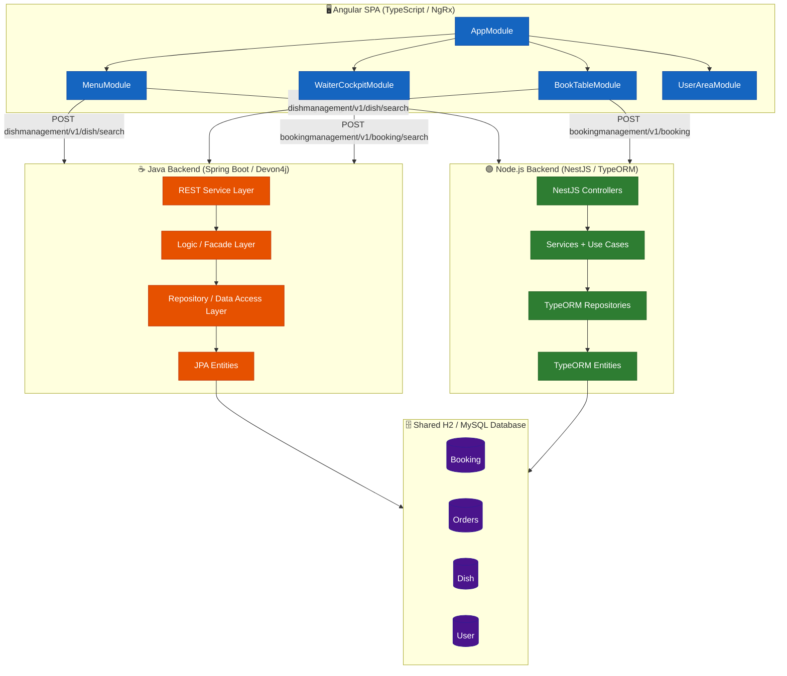
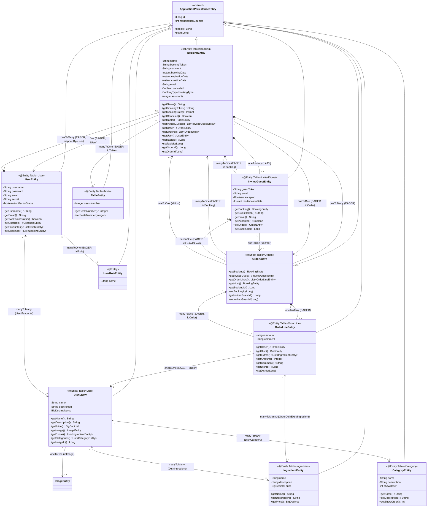
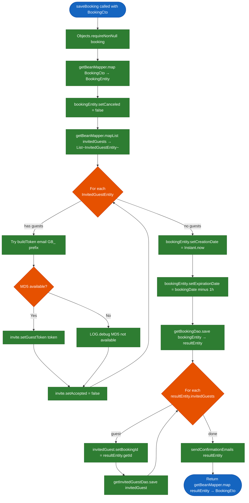
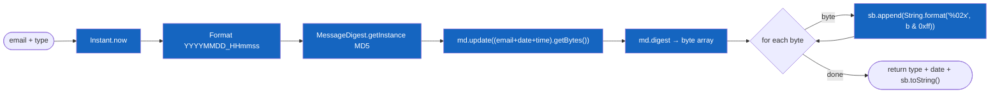
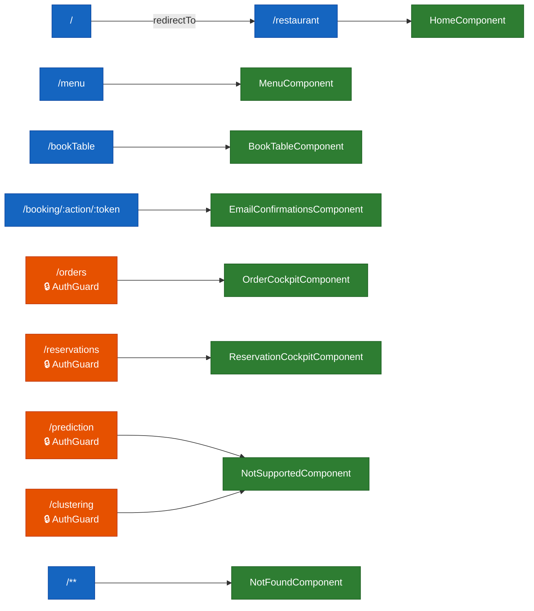
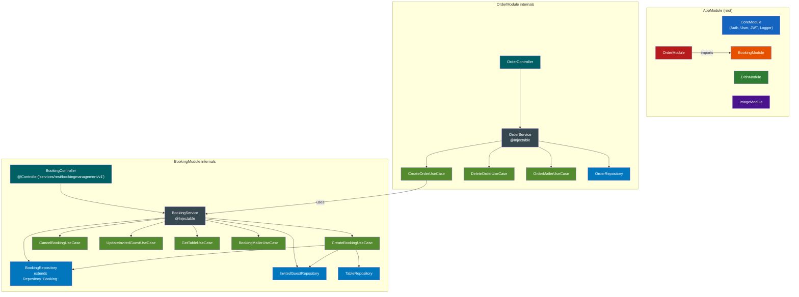
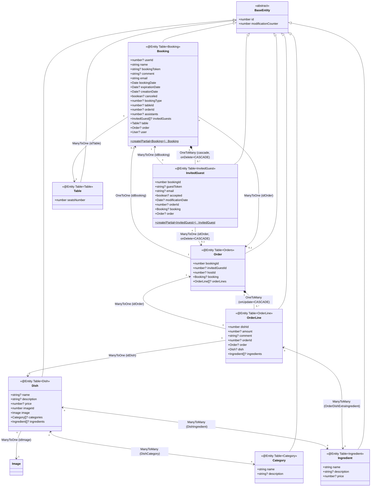
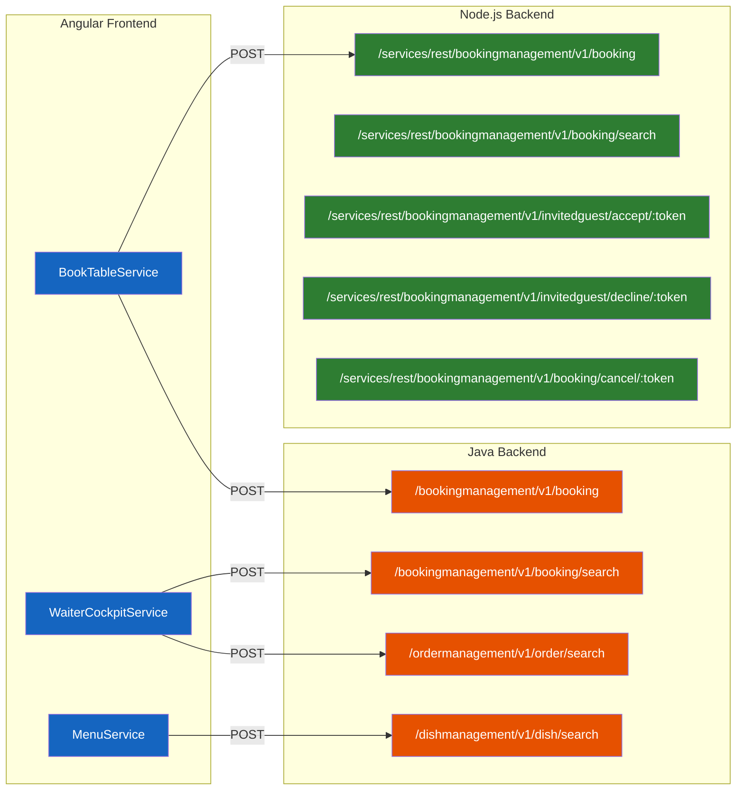

# My Thai Star — Abstract Syntax Tree Analysis Report

**Generated by**: AST Analyzer Agent  
**Repository**: my-thai-star (kpeteln/my-thai-star)  
**Scope**: Java backend · Angular frontend · Node.js backend  
**Output files**: `documentation/ast-java-bookingmanagement.json`, `documentation/ast-java-domains.json`, `documentation/ast-angular.json`, `documentation/ast-nodejs.json`

---

## Table of Contents

1. [Architecture Overview](#1-architecture-overview)
2. [Java Backend — Entity Model](#2-java-backend--entity-model)
3. [Java Backend — Layer Architecture](#3-java-backend--layer-architecture)
4. [Java Backend — Bookingmanagement Logic Flow](#4-java-backend--bookingmanagement-logic-flow)
5. [Angular Frontend — Module & Component Tree](#5-angular-frontend--module--component-tree)
6. [Angular Frontend — Route Map](#6-angular-frontend--route-map)
7. [NestJS Backend — Module Graph](#7-nestjs-backend--module-graph)
8. [NestJS Entity Model](#8-nestjs-entity-model)
9. [Cross-System Dependency Graph](#9-cross-system-dependency-graph)
10. [Design Patterns Catalogue](#10-design-patterns-catalogue)
11. [Method Signatures Reference](#11-method-signatures-reference)
12. [AST JSON File Index](#12-ast-json-file-index)

---

## 1. Architecture Overview

My Thai Star is a reference full-stack restaurant-management application with **three independent backends** sharing a common REST API contract and a single Angular SPA.



---

## 2. Java Backend — Entity Model

### JPA Entity Hierarchy & Relationships



---

## 3. Java Backend — Layer Architecture

### Devon4j Layered Architecture (per domain)

```mermaid
graph LR
    subgraph Domain["bookingmanagement domain (same pattern for all 4 domains)"]
        direction TB

        subgraph SVC["service layer"]
            RS[BookingmanagementRestServiceImpl\n@Named @Validated\nimplements BookingmanagementRestService]
        end

        subgraph LOGIC["logic layer"]
            IMPL[BookingmanagementImpl\n@Named @Transactional\nextends AbstractComponentFacade\nimplements Bookingmanagement]
        end

        subgraph DAO["dataaccess layer"]
            REPO[BookingRepository\nextends DefaultRepository~BookingEntity~\n@Query JPQL + QueryDSL]
            IGR[InvitedGuestRepository\nextends DefaultRepository~InvitedGuestEntity~]
            TR[TableRepository\nextends DefaultRepository~TableEntity~]
        end

        subgraph ENT["entities"]
            BE[BookingEntity\n@Entity @Table=Booking]
            IG[InvitedGuestEntity\n@Entity @Table=InvitedGuest]
            TE[TableEntity\n@Entity @Table=Table]
        end

        subgraph COMMON["common / api"]
            BKIFACE[Booking interface]
            BKSEARCH[BookingSearchCriteriaTo]
            BKCTO[BookingCto]
            BKETO[BookingEto]
        end
    end

    RS -->|delegates all calls to| IMPL
    IMPL -->|@Inject| REPO & IGR & TR
    IMPL -->|@Inject cross-domain| OrderMgmt[Ordermanagement]
    IMPL -->|@Inject| Mail[Mail service]
    REPO & IGR & TR -->|JPA operations| BE & IG & TE
    IMPL -->|getBeanMapper().map()| BKCTO & BKETO

    classDef svc fill:#E53935,color:#fff,stroke:#B71C1C
    classDef logic fill:#FB8C00,color:#fff,stroke:#E65100
    classDef dao fill:#43A047,color:#fff,stroke:#1B5E20
    classDef ent fill:#1E88E5,color:#fff,stroke:#0D47A1
    classDef common fill:#8E24AA,color:#fff,stroke:#4A148C

    class RS svc
    class IMPL logic
    class REPO,IGR,TR dao
    class BE,IG,TE ent
    class BKIFACE,BKSEARCH,BKCTO,BKETO common
```

---

## 4. Java Backend — Bookingmanagement Logic Flow

### `saveBooking()` method — Control Flow



### `buildToken()` — MD5 Token Generation Flow



---

## 5. Angular Frontend — Module & Component Tree

### Angular Application Module Hierarchy

```mermaid
graph TD
    APP_MOD["AppModule\n(root)"]:::root

    APP_MOD --> CORE_MOD["CoreModule\n(singleton services)"]:::core
    APP_MOD --> BOOK_MOD["BookTableModule\n(feature)"]:::feature
    APP_MOD --> MENU_MOD["MenuModule\n(feature)"]:::feature
    APP_MOD --> COCK_MOD["WaiterCockpitModule\n(feature)"]:::feature
    APP_MOD --> USER_MOD["UserAreaModule\n(feature)"]:::feature
    APP_MOD --> HOME_MOD["HomeModule"]:::feature
    APP_MOD --> SHARED_MOD["SharedModule"]:::shared

    BOOK_MOD --> BOOK_COMP["BookTableComponent\n(container)"]:::component
    BOOK_MOD --> BOOK_DIALOG["BookTableDialogComponent"]:::component
    BOOK_MOD --> INV_DIALOG["InvitationDialogComponent"]:::component
    BOOK_MOD --> BOOK_SVC["BookTableService\n@Injectable"]:::service
    BOOK_MOD --> BOOK_STORE["NgRx Store\n(bookTable feature)"]:::store

    MENU_MOD --> MENU_COMP["MenuComponent\n(container)"]:::component
    MENU_MOD --> MENU_CARD["MenuCardComponent"]:::component
    MENU_MOD --> MENU_FILTERS["MenuFiltersComponent"]:::component
    MENU_MOD --> FILTER_SEARCH["FilterSearchComponent"]:::component
    MENU_MOD --> FILTER_SORT["FilterSortComponent"]:::component
    MENU_MOD --> FILTER_CHECK["FilterCheckboxesComponent"]:::component
    MENU_MOD --> CARD_COMMENTS["MenuCardCommentsComponent"]:::component
    MENU_MOD --> CARD_DETAILS["MenuCardDetailsComponent"]:::component
    MENU_MOD --> MENU_SVC["MenuService\n@Injectable"]:::service
    MENU_MOD --> MENU_STORE["NgRx Store\n(menu feature)"]:::store

    COCK_MOD --> RES_COCK["ReservationCockpitComponent"]:::component
    COCK_MOD --> ORD_COCK["OrderCockpitComponent"]:::component
    COCK_MOD --> PRED_COCK["PredictionCockpitComponent"]:::component
    COCK_MOD --> CLUST_COCK["ClusteringCockpitComponent"]:::component
    COCK_MOD --> RES_DIALOG["ReservationDialogComponent"]:::component
    COCK_MOD --> ORD_DIALOG["OrderDialogComponent"]:::component
    COCK_MOD --> WAITER_SVC["WaiterCockpitService\n@Injectable"]:::service
    COCK_MOD --> PRED_SVC["PredictionService"]:::service
    COCK_MOD --> CLUST_SVC["ClusteringService"]:::service

    classDef root fill:#B71C1C,color:#fff,stroke:#7F0000
    classDef core fill:#1565C0,color:#fff,stroke:#0D47A1
    classDef feature fill:#1B5E20,color:#fff,stroke:#003300
    classDef shared fill:#4A148C,color:#fff,stroke:#311B92
    classDef component fill:#006064,color:#fff,stroke:#004D40
    classDef service fill:#E65100,color:#fff,stroke:#BF360C
    classDef store fill:#37474F,color:#fff,stroke:#263238
```



---

## 6. Angular Frontend — Route Map



---

## 7. NestJS Backend — Module Graph

### NestJS Module Dependency & Use Case Architecture



---

## 8. NestJS Entity Model

### TypeORM Entity Relationships (Node.js)



---

## 9. Cross-System Dependency Graph

### REST API Contract between Angular and Backends



---

## 10. Design Patterns Catalogue

| Pattern | Location | Files |
|---|---|---|
| **JPA Entity** | Java backend — all 4 domains | `*Entity.java` |
| **Repository (Spring Data + QueryDSL)** | Java backend | `*Repository.java extends DefaultRepository<>` |
| **Service Facade** | Java backend | `*managementImpl.java extends AbstractComponentFacade` |
| **REST Delegation** | Java backend | `*RestServiceImpl.java` |
| **Entity/DTO Mapping** | Java backend | `getBeanMapper().map()` / `mapList()` |
| **JPA Entity (TypeORM)** | Node.js backend | `*.entity.ts` |
| **Use Case** | Node.js backend | `*UseCase.ts` (CreateBookingUseCase, etc.) |
| **Repository (TypeORM)** | Node.js backend | `*Repository extends Repository<>` |
| **NestJS Module** | Node.js backend | `*.module.ts` |
| **DTO Validation** | Node.js backend | `class-validator` + `class-transformer` |
| **Observable / Reactive** | Angular frontend | `Observable<>`, `exhaustMap`, `pipe()` |
| **NgRx Store** | Angular frontend | `StoreModule.forFeature()`, reducers, effects |
| **Angular Module** | Angular frontend | `@NgModule` with lazy loading |
| **Route Guard** | Angular frontend | `AuthGuardService canActivate` |
| **Reactive Forms** | Angular frontend | `FormGroup`, `FormControl`, `Validators` |
| **Dialog Pattern** | Angular frontend | `MatDialog.open(*)` |

---

## 11. Method Signatures Reference

### Java — BookingmanagementImpl (logic layer)

| Method | Return Type | Parameters | Annotations |
|---|---|---|---|
| `findBooking` | `BookingCto` | `Long id` | `@Override` |
| `findBookingByToken` | `BookingCto` | `String token` | `@Override` |
| `findInvitedGuestByToken` | `InvitedGuestEto` | `String token` | `@Override` |
| `findBookingsByPost` | `Page<BookingCto>` | `BookingSearchCriteriaTo criteria` | `@Override @RolesAllowed` |
| `findBookingCtos` | `Page<BookingCto>` | `BookingSearchCriteriaTo criteria` | `@Override` |
| `deleteBooking` | `boolean` | `Long bookingId` | `@Override` |
| `saveBooking` | `BookingEto` | `BookingCto booking` | `@Override` |
| `buildToken` | `String` | `String email, String type` | `throws NoSuchAlgorithmException` |
| `findInvitedGuest` | `InvitedGuestEto` | `Long id` | `@Override` |
| `acceptInvite` | `InvitedGuestEto` | `String guestToken` | — |
| `declineInvite` | `InvitedGuestEto` | `String guestToken` | — |
| `cancelInvite` | `void` | `String bookingToken` | — |

### Java — BookingmanagementRestServiceImpl (REST layer)

| Method | HTTP | Path | Return |
|---|---|---|---|
| `getBooking(long id)` | GET | — | `BookingCto` |
| `saveBooking(@Valid BookingCto)` | POST | — | `BookingEto` |
| `deleteBooking(long id)` | DELETE | — | `void` |
| `findBookingsByPost(criteria)` | POST | `/search` | `Page<BookingCto>` |
| `acceptInvite(String token)` | GET | — | `InvitedGuestEto` |
| `declineInvite(String token)` | GET | — | `InvitedGuestEto` |
| `cancelInvite(String token)` | GET | — | `void` |

### NestJS — BookingController

| Method | HTTP | Route | Auth | Return |
|---|---|---|---|---|
| `register(NewBooking, User?)` | POST | `booking` | None | `Promise<Booking>` |
| `searchBooking(BookingSearch)` | POST | `booking/search` | Waiter JWT | `Promise<BookingPage>` |
| `acceptInvitedGuest(token)` | GET | `invitedguest/accept/:token` | None | `Promise<void>` |
| `declineInvitedGuest(token)` | GET | `invitedguest/decline/:token` | None | `Promise<void>` |
| `cancelBooking(token)` | GET | `booking/cancel/:token` | None | `Promise<void>` |

### Angular — BookTableComponent

| Method | Return | Parameters | Role |
|---|---|---|---|
| `ngOnInit()` | `void` | — | Lifecycle: init forms |
| `showBookTableDialog(checkbox)` | `void` | `MatCheckbox` | Open booking dialog |
| `showInviteDialog(checkbox)` | `void` | `MatCheckbox` | Open invitation dialog |
| `validateEmail(event)` | `void` | `MatChipInputEvent` | Email chip validation |
| `removeInvite(invite)` | `void` | `string` | Remove email from invite list |
| `getFirstDayWeek()` | `string` | — | i18n week start day |
| `get name()` | `AbstractControl` | — | Form control getter |
| `get email()` | `AbstractControl` | — | Form control getter |
| `get assistants()` | `AbstractControl` | — | Form control getter |

### Angular — WaiterCockpitService

| Method | Return | Parameters |
|---|---|---|
| `getOrders(pageable, sorting, filters)` | `Observable<OrderResponse>` | `Pageable, Sort[], FilterCockpit` |
| `getReservations(pageable, sorting, filters)` | `Observable<BookingResponse>` | `Pageable, Sort[], FilterCockpit` |
| `orderComposer(orderList)` | `OrderView[]` | `OrderView[]` |
| `getTotalPrice(orderLines)` | `number` | `OrderView[]` |

---

## 12. AST JSON File Index

| File | Domain | Language | Size |
|---|---|---|---|
| `documentation/ast-java-bookingmanagement.json` | bookingmanagement | Java | Full AST: 5 classes, 32 methods |
| `documentation/ast-java-domains.json` | order, dish, user management | Java | Full AST: 6 entity classes |
| `documentation/ast-angular.json` | Frontend | TypeScript/Angular | Full AST: 10 files, 14 components |
| `documentation/ast-nodejs.json` | Node.js backend | TypeScript/NestJS | Full AST: 9 files, 6 entities |

### JSON Schema (common structure)

```json
{
  "ast_version": "1.0",
  "language": "java | typescript",
  "framework": "Spring Boot | Angular | NestJS",
  "files": [
    {
      "file_path": "...",
      "packageName": "...",
      "imports": ["..."],
      "typeDeclarations": [
        {
          "type": "ClassDeclaration | InterfaceDeclaration | NgModule | NestModule",
          "name": "...",
          "modifiers": ["public | export | abstract"],
          "annotations": [{ "name": "@Annotation", "parameters": {} }],
          "extends": "...",
          "implements": ["..."],
          "designPattern": "...",
          "fields": [
            { "name": "...", "type": "...", "modifiers": ["..."], "annotations": ["..."] }
          ],
          "methods": [
            {
              "name": "...", "modifiers": ["..."], "returnType": "...",
              "parameters": [{ "name": "...", "type": "..." }],
              "annotations": ["..."],
              "throws": ["..."],
              "body": [
                { "type": "IfStatement | ReturnStatement | VariableDeclaration | MethodInvocation | Assignment | ForEachStatement | TryStatement | ...",
                  "condition": { "type": "BinaryExpression", "operator": "==|!=|&&|...", "left": {...}, "right": {...} },
                  "thenBlock": [...], "elseBlock": [...],
                  "value": { "type": "VariableReference | Literal | ObjectCreation | MethodInvocation | LambdaExpression", "..." }
                }
              ]
            }
          ]
        }
      ]
    }
  ],
  "complexity_metrics": { "total_classes": 0, "total_methods": 0, "design_patterns": [] }
}
```

---

*AST analysis performed by ast-analyzer agent. All source files read-only — no modifications made.*
