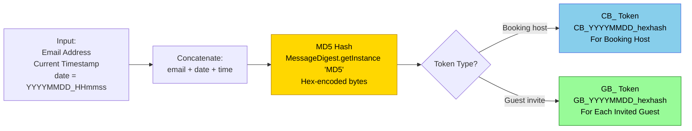
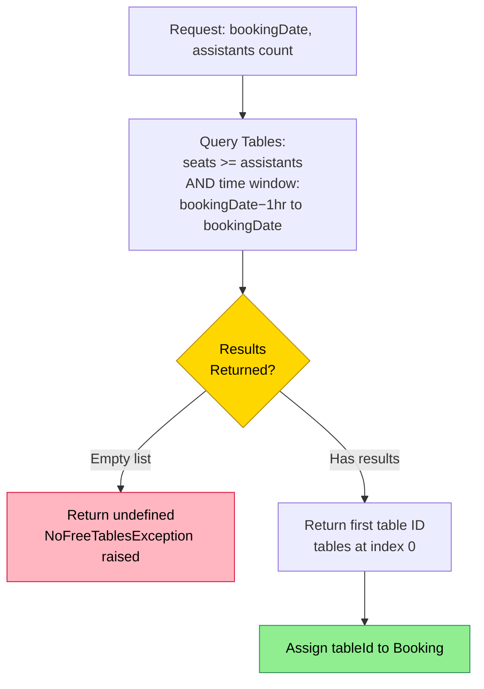

# PROC-001 — Table Booking Process

**Process ID**: PROC-001  
**Source**: `BookingmanagementImpl.saveBooking()` (Java) · `CreateBookingUseCase.createBooking()` (Node.js)  
**Participants**: Customer · Booking Management System · Email Service  
**Trigger**: Customer submits a booking request via the web UI  

---

## Process Description

A customer creates a table reservation at My Thai Star. There are two booking modes:

- **Solo Reservation (COMMON)**: One customer books for themselves and a number of guests. A table is assigned immediately based on seat availability.
- **Group Event (INVITED)**: One host invites friends by email. Guest tokens are generated and emailed. The table is assigned dynamically as guests accept/decline invitations.

In both cases, a booking token (`CB_...`) is issued to the host and confirmation emails are sent.

---

## Main BPMN Diagram

```mermaid
flowchart TD
    %% ═══════════════════════════════════════════════════
    %% CUSTOMER LANE
    %% ═══════════════════════════════════════════════════
    subgraph CUST["🧑 Customer"]
        C_Start([Start:\nVisit Restaurant Website])
        C_Form[Fill Booking Form:\nName · Email · Date · Time\nParty Size · Accept Terms]
        C_InviteQ{Invite\nFriends?}
        C_AddGuests[Enter Guest Email Addresses]
        C_Submit[Submit Booking Request]
    end

    %% ═══════════════════════════════════════════════════
    %% BOOKING SYSTEM LANE
    %% ═══════════════════════════════════════════════════
    subgraph SYS["⚙️ Booking Management System"]
        S_Validate{Validate Input:\nFuture date?\nValid email?\nTerms accepted?}
        S_ErrValidate[Return Validation Error\nto Customer]

        S_TypeQ{Booking\nType?}

        S_FindTable[Find Free Table\nseats ≥ party size\nwithin bookingDate−1hr window]
        S_TableQ{Table\nFound?}
        S_ErrNoTable[Throw NoFreeTablesException\nReturn error to Customer]
        S_AssignTable[Assign Table ID to Booking]

        S_CreateInvited[Create INVITED Booking\nTable assigned later\nwhen guests respond]

        S_TokenCB[Generate CB_ Token for Host\nCB_YYYYMMDD_MD5 of email+date+time]
        S_SetDates[Set ExpirationDate = bookingDate − 1 hour\nSet CreationDate = now\nSet canceled = false]
        S_SaveBooking[Save Booking to Database]

        S_GuestQ{Has Invited\nGuests?}
        S_GuestLoop[For Each Invited Guest:\nGenerate GB_ Token\nGB_YYYYMMDD_MD5 of email+timestamp\nSet accepted = false\nSave InvitedGuest record]
    end

    %% ═══════════════════════════════════════════════════
    %% EMAIL SERVICE LANE
    %% ═══════════════════════════════════════════════════
    subgraph EMAIL["📧 Email Service"]
        E_HostMail[Send Host Confirmation Email:\nBooking Date · CB_ Token\nGuest List · Cancellation Link]
        E_GuestMail[Send Invite Email per Guest:\nHost Name · Booking Date\nAccept Link /booking/acceptInvite/GB_...\nDecline Link /booking/rejectInvite/GB_...]
    end

    %% ═══════════════════════════════════════════════════
    %% END EVENTS
    %% ═══════════════════════════════════════════════════
    END_OK([Booking Confirmed\nHost receives CB_ Token])
    END_GUESTS([Guests Notified via Email])
    END_VALERR([End: Validation Error\nCustomer corrects form])
    END_NOTABLE([End: No Tables Available\nCustomer retries or exits])

    %% ═══════════════════════════════════════════════════
    %% FLOW CONNECTIONS
    %% ═══════════════════════════════════════════════════
    C_Start --> C_Form
    C_Form --> C_InviteQ
    C_InviteQ -->|No - Solo Reservation| C_Submit
    C_InviteQ -->|Yes - Group Event| C_AddGuests
    C_AddGuests --> C_Submit

    C_Submit --> S_Validate
    S_Validate -->|Invalid| S_ErrValidate
    S_ErrValidate --> END_VALERR

    S_Validate -->|Valid - Solo| S_TypeQ
    S_Validate -->|Valid - Group| S_TypeQ

    S_TypeQ -->|COMMON - Solo| S_FindTable
    S_TypeQ -->|INVITED - Group| S_CreateInvited

    S_FindTable --> S_TableQ
    S_TableQ -->|No table found| S_ErrNoTable
    S_ErrNoTable --> END_NOTABLE
    S_TableQ -->|Table found| S_AssignTable
    S_AssignTable --> S_TokenCB

    S_CreateInvited --> S_TokenCB

    S_TokenCB --> S_SetDates
    S_SetDates --> S_SaveBooking
    S_SaveBooking --> S_GuestQ

    S_GuestQ -->|No guests| E_HostMail
    S_GuestQ -->|Has guests| S_GuestLoop
    S_GuestLoop --> E_HostMail
    S_GuestLoop --> E_GuestMail

    E_HostMail --> END_OK
    E_GuestMail --> END_GUESTS

    %% ═══════════════════════════════════════════════════
    %% STYLING
    %% ═══════════════════════════════════════════════════
    style C_Start fill:#90EE90,stroke:#2E8B57,color:#000
    style END_OK fill:#90EE90,stroke:#2E8B57,color:#000
    style END_GUESTS fill:#90EE90,stroke:#2E8B57,color:#000
    style END_VALERR fill:#FFB6C1,stroke:#DC143C,color:#000
    style END_NOTABLE fill:#FFB6C1,stroke:#DC143C,color:#000
    style S_ErrValidate fill:#FFB6C1,stroke:#DC143C,color:#000
    style S_ErrNoTable fill:#FFB6C1,stroke:#DC143C,color:#000
    style S_Validate fill:#FFD700,stroke:#B8860B,color:#000
    style C_InviteQ fill:#FFD700,stroke:#B8860B,color:#000
    style S_TypeQ fill:#FFD700,stroke:#B8860B,color:#000
    style S_TableQ fill:#FFD700,stroke:#B8860B,color:#000
    style S_GuestQ fill:#FFD700,stroke:#B8860B,color:#000
    style S_TokenCB fill:#87CEEB,stroke:#4169E1,color:#000
    style S_GuestLoop fill:#87CEEB,stroke:#4169E1,color:#000
    style E_HostMail fill:#DDA0DD,stroke:#9370DB,color:#000
    style E_GuestMail fill:#DDA0DD,stroke:#9370DB,color:#000
```

---

## Token Generation Detail

---

## Table Availability Check Detail

---

## Process Elements Summary

| Element Type | Count | Notes |
|-------------|-------|-------|
| Start Events | 1 | Customer visits website |
| End Events | 4 | Success (×2), Validation Error, No Table |
| User Tasks | 3 | Fill form, add guests, submit |
| Service Tasks | 9 | Token gen, table lookup, DB saves, emails |
| Decision Gateways | 5 | Invite friends? · Booking type · Table found? · Has guests? · Input valid? |
| Message Flows | 2 | Host confirmation email, Guest invite email |

---

## Business Rules

| Rule | Detail |
|------|--------|
| Only future dates allowed | Validation ensures `bookingDate > now` |
| Valid email required | Standard email format validation |
| Terms must be accepted | AGB checkbox required |
| Table assignment | COMMON booking: immediate; INVITED booking: deferred |
| Table seat constraint | `table.seats >= booking.assistants` |
| Time window for table check | `[bookingDate − 1 hour, bookingDate]` |
| Token uniqueness | MD5 of `email + YYYYMMDD + HHmmss` ensures practical uniqueness |
| Expiration | `bookingEntity.expirationDate = bookingDate − Duration.ofHours(1)` |

---

## Exception Catalogue

| Exception | Trigger | Resolution |
|-----------|---------|-----------|
| `ValidationException` | Invalid form inputs | Return error, customer corrects |
| `InvalidBookingException` | COMMON booking supplied with invited guests | Return error |
| `NoFreeTablesException` | No table with sufficient seats found | Return error, customer picks different date/time |
| Mail delivery failure | SMTP error | Logged at ERROR level, booking still saved |
