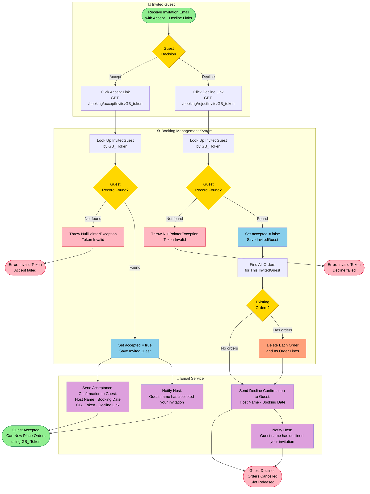
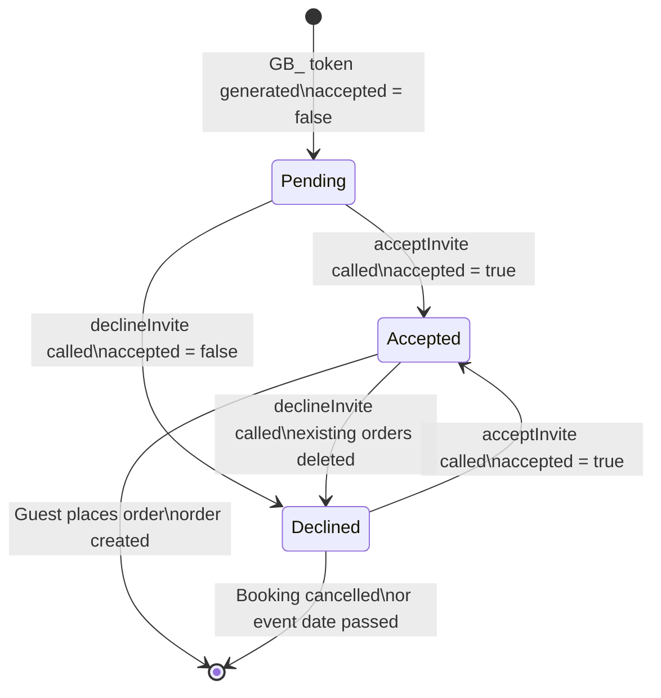

# PROC-002 — Guest Invitation Response Process

**Process ID**: PROC-002  
**Source**: `BookingmanagementImpl.acceptInvite()` · `BookingmanagementImpl.declineInvite()` (Java)  
**Source (Node)**: `UpdateInvitedGuestUseCase.updateInvitedGuest()` (Node.js)  
**Participants**: Guest · Booking Management System · Host · Email Service  
**Trigger**: Guest clicks Accept or Decline link in invitation email  

---

## Process Description

After a host creates a group booking (INVITED type), each invited guest receives an email containing:
- A personal **GB_ token** (unique per guest)
- An **Accept** link (`/booking/acceptInvite/GB_...`)
- A **Decline** link (`/booking/rejectInvite/GB_...`)

The guest's response determines whether they can later place a food order. Accepting sets `accepted = true`, which is a hard prerequisite for the order placement process. Declining cancels any already-placed orders and frees their slot.

The host is notified of every accept and decline action.

---

## Main BPMN Diagram

---

## State Transition: InvitedGuest.accepted

---

## Email Notification Matrix

| Event | Recipient | Subject | Key Content |
|-------|-----------|---------|-------------|
| Invitation sent (PROC-001) | Guest | "Event invite" | Host name, booking date, accept/decline links |
| Guest accepts | Guest | "Invite accepted" | Booking date, GB_ token, decline link for later change |
| Guest accepts | Host | "Invite accepted" | Which guest accepted |
| Guest declines | Guest | "Invite declined" | Host name, booking date |
| Guest declines | Host | "Invite declined" | Which guest declined |
| Booking cancelled (PROC-005) | Guest | "Event cancellation" | Host email, booking date |

---

## Process Elements Summary

| Element Type | Count | Notes |
|-------------|-------|-------|
| Start Events | 2 | Accept click / Decline click (both triggered by email link) |
| End Events | 4 | Accepted, Declined, Error ×2 |
| User Tasks | 2 | Click Accept, Click Decline |
| Service Tasks | 8 | Token lookup ×2, DB updates ×2, order deletion, emails ×4 |
| Decision Gateways | 4 | Guest decision · Record found? (×2) · Existing orders? |

---

## Business Rules

| Rule | Detail |
|------|--------|
| `accepted = true` is mandatory for placing an order | Enforced in `CreateOrderUseCase` — `GuestNotAcceptedException` thrown otherwise |
| Declining removes all guest orders | `declineInvite()` fetches and deletes all guest orders before saving `accepted=false` |
| Guests can change their mind | A guest who accepted can later decline (and vice versa) |
| Host always notified | Every accept/decline triggers a host notification email |
| Token required | Both accept and decline endpoints require a valid GB_ token |
