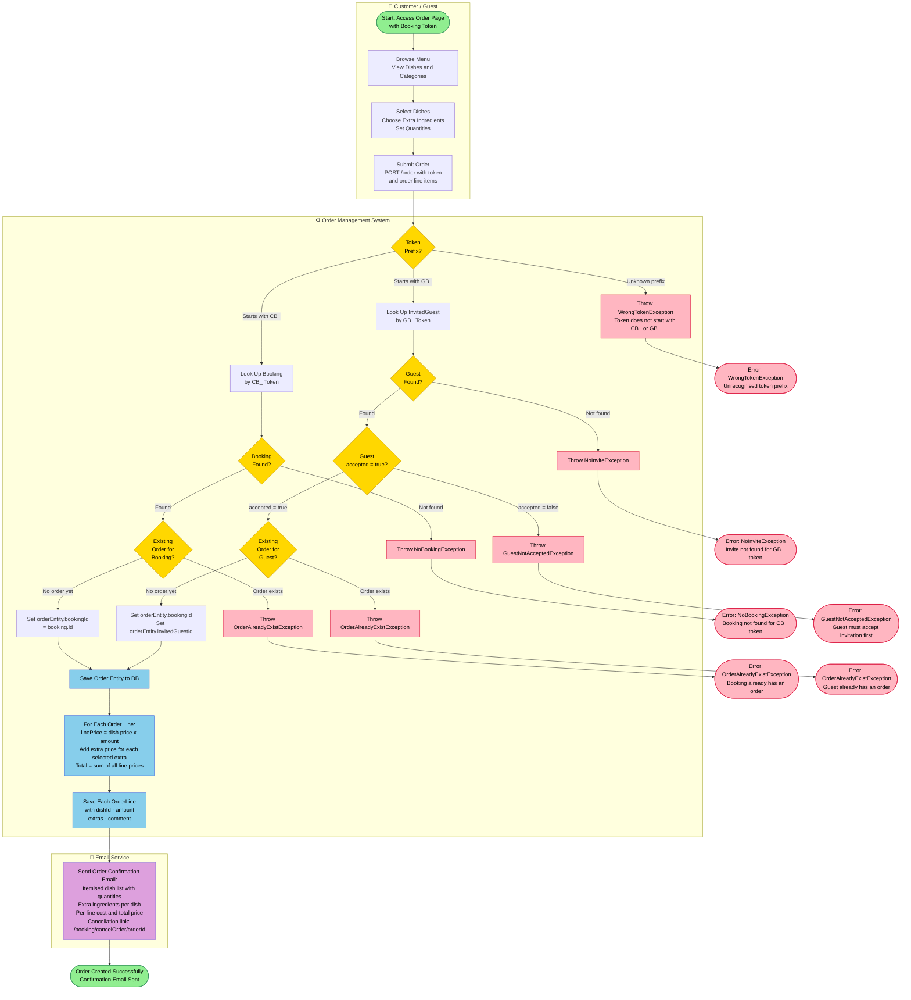
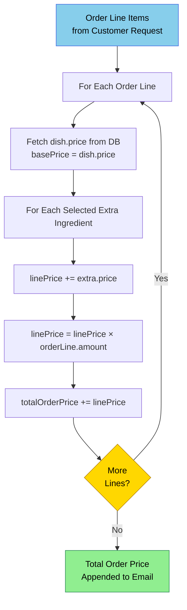
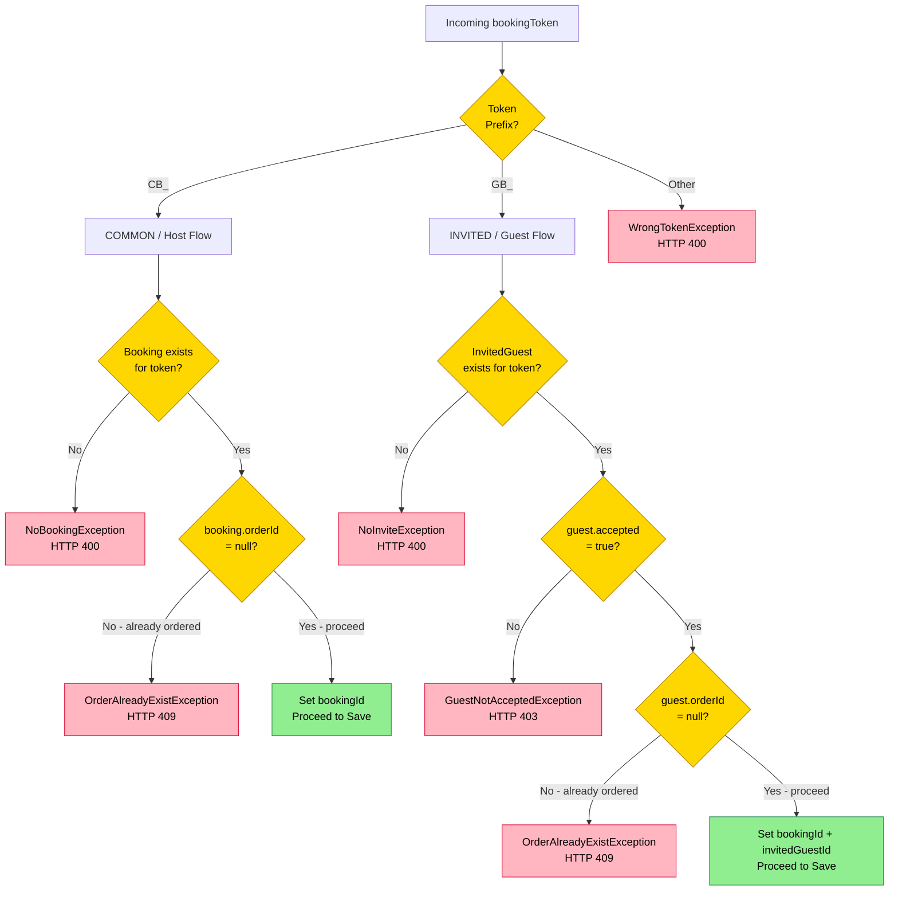

# PROC-003 — Order Placement Process

**Process ID**: PROC-003  
**Source**: `OrdermanagementImpl.saveOrder()` · `getValidatedOrder()` (Java)  
**Source (Node)**: `CreateOrderUseCase.createOrder()` (Node.js)  
**Participants**: Customer / Guest · Order Management System · Email Service  
**Trigger**: Customer or Guest submits an order using their booking token  

---

## Process Description

A customer (or invited guest) places a food order by submitting their booking token alongside a list of chosen dishes and extra ingredients. The system enforces strict token-based access control before creating the order:

- **Host** uses their `CB_` token — the booking must exist and have no prior order.
- **Guest** uses their `GB_` token — the invite must exist, the guest must have accepted, and no prior order may exist.
- Prices are calculated server-side: `(dish.price + Σ extras.price) × quantity`.
- An itemised confirmation email is sent after successful order creation.

---

## Main BPMN Diagram

---

## Price Calculation Detail

---

## Token Validation Decision Tree

---

## Process Elements Summary

| Element Type | Count | Notes |
|-------------|-------|-------|
| Start Events | 1 | Customer accesses order page |
| End Events | 7 | Success (×1), Exceptions (×6) |
| User Tasks | 3 | Browse, select, submit |
| Service Tasks | 8 | Token lookup, DB saves, price calc, email |
| Decision Gateways | 6 | Token prefix · booking found · order exists · guest found · accepted · guest order exists |

---

## Exception Catalogue

| Exception | HTTP | Trigger |
|-----------|------|---------|
| `WrongTokenException` | 400 | Token does not start with `CB_` or `GB_` |
| `NoBookingException` | 404 | No booking found for CB_ token |
| `OrderAlreadyExistException` | 409 | Booking or guest already has an order |
| `NoInviteException` | 404 | No invite found for GB_ token |
| `GuestNotAcceptedException` | 403 | Guest has not accepted the invitation yet |
