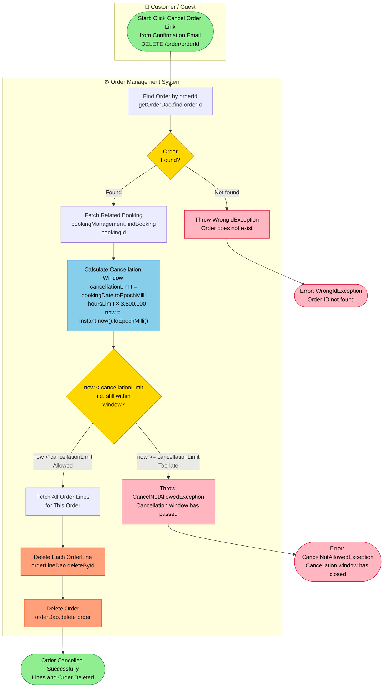
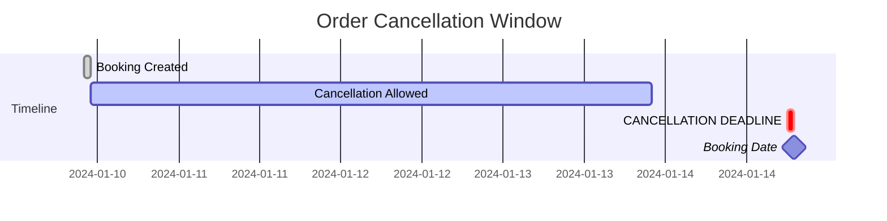
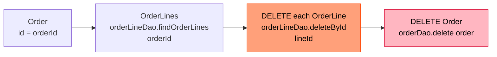

# PROC-004 — Order Cancellation Process

**Process ID**: PROC-004  
**Source**: `OrdermanagementImpl.deleteOrder()` · `cancellationAllowed()` (Java)  
**Source (Node)**: `DeleteOrderUseCase.deleteOrder()` (Node.js)  
**Participants**: Customer / Guest · Order Management System  
**Trigger**: Customer clicks the cancellation link in the order confirmation email  

---

## Process Description

A customer or guest can cancel their placed order up until a configurable number of hours before the booking date (`mythaistar.hourslimitcancellation`). The cancellation window is calculated as:

```
cancellationAllowed = now < (bookingDate - hoursLimit × 3,600,000 ms)
```

If the window has passed, a `CancelNotAllowedException` is thrown. If allowed, all order lines are deleted first (referential integrity), then the order itself is removed.

---

## Main BPMN Diagram



---

## Cancellation Time Window Visualisation



> **Note**: The `hoursLimit` value is configurable via `mythaistar.hourslimitcancellation` in `application.properties`. The diagram above assumes `hoursLimit = 1` for illustration.

---

## Deletion Cascade Detail



---

## Process Elements Summary

| Element Type | Count | Notes |
|-------------|-------|-------|
| Start Events | 1 | Customer clicks cancellation link |
| End Events | 3 | Success · Order Not Found · Too Late |
| Service Tasks | 5 | Find order · Find booking · Calc window · Delete lines · Delete order |
| Decision Gateways | 2 | Order found? · Within cancellation window? |

---

## Business Rules

| Rule | Detail |
|------|--------|
| Time window formula | `cancellationAllowed = now < bookingDate − (hoursLimit × 3,600,000 ms)` |
| Configuration key | `mythaistar.hourslimitcancellation` in `application.properties` |
| Deletion order | Order lines MUST be deleted before the parent order (referential integrity) |
| No email on cancel | Order cancellation does not send an email (booking cancellation does) |

---

## Exception Catalogue

| Exception | Trigger |
|-----------|---------|
| `WrongIdException` | Order ID not found in database |
| `CancelNotAllowedException` | Current time is past the cancellation deadline |
