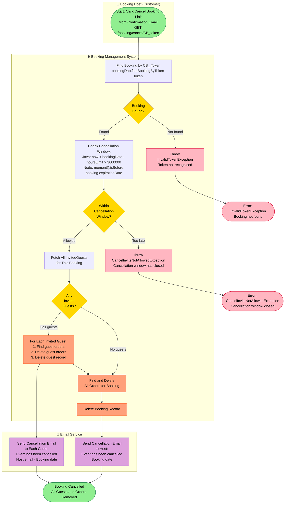
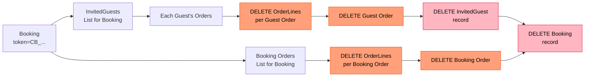

# PROC-005 — Booking Cancellation Process

**Process ID**: PROC-005  
**Source**: `BookingmanagementImpl.cancelInvite()` · `deleteBooking()` · `cancelInviteAllowed()` (Java)  
**Source (Node)**: `CancelBookingUseCase.cancelBooking()` (Node.js)  
**Participants**: Customer · Booking Management System · Email Service  
**Trigger**: Host clicks the cancellation link in the booking confirmation email  

---

## Process Description

The booking host can cancel an entire booking (and all associated guest invitations and orders) within the cancellation window. The process is a **cascade delete** that:

1. Validates the booking token and time window
2. Deletes each invited guest's orders first
3. Deletes the invited guest records
4. Deletes the booking's own orders
5. Deletes the booking itself
6. Sends cancellation emails to the host and all guests

The time window uses the same formula as order cancellation:

```
cancelAllowed = now < (bookingDate - hoursLimit × 3,600,000 ms)
```

In the Node.js implementation, the expiration date stored at booking creation time is compared directly:

```
cancelAllowed = moment().isBefore(moment(booking.expirationDate))
```

---

## Main BPMN Diagram



---

## Cascade Delete Sequence



---

## Implementation Differences: Java vs Node.js

| Aspect | Java Implementation | Node.js Implementation |
|--------|--------------------|-----------------------|
| Time check | Calculate at runtime: `now < bookingDate − hoursLimit × 3.6M` | Compare against stored `expirationDate`: `moment().isBefore(expirationDate)` |
| Cascade | Manual iteration over guests and orders | `bookingRepository.deleteCascadeBooking(booking)` |
| Email trigger | Inside main method after each guest deleted | After all deletes, `bookingMailerService.sendCanceledEmails(booking, invitedGuests)` |

---

## Process Elements Summary

| Element Type | Count | Notes |
|-------------|-------|-------|
| Start Events | 1 | Host clicks cancel link |
| End Events | 3 | Success · Invalid Token · Too Late |
| Service Tasks | 6 | Find booking, time check, find guests, guest loop (delete cascade), delete orders, delete booking |
| Message Flows | 2 | Host cancellation email, guest cancellation emails |
| Decision Gateways | 3 | Booking found? · Within window? · Has guests? |

---

## Business Rules

| Rule | Detail |
|------|--------|
| Time window | Java: `now < bookingDate − (hoursLimit × 3,600,000 ms)` |
| Expiration field | Node: `expirationDate = bookingDate − 1 hour` (stored at creation time) |
| Cascade order | Guest orders → Guest records → Booking orders → Booking |
| Email on cancel | Both host and all guests receive cancellation notifications |
| Config key | `mythaistar.hourslimitcancellation` in `application.properties` |

---

## Exception Catalogue

| Exception | Trigger |
|-----------|---------|
| `InvalidTokenException` | CB_ token not found in database |
| `CancelInviteNotAllowedException` | Current time is past the cancellation deadline |
