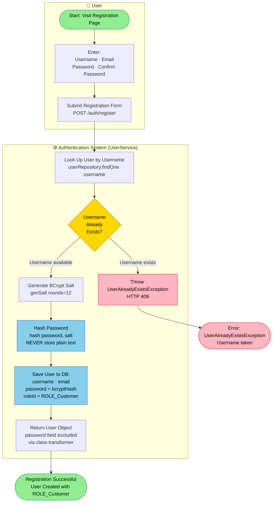
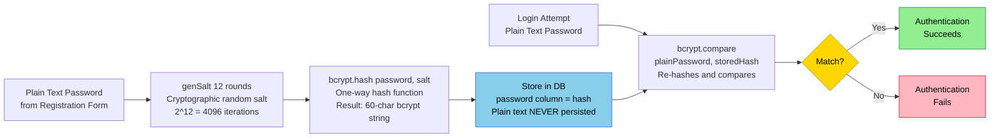
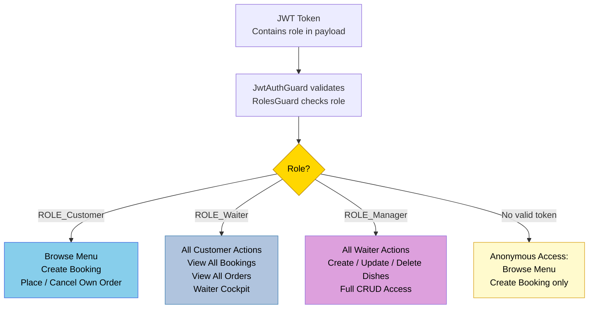

# PROC-006 — User Registration and Authentication Process

**Process ID**: PROC-006  
**Source**: `AuthService` · `UserService` (Node.js)  
**Source (Java)**: Spring Security + BCrypt (Java backend uses JWT via Spring Security filter chain)  
**Participants**: User · Authentication System  
**Trigger**: User clicks Register or Login on the website  

---

## Process Description

My Thai Star supports two entry paths:

1. **Registration**: A new user creates an account with username, email, and password. The password is hashed using **BCrypt** (salt rounds = 12) before storage. New users are always assigned `ROLE_Customer`.

2. **Login / Authentication**: An existing user submits credentials. The system verifies the password against the stored BCrypt hash. On success, a signed **JWT token** is issued, which the client sends in the `Authorization: Bearer` header on subsequent API calls.

TOTP-based 2FA is referenced in the Java backend (see `twofactor.asciidoc`) but not implemented in the Node.js backend analysed here.

---

## Registration Process



---

## Login / Authentication Process

```mermaid
flowchart TD
    %% ═══════════════════════════════════════════════════
    %% USER LANE
    %% ═══════════════════════════════════════════════════
    subgraph USER["🧑 User"]
        L_Start([Start: Visit Login Page])
        L_Form[Enter: Username and Password]
        L_Submit[Submit Login\nPOST /auth/login]
        L_UseToken[Store JWT Token\nAttach to future requests\nAuthorization: ******
    end

    %% ═══════════════════════════════════════════════════
    %% AUTH SYSTEM LANE
    %% ═══════════════════════════════════════════════════
    subgraph SYS["⚙️ Authentication System  (AuthService)"]
        S_FindUser[Find User by Username\nusersService.findOne username\nIncludes role relation]
        S_UserQ{User\nFound?}
        S_BCrypt[Compare Password with Hash\nbcrypt.compare password, user.password]
        S_MatchQ{Password\nMatches?}
        S_ErrAuth[Throw InvalidUserException\nHTTP 401]
        S_SignJWT[Sign JWT Token\njwtService.sign userPayload\nPayload includes username and role]
        S_ReturnJWT[Return JWT Token String]
    end

    %% ═══════════════════════════════════════════════════
    %% API GATEWAY LANE
    %% ═══════════════════════════════════════════════════
    subgraph GW["🔒 API Security Guard  (JwtAuthGuard)"]
        G_Verify[Verify JWT on Protected Routes\nExtract ****** signature and expiry]
        G_ValidQ{Token\nValid?}
        G_Reject[Return HTTP 401 Unauthorized]
        G_Allow[Attach User to Request Context\nProceed to Route Handler]
    end

    %% END EVENTS
    END_LOGIN([Login Successful\nJWT Token Issued])
    END_AUTHFAIL([Error: InvalidUserException\nHTTP 401 Unauthorized])
    END_APIFAIL([Error: HTTP 401\nInvalid or Expired Token])
    END_API([API Request Authorised\nRBAC Applied])

    %% FLOW
    L_Start --> L_Form
    L_Form --> L_Submit
    L_Submit --> S_FindUser
    S_FindUser --> S_UserQ
    S_UserQ -->|"Not found"| S_ErrAuth
    S_UserQ -->|"Found"| S_BCrypt
    S_BCrypt --> S_MatchQ
    S_MatchQ -->|"No match"| S_ErrAuth
    S_ErrAuth --> END_AUTHFAIL
    S_MatchQ -->|"Match"| S_SignJWT
    S_SignJWT --> S_ReturnJWT
    S_ReturnJWT --> L_UseToken
    L_UseToken --> END_LOGIN

    %% Subsequent API usage
    END_LOGIN -.->|On next API call| G_Verify
    G_Verify --> G_ValidQ
    G_ValidQ -->|"Invalid"| G_Reject
    G_Reject --> END_APIFAIL
    G_ValidQ -->|"Valid"| G_Allow
    G_Allow --> END_API

    %% STYLING
    style L_Start fill:#90EE90,stroke:#2E8B57,color:#000
    style END_LOGIN fill:#90EE90,stroke:#2E8B57,color:#000
    style END_API fill:#90EE90,stroke:#2E8B57,color:#000
    style END_AUTHFAIL fill:#FFB6C1,stroke:#DC143C,color:#000
    style END_APIFAIL fill:#FFB6C1,stroke:#DC143C,color:#000
    style S_ErrAuth fill:#FFB6C1,stroke:#DC143C,color:#000
    style G_Reject fill:#FFB6C1,stroke:#DC143C,color:#000
    style S_UserQ fill:#FFD700,stroke:#B8860B,color:#000
    style S_MatchQ fill:#FFD700,stroke:#B8860B,color:#000
    style G_ValidQ fill:#FFD700,stroke:#B8860B,color:#000
    style S_BCrypt fill:#87CEEB,stroke:#4169E1,color:#000
    style S_SignJWT fill:#87CEEB,stroke:#4169E1,color:#000
    style G_Verify fill:#B0C4DE,stroke:#4682B4,color:#000
    style G_Allow fill:#B0C4DE,stroke:#4682B4,color:#000
```

---

## BCrypt Password Hashing Flow



---

## Role-Based Access Control (RBAC)



---

## Process Elements Summary

| Element Type | Count | Notes |
|-------------|-------|-------|
| Start Events | 2 | Registration start · Login start |
| End Events | 5 | Success ×3 (registered, logged in, API authorised) · Error ×2 (duplicate user, bad credentials) |
| User Tasks | 4 | Fill register form · Submit · Fill login form · Submit |
| Service Tasks | 8 | Check username · Generate salt · Hash password · Save user · Find user · BCrypt compare · Sign JWT · Return JWT |
| Decision Gateways | 4 | Username exists? · User found? · Password match? · Token valid? |

---

## Security Controls

| Control | Implementation |
|---------|--------------|
| Password hashing | BCrypt with salt rounds = 12 (≈ 4096 iterations) |
| Token type | JWT (JSON Web Token), signed with server secret |
| Default role | `ROLE_Customer` — users never self-assign elevated roles |
| No plain text | `@Exclude()` / `classToPlain` strips password from response |
| TOTP 2FA | Available in Java backend (see `twofactor.asciidoc`) |
