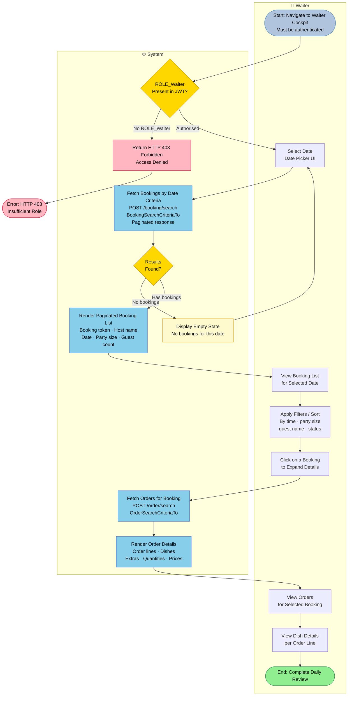
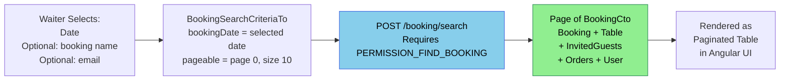
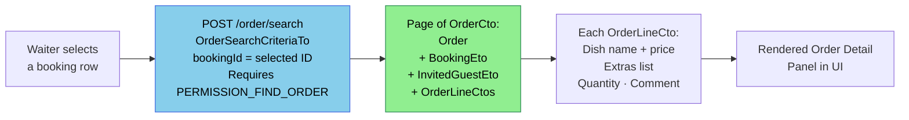

# PROC-007 — Waiter Cockpit Process

**Process ID**: PROC-007  
**Source**: `BookingmanagementImpl.findBookingsByPost()` · `OrdermanagementImpl.findOrdersByPost()` (Java)  
**Source (Angular)**: `WaiterCockpitService` · `ReservationCockpitComponent`  
**Role Required**: `ROLE_Waiter` (Java: `@RolesAllowed(PERMISSION_FIND_BOOKING)`, `@RolesAllowed(PERMISSION_FIND_ORDER)`)  
**Participants**: Waiter · System  
**Trigger**: Waiter logs in and navigates to the Waiter Cockpit  

---

## Process Description

The Waiter Cockpit is the operational view for restaurant staff. A waiter (or manager) can:

1. Log in with their role credentials to receive a JWT token that includes `ROLE_Waiter`
2. Navigate to the Waiter Cockpit UI
3. Select a date to view all bookings for that day
4. Inspect individual bookings and their associated orders
5. Filter and sort the reservation list

All data access is read-only from the waiter's perspective — they view but do not modify bookings or orders through this interface.

---

## Main BPMN Diagram

---

## Booking Search Criteria Flow

---

## Paginated Order View

---

## Process Elements Summary

| Element Type | Count | Notes |
|-------------|-------|-------|
| Start Events | 1 | Waiter navigates to cockpit |
| End Events | 2 | Success (daily review done) · Forbidden (wrong role) |
| User Tasks | 5 | Select date · View list · Filter/sort · Select booking · View orders |
| Service Tasks | 4 | Auth check · Fetch bookings · Render list · Fetch orders · Render orders |
| Decision Gateways | 2 | ROLE_Waiter present? · Bookings found? |

---

## Security Requirements

| Permission | Java Annotation | Grants Access To |
|-----------|----------------|-----------------|
| `PERMISSION_FIND_BOOKING` | `@RolesAllowed(...)` on `findBookingsByPost` | All booking search |
| `PERMISSION_FIND_ORDER` | `@RolesAllowed(...)` on `findOrdersByPost` | All order search |

Both permissions are held by `ROLE_Waiter` and `ROLE_Manager`.  
`ROLE_Customer` can only access their own booking/order data via token.
