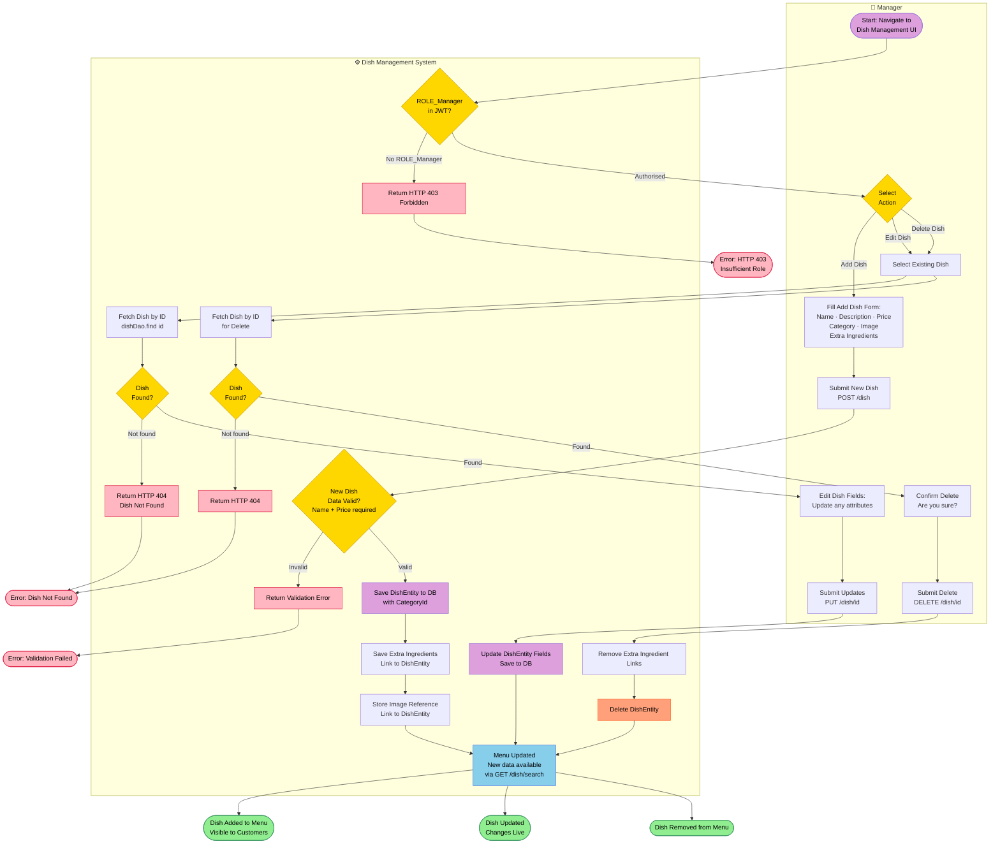
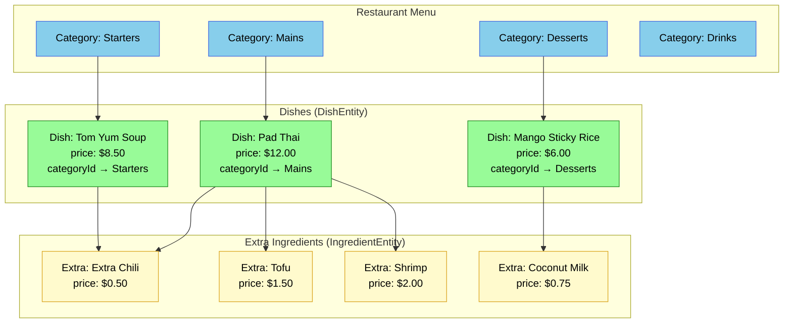
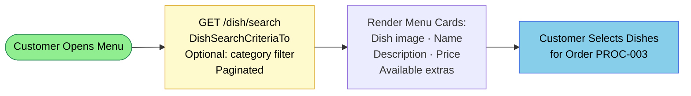

# PROC-008 — Menu Management Process

**Process ID**: PROC-008  
**Source**: `DishmanagementImpl` (Java) · `DishService` / `DishController` (inferred from domain model)  
**Source (Angular)**: `MenuService` · `MenuComponent`  
**Role Required**: `ROLE_Manager` for create/update/delete; Anonymous for read  
**Participants**: Manager · Dish Management System  
**Trigger**: Manager navigates to the dish management interface  

---

## Process Description

The Menu Management process allows a **Manager** to maintain the restaurant's dish catalogue. The menu is hierarchical:

- **Category** → groups of dishes (e.g., Starters, Mains, Desserts)
- **Dish** → individual menu items with name, price, description, and image
- **Extras (Ingredients)** → optional add-ons that a customer can select when ordering (each has its own price)

All customers (including anonymous users) can browse the menu. Only managers can modify it.

---

## Main BPMN Diagram

---

## Menu Data Model Hierarchy

---

## Customer Menu Browsing (Read-Only — No Auth Required)

---

## Process Elements Summary

| Element Type | Count | Notes |
|-------------|-------|-------|
| Start Events | 1 | Manager navigates to dish management |
| End Events | 6 | Added · Updated · Deleted · Forbidden · Validation Error · Not Found |
| User Tasks | 6 | Fill add form · Submit add · Select dish · Fill edit · Confirm delete · Submit delete |
| Service Tasks | 9 | Auth check · Validate · Save dish · Save extras · Save image · Find dish ×2 · Update · Delete |
| Decision Gateways | 5 | Auth? · Action choice · Data valid? · Dish exists? ×2 |

---

## Access Control Matrix

| Operation | ROLE_Customer | ROLE_Waiter | ROLE_Manager |
|-----------|:---:|:---:|:---:|
| Browse Menu (GET) | ✅ | ✅ | ✅ |
| View Dish Details (GET) | ✅ | ✅ | ✅ |
| Add New Dish (POST) | ❌ | ❌ | ✅ |
| Update Dish (PUT) | ❌ | ❌ | ✅ |
| Delete Dish (DELETE) | ❌ | ❌ | ✅ |
| Manage Categories | ❌ | ❌ | ✅ |
| Manage Extras | ❌ | ❌ | ✅ |
