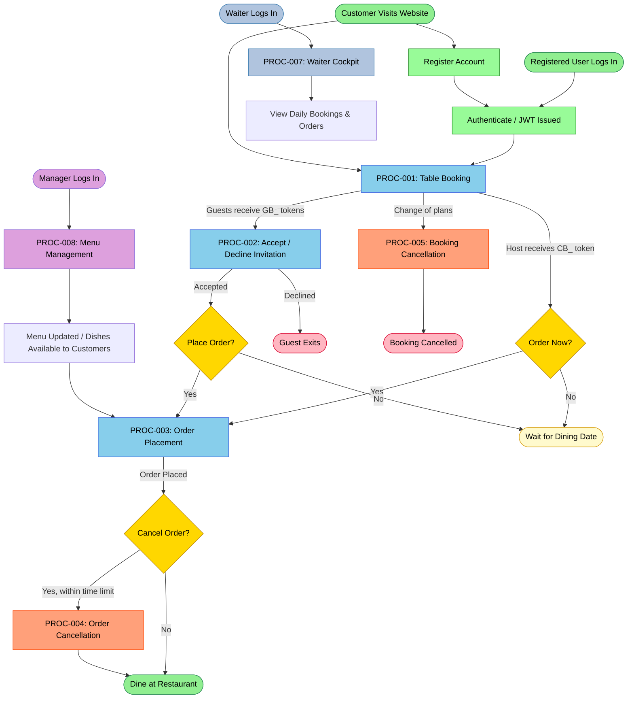
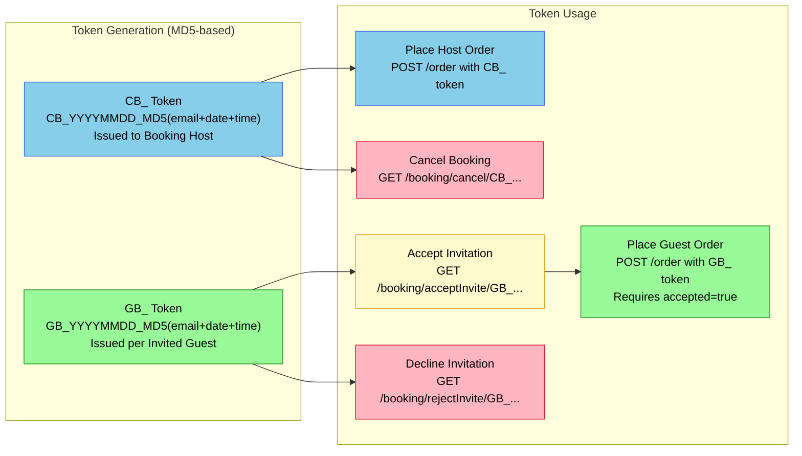

# My Thai Star — BPMN Business Process Diagrams

**Application**: My Thai Star Restaurant Management System  
**Generator**: `bpmn-generator` agent  
**Source analysed**: Java Spring Boot backend + NestJS Node.js backend  

---

## Process Inventory

| # | Process ID | Business Process | Actors | Complexity |
|---|-----------|-----------------|--------|-----------|
| 1 | PROC-001 | [Table Booking Process](bpmn-01-table-booking-process.md) | Customer, System, Email Service | High |
| 2 | PROC-002 | [Guest Invitation Response Process](bpmn-02-guest-invitation-process.md) | Guest, System, Host, Email Service | Medium |
| 3 | PROC-003 | [Order Placement Process](bpmn-03-order-placement-process.md) | Customer/Guest, System, Email Service | High |
| 4 | PROC-004 | [Order Cancellation Process](bpmn-04-order-cancellation-process.md) | Customer/Guest, System | Low |
| 5 | PROC-005 | [Booking Cancellation Process](bpmn-05-booking-cancellation-process.md) | Customer, System, Email Service | Medium |
| 6 | PROC-006 | [User Registration & Authentication](bpmn-06-user-auth-process.md) | User, Auth System | Medium |
| 7 | PROC-007 | [Waiter Cockpit Process](bpmn-07-waiter-cockpit-process.md) | Waiter, System | Low |
| 8 | PROC-008 | [Menu Management Process](bpmn-08-menu-management-process.md) | Manager, System | Low |

---

## End-to-End Customer Journey Overview

The diagram below shows how the eight processes interconnect across a complete customer journey — from discovering the restaurant through to dining and beyond.

---

## Token System Overview

The booking token system is the central access-control mechanism linking bookings, guest invitations, and orders:

---

## Data Flow Between Processes

```mermaid
flowchart TD
    subgraph DataStores["Core Data Entities"]
        DB_B[(Booking)]
        DB_IG[(InvitedGuest)]
        DB_O[(Order)]
        DB_OL[(OrderLine)]
        DB_D[(Dish + Extras)]
        DB_U[(User)]
        DB_T[(Table)]
    end

    PROC1[PROC-001 Table Booking] -->|creates| DB_B
    PROC1 -->|creates| DB_IG
    PROC1 -->|assigns| DB_T

    PROC2[PROC-002 Invite Response] -->|updates accepted flag| DB_IG

    PROC3[PROC-003 Order Placement] -->|reads| DB_B
    PROC3 -->|reads| DB_IG
    PROC3 -->|reads| DB_D
    PROC3 -->|creates| DB_O
    PROC3 -->|creates| DB_OL

    PROC4[PROC-004 Order Cancel] -->|deletes| DB_OL
    PROC4 -->|deletes| DB_O

    PROC5[PROC-005 Booking Cancel] -->|cascade deletes| DB_O
    PROC5 -->|cascade deletes| DB_IG
    PROC5 -->|deletes| DB_B

    PROC6[PROC-006 Auth] -->|creates/reads| DB_U

    PROC7[PROC-007 Waiter Cockpit] -->|reads| DB_B
    PROC7 -->|reads| DB_O

    PROC8[PROC-008 Menu Mgmt] -->|creates/updates/deletes| DB_D

    style DB_B fill:#87CEEB,stroke:#4169E1,color:#000
    style DB_IG fill:#98FB98,stroke:#228B22,color:#000
    style DB_O fill:#FFD700,stroke:#B8860B,color:#000
    style DB_OL fill:#FFFACD,stroke:#DAA520,color:#000
    style DB_D fill:#DDA0DD,stroke:#9370DB,color:#000
    style DB_U fill:#FFA07A,stroke:#FF4500,color:#000
    style DB_T fill:#B0C4DE,stroke:#4682B4,color:#000
```

---

## Role and Permission Matrix

| Role | Booking | Orders | Menu | Waiter Cockpit |
|------|---------|--------|------|----------------|
| Anonymous | Create Booking | — | View Menu | — |
| ROLE_Customer | Create Booking, Cancel Own | Place Order, Cancel Own | View Menu | — |
| ROLE_Waiter | View All (PERMISSION_FIND_BOOKING) | View All (PERMISSION_FIND_ORDER) | View Menu | Full Access |
| ROLE_Manager | Full CRUD | Full CRUD | Full CRUD | Full Access |

---

## Key Business Rules Summary

| Rule | Value | Source |
|------|-------|--------|
| Token format (host) | `CB_YYYYMMDD_MD5(email+timestamp)` | `BookingmanagementImpl.buildToken()` |
| Token format (guest) | `GB_YYYYMMDD_MD5(email+timestamp)` | `BookingmanagementImpl.buildToken()` |
| Booking expiration | `bookingDate − 1 hour` | `BookingmanagementImpl.saveBooking()` |
| Cancellation window | `now < bookingDate − hoursLimit × 3,600,000 ms` | `cancellationAllowed()` / `cancelInviteAllowed()` |
| Password hashing | BCrypt, salt rounds = 12 | `UserService.registerUser()` |
| Price calculation | `(dish.price + Σ extras.price) × quantity` | `OrdermanagementImpl.getContentFormatedWithCost()` |
| Table selection | `seats ≥ assistants` within `[bookingDate−1hr, bookingDate]` | `GetTableUseCase.getFreeTable()` |
| Guest order prerequisite | `invitedGuest.accepted = true` | `CreateOrderUseCase.createOrder()` |
| One order per booking | `orderId` must be null on booking/guest | `getValidatedOrder()` |
