# My Thai Star — Cloud Architecture Diagrams

> **Generated by**: architecture-analyzer  
> **Source**: Live analysis of `docker-compose.yml`, `docker-compose.traefik.yml`, `k8s.yml`, `k8s/aws/`, `k8s/azure/`, `reverse-proxy/nginx.conf`, `java/mtsj/architecture.json`, `node/ormconfig.json`, `net/docker-compose.yml`  
> **Application**: My Thai Star v3.2.0-SNAPSHOT — Multi-stack cloud-native restaurant management reference application

---

## 1. System Context Diagram (C4 Level 1)

Shows My Thai Star as a complete system in the context of its users and external services.

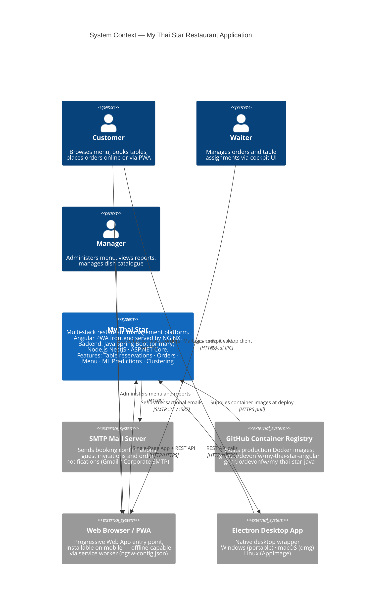

---

## 2. Container Diagram (C4 Level 2)

Shows all deployable containers across all three backend stacks with their technology and interactions.

```mermaid
C4Container
    title Container Diagram — My Thai Star (All Stacks)

    Person(users, "Users", "Customer · Waiter · Manager")

    System_Boundary(mts, "My Thai Star Platform") {

        Container(traefik, "Reverse Proxy", "Traefik v2.0 OR NGINX",
            "Single HTTP entry point on :8081.<br/>Routes /* → Angular, /api/* → Backend.<br/>Traefik mode: Docker label-driven routing,<br/>health checks every 10s, dashboard :8080.<br/>NGINX mode: static proxy_pass rules.")

        Container(angular, "Angular SPA", "Angular 12+ · NGINX · PWA",
            "SPA served by NGINX (port 80).<br/>NgRx state management.<br/>Angular Material + Transloco i18n.<br/>PWA service worker (ngsw-config.json).<br/>Electron desktop wrapper.<br/>Endpoints: /health → 200 OK,<br/>/config → runtime JSON config.")

        Container(java_be, "Java Spring Boot API", "Java 11 · Spring Boot 2.4<br/>Devon4j · JAX-RS · JWT",
            "Primary backend. Port 8081.<br/>Context path: /mythaistar.<br/>9 domain modules: booking · order · dish<br/>user · image · mail · cluster · prediction<br/>· general. Flyway migrations.<br/>H2 in-memory DB (default profile).")

        Container(node_be, "Node.js NestJS API", "Node.js · NestJS · TypeORM<br/>Passport JWT · SQLite",
            "Alternative backend. Port 8081.<br/>Use-case pattern. Modules:<br/>booking · order · dish · image.<br/>SQLite in-memory DB. MailDev integration.<br/>Swagger/OpenAPI docs included.")

        Container(dotnet_be, ".NET Core API", "ASP.NET Core · EF Core<br/>JWT · Clean Architecture",
            "Alternative backend. Port 8081.<br/>Layers: WebApi · Business · Domain<br/>· Infrastructure. JWT auth.<br/>MSSQL Server database.<br/>Custom SMTP mail microservice.")

        ContainerDb(h2_db, "H2 In-Memory DB", "H2 · Flyway",
            "Embedded Java database.<br/>Active profile: h2mem.<br/>Tables: Booking · Order · OrderLine<br/>· Dish · Category · Ingredient<br/>· Image · User · InvitedGuest.")

        ContainerDb(sqlite_db, "SQLite In-Memory DB", "SQLite · TypeORM",
            "Embedded Node.js database.<br/>Auto-migrated on startup.<br/>Mirrors Java schema.")

        ContainerDb(mssql_db, "MS SQL Server", "SQL Server 2017 Linux",
            "Relational DB for .NET backend.<br/>Port 1433. EF Core migrations.<br/>Static IP: 172.20.128.5.")

        Container(maildev, "MailDev / SMTP Service", "MailDev · Custom .NET SMTP",
            "Dev mail catcher (Node stack): MailDev<br/>SMTP :25 · Web UI :80.<br/>Custom SMTP microservice (.NET stack)<br/>on port :2025.")
    }

    System_Ext(smtp_ext, "External SMTP", "Gmail SMTP / Corporate SMTP Server")
    System_Ext(ghcr_ext, "GitHub Container Registry", "ghcr.io/devonfw/*")

    Rel(users, traefik, "HTTP/HTTPS requests", ":8081 (Docker) / :443 (K8s)")
    Rel(traefik, angular, "/* → SPA", "HTTP :80")
    Rel(traefik, java_be, "/api/* → /mythaistar/*", "HTTP :8081")
    Rel(traefik, node_be, "/api/* → /mythaistar/*", "HTTP :8081 (Node stack)")
    Rel(traefik, dotnet_be, "/api/* → backend", "HTTP :8081 (.NET stack)")

    Rel(java_be, h2_db, "Spring Data JPA / Hibernate", "JDBC in-process")
    Rel(node_be, sqlite_db, "TypeORM repositories", "In-process")
    Rel(dotnet_be, mssql_db, "Entity Framework Core", "TCP :1433")

    Rel(java_be, smtp_ext, "Spring Mail / JavaMail", "SMTP :25 / :587")
    Rel(node_be, maildev, "Nodemailer", "SMTP :25")
    Rel(dotnet_be, maildev, "Custom SMTP microservice", "SMTP :2025")

    Rel(ghcr_ext, angular, "docker pull at deploy", "HTTPS")
    Rel(ghcr_ext, java_be, "docker pull at deploy", "HTTPS")

    UpdateLayoutConfig($c4ShapeInRow="3", $c4BoundaryInRow="1")
```

---

## 3. Docker Compose — Local Development Deployments

### 3a. Primary Java Stack (NGINX Reverse Proxy)

Derived from `docker-compose.yml` and `reverse-proxy/nginx.conf`.

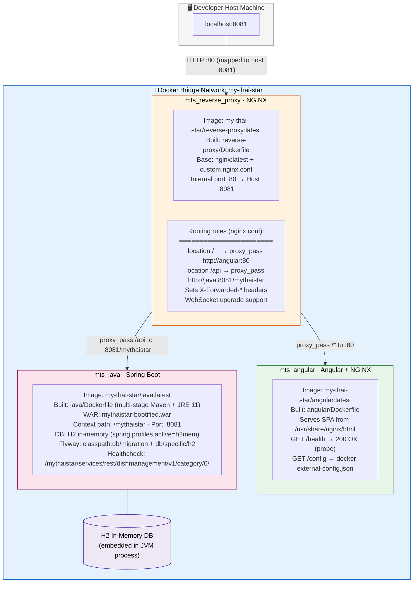

### 3b. Traefik Stack (Dynamic Service Discovery)

Derived from `docker-compose.traefik.yml` and `reverse-proxy/traefik/docker-compose.yml`.

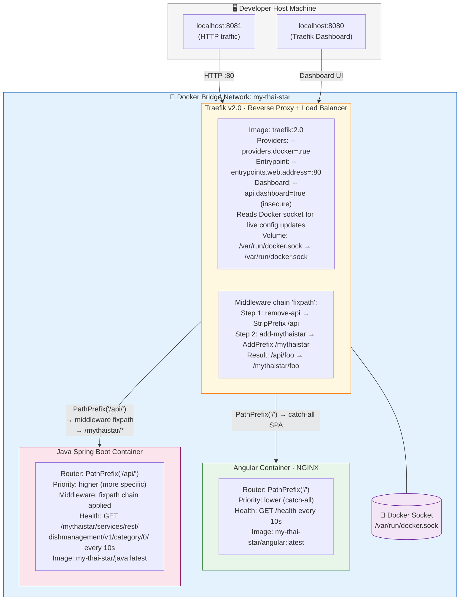

### 3c. Node.js Stack

Derived from `node/docker-compose.yml`.

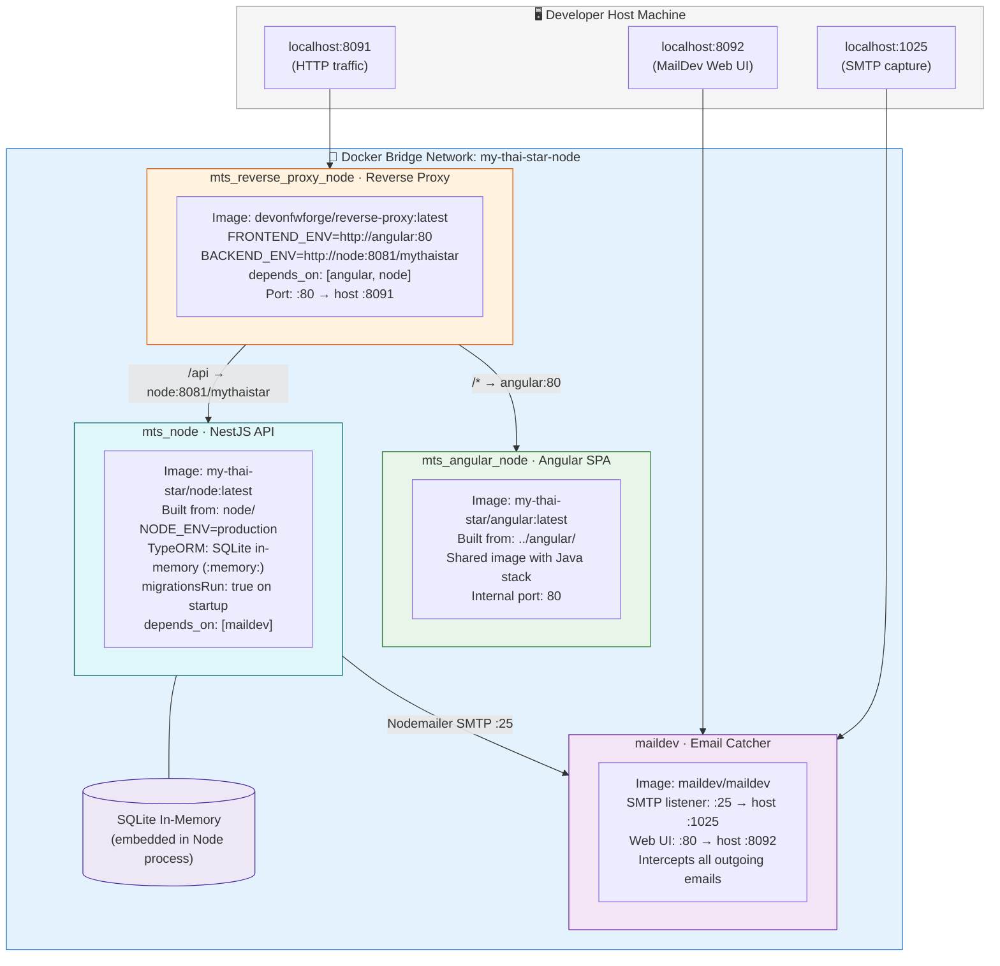

### 3d. .NET Core Stack

Derived from `net/docker-compose.yml`.

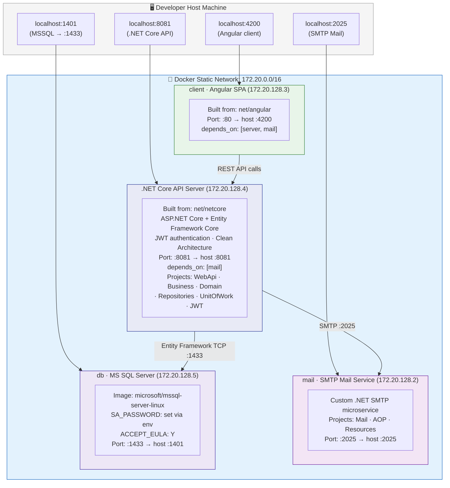

---

## 4. Kubernetes Production Deployments

### 4a. Base Kubernetes Manifest (Okteto / Generic Cluster)

Derived from `k8s.yml`. Deployed to Okteto cloud at `mts-devonfw-core.cloud.okteto.net`.

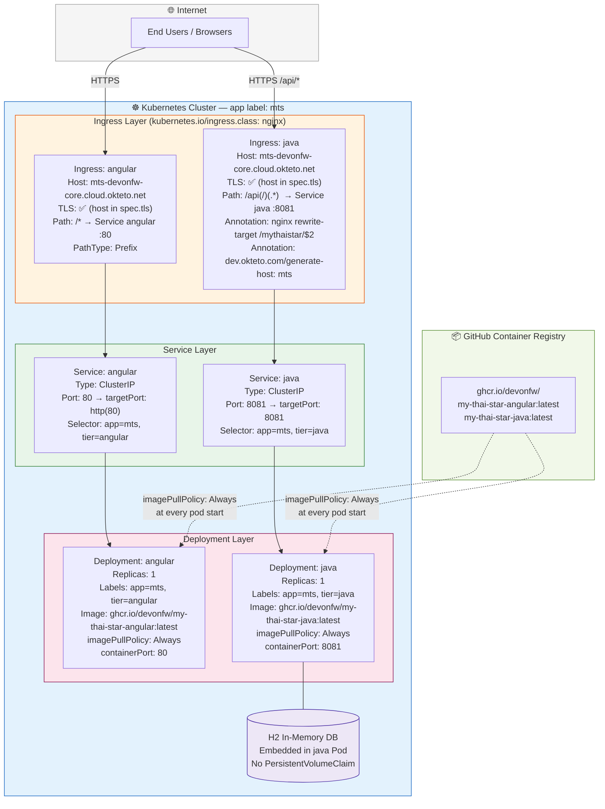

### 4b. AWS EKS Deployment

Derived from `k8s/aws/` manifests. Region: `eu-west-1`. Host: `ab1c2d100…eu-west-1.elb.amazonaws.com`.

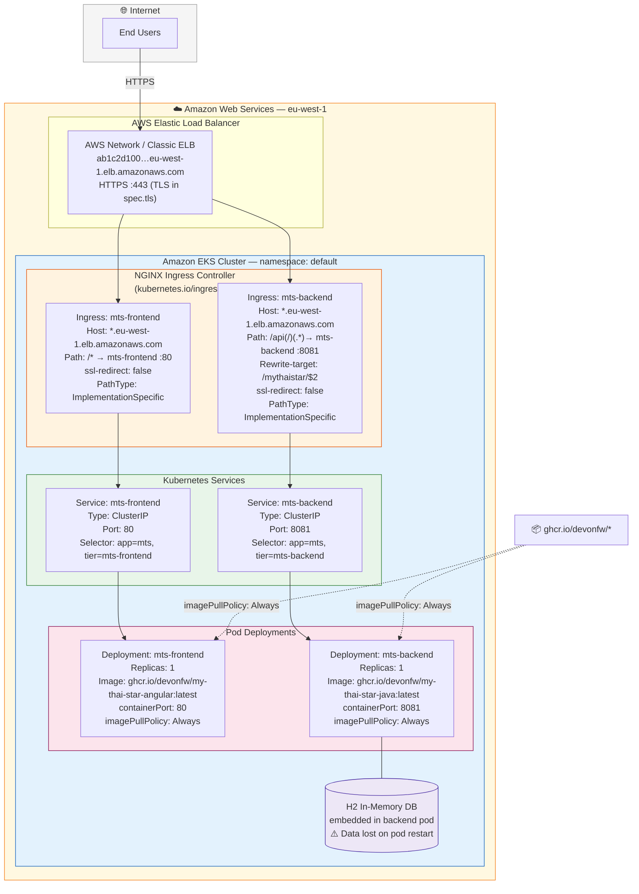

### 4c. Azure AKS Deployment

Derived from `k8s/azure/` manifests. Region: `westeurope`. Host: `100001xx…westeurope.aksapp.io`.

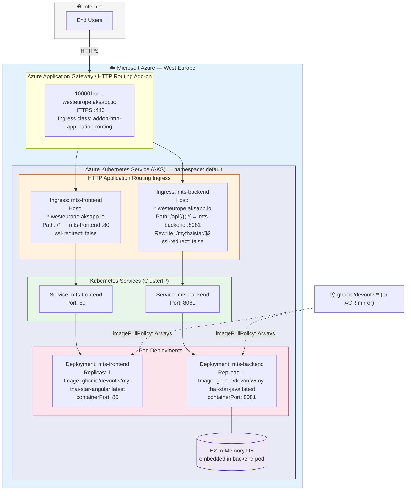

---

## 5. CI/CD Pipeline Architecture

Derived from `jenkins/deployment/Jenkinsfile`. Supplemented by GitHub Actions (`.github/`) and Travis CI (`.travis.yml`).

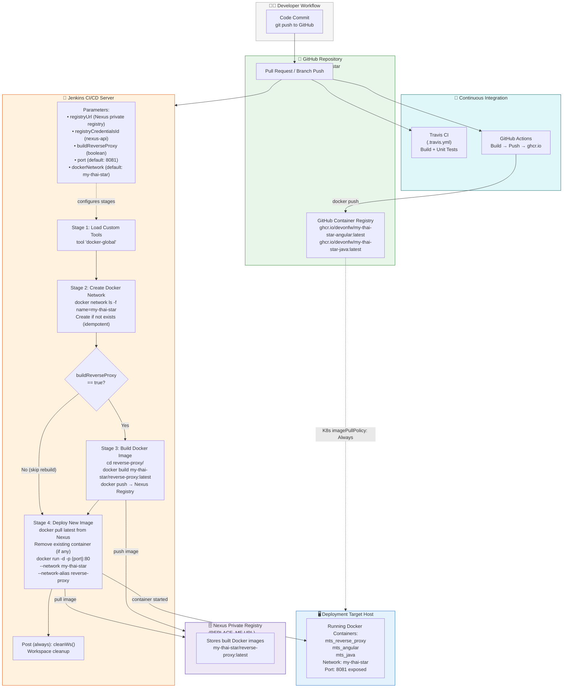

---

## 6. Network Architecture & Request Routing

Complete request flow from browser through every routing layer to the backend.

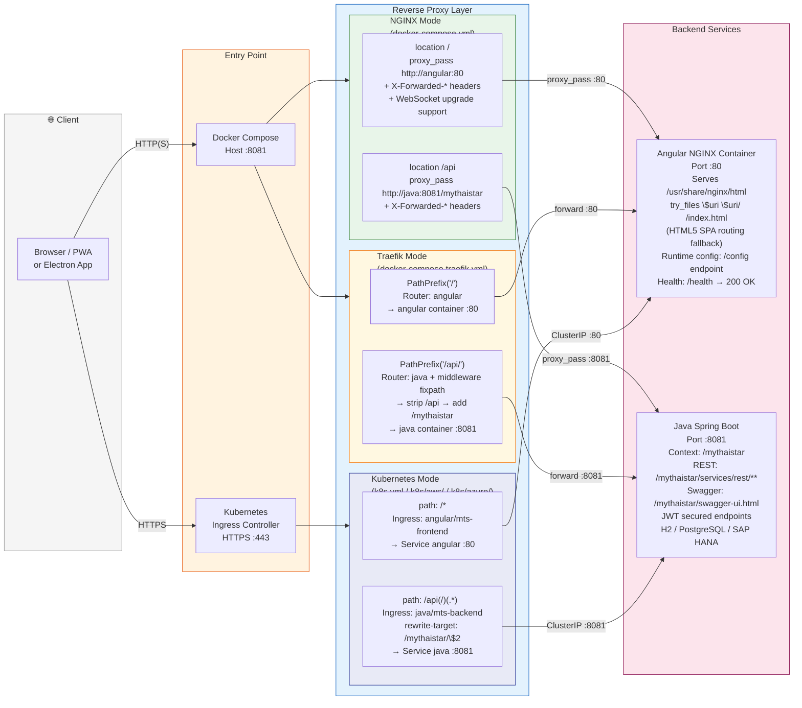

---

## 7. Recommended Production Cloud Architecture (AWS)

A target-state architecture for My Thai Star on AWS, building upon the existing K8s infrastructure patterns.

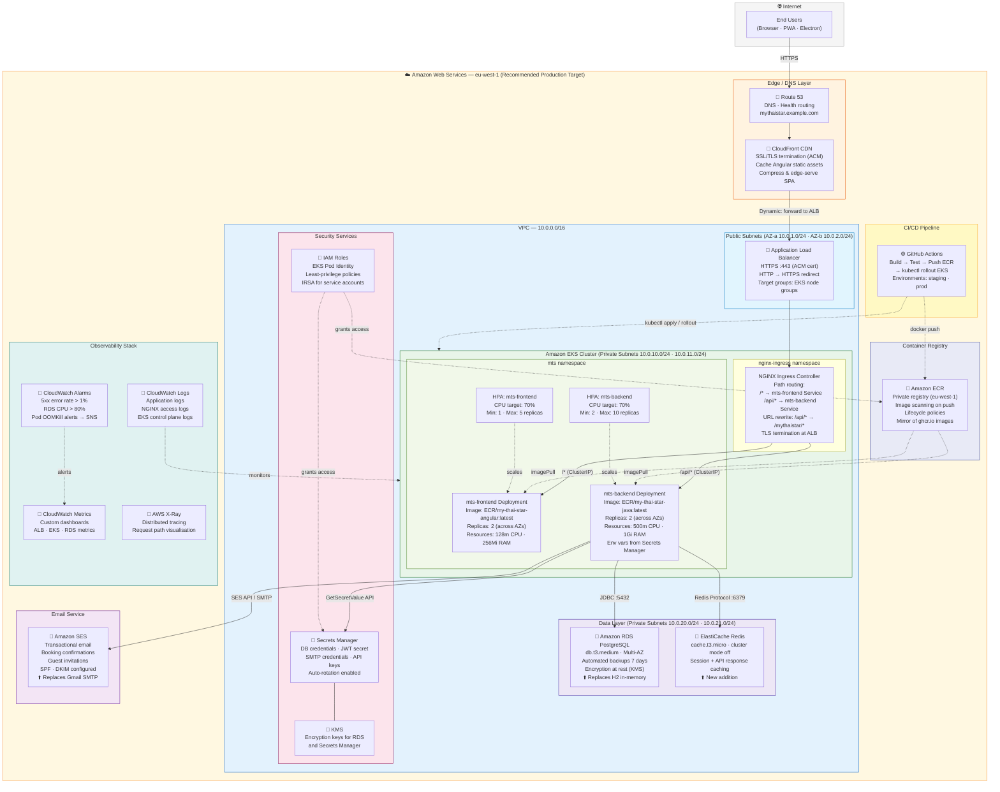

---

## Component Inventory

| Component | Technology | Internal Port | Host Port | Database | Network |
|---|---|---|---|---|---|
| NGINX Reverse Proxy | `nginx:latest` + custom `nginx.conf` | 80 | 8081 | — | my-thai-star (bridge) |
| Traefik Reverse Proxy | `traefik:2.0` | 80 (+8080 dashboard) | 8081, 8080 | — | my-thai-star (bridge) |
| Angular SPA | Angular 12+ on NGINX | 80 | — | — | my-thai-star / my-thai-star-node |
| Java Spring Boot API | JDK 11, Spring Boot 2.4, Devon4j | 8081 | — | H2 (default) | my-thai-star (bridge) |
| Node.js NestJS API | Node.js, NestJS, TypeORM | 8081 | — | SQLite in-memory | my-thai-star-node (bridge) |
| .NET Core API | ASP.NET Core, EF Core | 8081 | 8081 | MSSQL Server | static 172.20.0.0/16 |
| MS SQL Server | `microsoft/mssql-server-linux` | 1433 | 1401 | — | static 172.20.0.0/16 |
| MailDev | `maildev/maildev` | 25 (SMTP), 80 (UI) | 1025, 8092 | — | my-thai-star-node |
| SMTP Mail Service | Custom .NET microservice | 2025 | 2025 | — | static 172.20.0.0/16 |

## Migration Recommendations

| Category | Current State | Recommended Cloud Service | Benefit | Effort |
|---|---|---|---|---|
| **Database (Java)** | H2 in-memory — data lost on pod restart | AWS RDS PostgreSQL / Azure DB for PostgreSQL | Persistence, Multi-AZ HA, automated backups | Medium |
| **Database (Node.js)** | SQLite in-memory | AWS RDS PostgreSQL / Azure DB for PostgreSQL | Persistence, horizontal scalability | Medium |
| **Database (.NET)** | MSSQL Server in Docker | Azure SQL Managed Instance / AWS RDS SQL Server | Managed patching, HA, point-in-time restore | Low |
| **Email (Java)** | Gmail SMTP / corporate SMTP | AWS SES / Azure Communication Services | Deliverability, bounce/complaint handling, templates | Low |
| **Email (Node)** | MailDev (dev-only catcher) | AWS SES / Mailgun | Production-grade delivery | Low |
| **Caching** | None currently | AWS ElastiCache Redis / Azure Cache for Redis | Session storage, API caching, ML prediction cache | Medium |
| **Object Storage** | Local filesystem (dish images) | AWS S3 / Azure Blob Storage | Scalable, CDN-backed image storage | Low |
| **Compute** | 1 replica per K8s Deployment | 2+ replicas + HPA (CPU-based) | HA, zero-downtime rolling deploys | Low |
| **Secrets** | Env vars in docker-compose | AWS Secrets Manager / Azure Key Vault | Secure credential management, rotation | Low |
| **Monitoring** | None | CloudWatch / Azure Monitor + Grafana | Observability, proactive alerting | Medium |
| **CDN** | None (SPA served by NGINX pod) | AWS CloudFront / Azure Front Door | Static asset caching, reduced latency, SSL offload | Low |
| **Container Registry** | ghcr.io (public) | AWS ECR / Azure ACR | Private registry, image scanning, lifecycle policies | Low |
| **CI/CD** | Jenkins (manual trigger) + Travis CI | GitHub Actions (`.github/` already started) | Fully automated build → test → push → deploy | Low |
| **TLS** | TLS defined in K8s Ingress spec | AWS ACM + ALB / Azure App Gateway | Managed cert renewal, HTTPS redirect enforcement | Low |
