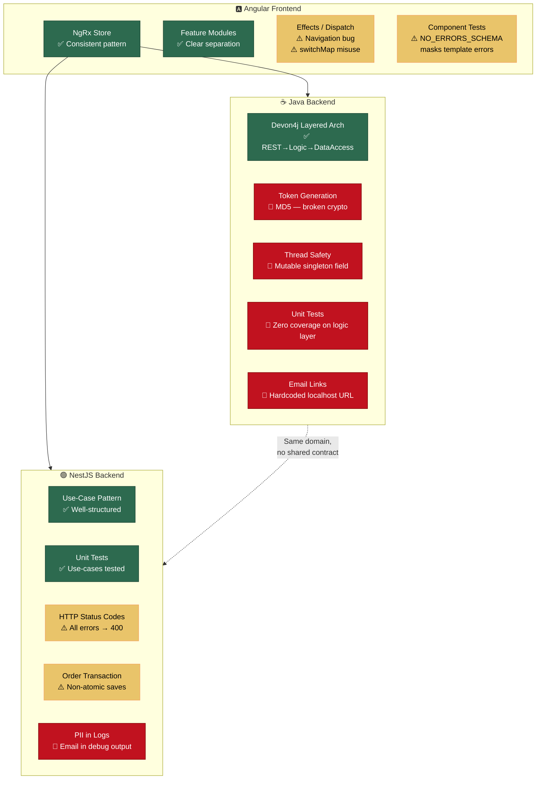
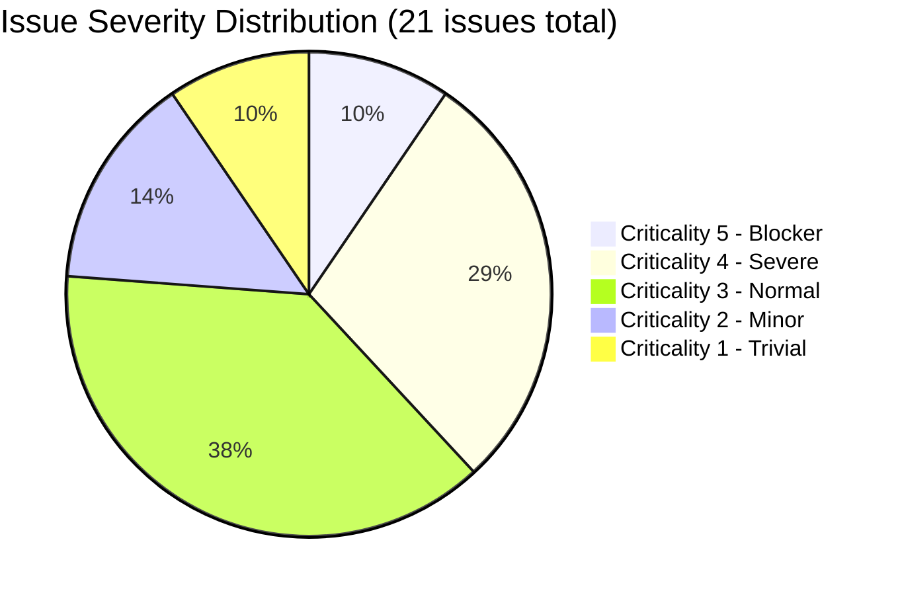
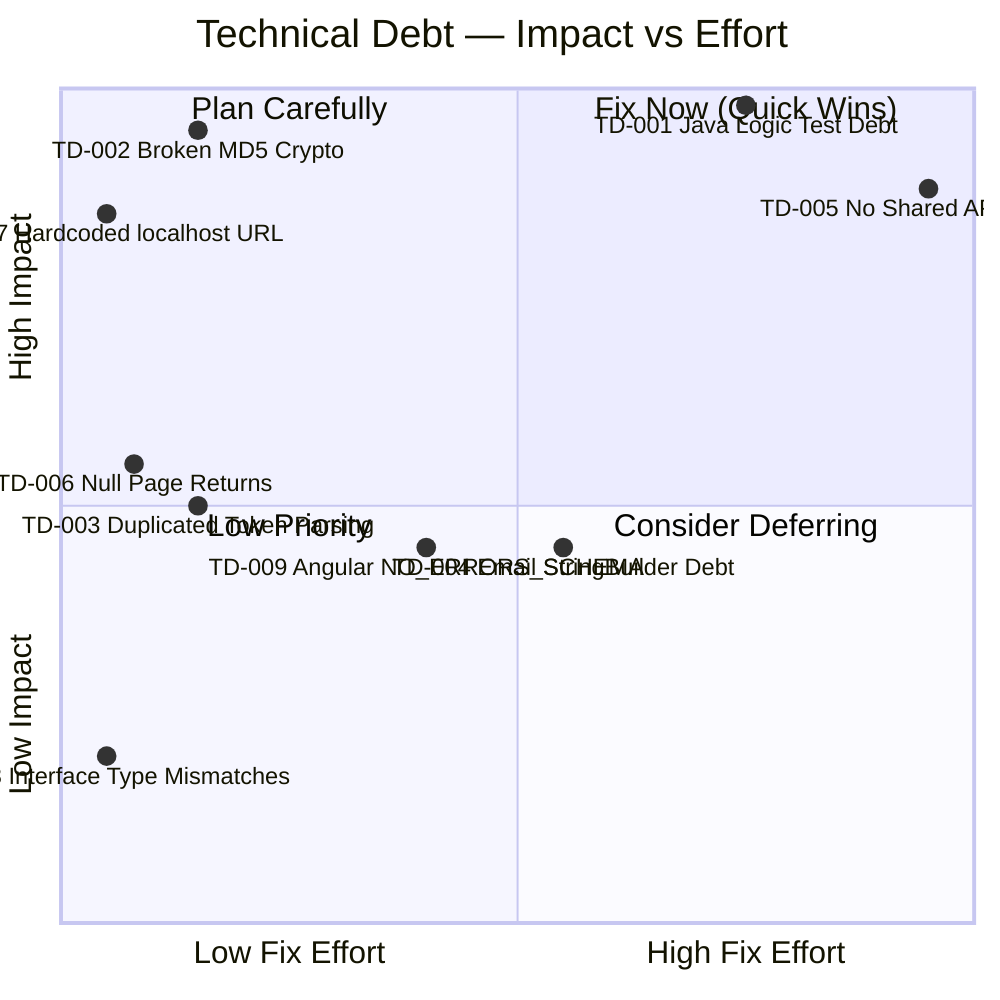
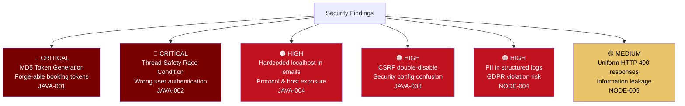

# Code Quality Assessment Report
## My Thai Star — Full-Stack Restaurant Management Application

**Assessment Date**: 2025-01-30  
**Assessed By**: code-assessor agent  
**Repository**: `kpeteln/my-thai-star`  
**Stacks Covered**: Java/Spring Boot · Angular/NgRx · Node.js/NestJS

---

## 📊 Executive Summary

My Thai Star is a multi-stack reference application demonstrating enterprise patterns across three backend technologies and a shared Angular frontend. The codebase exhibits **solid architectural intent** — the Devon4j layered architecture in Java, the use-case pattern in NestJS, and the NgRx Redux pattern in Angular are all applied coherently. However, several **critical security vulnerabilities**, a significant **Java test debt**, cross-cutting **data integrity risks**, and **functional bugs in Angular effects** require immediate attention before the application can be considered production-ready.

### Overall Project Score: **6.1 / 10**

```mermaid
radar
  title Quality Dimensions — My Thai Star
  options
    max 10
  "Code Complexity"
  "Logic Complexity"
  "Maintainability"
  "Testability"
  "Security"
  "Documentation"
  Java Backend: 6, 7, 6, 4, 5, 6
  Angular Frontend: 5, 5, 7, 6, 6, 5
  Node.js Backend: 5, 6, 7, 7, 6, 7
```

### Stack Score Breakdown

```mermaid
xychart-beta
  title "Stack Quality Scores (0–10)"
  x-axis ["Code Complexity", "Logic Complexity", "Maintainability", "Testability", "Security", "Documentation", "Overall"]
  y-axis "Score" 0 --> 10
  bar [6, 7, 6, 4, 5, 6, 6.0]
  bar [5, 5, 7, 6, 6, 5, 6.4]
  bar [5, 6, 7, 7, 6, 7, 7.0]
```



| Stack | Overall | Complexity | Maintainability | Testability | Security | Docs |
|---|---|---|---|---|---|---|
| ☕ Java / Spring Boot | **6.0** | 6/10 | 6/10 | **4/10** ⚠️ | **5/10** 🔴 | 6/10 |
| 🅰️ Angular / NgRx | **6.4** | 5/10 | 7/10 | 6/10 | 6/10 | 5/10 |
| 🟢 Node.js / NestJS | **7.0** | 5/10 | 7/10 | 7/10 | 6/10 | 7/10 |

---

## 🏗️ Architecture Quality Overview



---

## 🔴 Critical Issues (Criticality 4–5)

### JAVA-001 · Severity 5 — MD5 Token Generation
**File**: `bookingmanagement/logic/impl/BookingmanagementImpl.java` · **Line**: 243  
**Category**: Security

**Problem**: `MessageDigest.getInstance("MD5")` is used to hash `email + timestamp` into a booking token. MD5 is cryptographically broken — it has known collision vulnerabilities and is computationally cheap to brute-force, enabling an attacker to enumerate or forge valid booking tokens.

```java
// ❌ CURRENT — cryptographically weak
MessageDigest md = MessageDigest.getInstance("MD5");
md.update((email + date + time).getBytes());
byte[] digest = md.digest();
// Token is predictable from known email + approximate time
```

**Solution**: Replace with `SecureRandom`-based token generation:
```java
// ✅ RECOMMENDED — cryptographically secure
public String generateToken(String prefix) {
    byte[] bytes = new byte[32]; // 256-bit entropy
    new SecureRandom().nextBytes(bytes);
    String random = Base64.getUrlEncoder()
                          .withoutPadding()
                          .encodeToString(bytes);
    String date = LocalDate.now().format(DateTimeFormatter.BASIC_ISO_DATE);
    return prefix + date + "_" + random;
}
```
**Estimated Fix**: 2 hours

---

### JAVA-002 · Severity 5 — Thread-Safety Violation in Security Bean
**File**: `general/common/impl/security/BaseUserDetailsService.java` · **Line**: 75  
**Category**: Security

**Problem**: `private UserEntity user` is an instance field on a Spring singleton bean. In a concurrent environment, one request's `loadUserByUsername` can overwrite another's `user` field, causing requests to authenticate under the wrong user identity — a critical security breach.

```java
// ❌ CURRENT — race condition under concurrent requests
@Named
public class BaseUserDetailsService implements UserDetailsService {
    private UserEntity user;  // ← shared mutable state on singleton!
    
    @Override
    public UserDetails loadUserByUsername(String username) {
        this.user = this.userRepository.findByUsername(username); // ← race condition
        UserData userData = new UserData(this.user.getUsername(), ...);
        return userData;
    }
}
```

**Solution**: Make `user` a local variable:
```java
// ✅ RECOMMENDED — thread-safe, no shared state
@Override
public UserDetails loadUserByUsername(String username) {
    UserProfile principal = this.usermanagement.findUserProfileByLogin(username);
    UserEntity user = this.userRepository.findByUsername(username); // ← local variable
    return new UserData(user.getUsername(), user.getPassword(), getAuthorities(principal));
}
```
**Estimated Fix**: 1 hour

---

### JAVA-004 · Severity 4 — Hardcoded `http://localhost` in Production Emails
**File**: `OrdermanagementImpl.java` · **Line**: 430  
**Category**: Security / Infrastructure

**Problem**: Cancellation links in confirmation emails always point to `http://localhost:{port}` regardless of deployment environment. This breaks staging/production deployments and leaks internal network topology in emails.

```java
// ❌ CURRENT — hardcoded localhost, HTTP only
String link = "http://localhost:" + this.clientPort 
              + "/booking/cancelOrder/" + order.getId();
```

**Solution**:
```java
// ✅ RECOMMENDED — configurable, HTTPS-capable
@Value("${mythaistar.client.baseUrl}")
private String clientBaseUrl; // e.g. "https://mythaistar.example.com"

String link = this.clientBaseUrl + "/booking/cancelOrder/" + order.getId();
```
**Estimated Fix**: 1 hour

---

### JAVA-005 · Severity 4 — N+1 Query Pattern in Order Email
**File**: `OrdermanagementImpl.java` · **Line**: 446  
**Category**: Performance

**Problem**: `getContentFormatedWithCost()` calls `dishManagement.findDish(orderLine.getDishId())` inside a nested loop, triggering one database query **per order line** plus nested ingredient matching loops — O(n×m) database calls for an n-line order.

```java
// ❌ CURRENT — N+1 queries
for (OrderLineEntity orderLine : orderLines) {
    DishCto dishCto = this.dishManagement.findDish(orderLine.getDishId()); // DB call in loop!
    for (Ingredient extra : extras) {
        for (Ingredient selectedExtra : orderLine.getExtras()) { // nested loop
            ...
        }
    }
}
```

**Solution**: Batch fetch dishes before the loop:
```java
// ✅ RECOMMENDED — 1 query for all dishes
List<Long> dishIds = orderLines.stream()
    .map(OrderLineEntity::getDishId).collect(Collectors.toList());
Map<Long, DishCto> dishMap = dishManagement.findDishesByIds(dishIds);

for (OrderLineEntity orderLine : orderLines) {
    DishCto dishCto = dishMap.get(orderLine.getDishId()); // map lookup, no DB call
    ...
}
```
**Estimated Fix**: 3 hours

---

### JAVA-011 · Severity 4 — Zero Unit Test Coverage on Logic Layer
**File**: `BookingmanagementImpl.java`, `OrdermanagementImpl.java`  
**Category**: Testing

**Problem**: Neither `BookingmanagementImpl` nor `OrdermanagementImpl` has any unit tests. All complex business logic — token validation, cancellation time windows, guest invitation workflows, order price calculation — is entirely untested. The NestJS backend has use-case unit tests; the Java backend has none.

**Solution**: Create `BookingmanagementImplTest` with JUnit 5 + Mockito:
```java
@ExtendWith(MockitoExtension.class)
class BookingmanagementImplTest {
    @InjectMocks private BookingmanagementImpl underTest;
    @Mock private BookingRepository bookingDao;
    @Mock private Mail mailService;

    @Test
    void saveBooking_shouldAssignCB_PrefixedToken() {
        BookingCto booking = validBookingFixture();
        BookingEto result = underTest.saveBooking(booking);
        assertThat(result.getBookingToken()).startsWith("CB_");
    }

    @Test
    void cancellationAllowed_shouldReturnFalse_whenPastCancellationWindow() {
        // Test the inverted ternary business rule
    }
}
```
**Estimated Fix**: 8 hours

---

### ANG-007 · Severity 4 — Booking Success Navigation Never Fires
**File**: `book-table/store/effects/book-table.effects.ts` · **Line**: 48  
**Category**: Business Logic

**Problem**: `bookTableSuccess$` calls `fromRoot.go({ path: ['/menu'] })` as a plain function invocation. `fromRoot.go` is an NgRx **action creator** — it returns an action object but does not dispatch it. The return value is discarded, so navigation after successful booking **never occurs**.

```typescript
// ❌ CURRENT — action created but discarded, navigation never happens
bookTableSuccess$ = createEffect(() =>
  this.actions$.pipe(
    ofType(bookTableActions.bookTableSuccess),
    tap(() => {
      this.snackBar.openSnack(...);
      fromRoot.go({ path: ['/menu'] }); // ← creates action, throws it away!
    }),
  ),
  { dispatch: false },
);
```

**Solution**:
```typescript
// ✅ OPTION A — dispatch the router action
tap(() => {
  this.snackBar.openSnack(...);
  this.store.dispatch(fromRoot.go({ path: ['/menu'] }));
}),

// ✅ OPTION B — inject Router and navigate directly
tap(() => {
  this.snackBar.openSnack(...);
  this.router.navigate(['/menu']);
}),
```
**Estimated Fix**: 1 hour

---

### NODE-002 · Severity 4 — Non-Atomic Order Creation (Data Integrity Risk)
**File**: `order/services/use-cases/create-order.use-case.ts` · **Line**: 66  
**Category**: Error Handling

**Problem**: The `Order` entity is saved to the database before `OrderLine` entities. If the `orderLineRepository.save(orderLines)` call fails (validation error, constraint violation, SMTP timeout), the `Order` record persists as an orphan with no lines — corrupting the database state. `CreateBookingUseCase` correctly uses `connection.transaction()` but `CreateOrderUseCase` does not.

```typescript
// ❌ CURRENT — non-atomic, orphan Order possible
newOrder = await this.orderRepository.save(newOrder);      // ← committed
await this.orderLineRepository.save(orderLines);           // ← if this fails, Order is stranded
```

**Solution**:
```typescript
// ✅ RECOMMENDED — transactional, atomic
return await this.connection.transaction(async (em) => {
    const savedOrder = await em.save(Order, newOrder);
    const lines = orderLines.map(l => ({ ...l, orderId: savedOrder.id }));
    await em.save(OrderLine, lines);
    return em.findOne(Order, { where: { id: savedOrder.id }, relations: [...] });
});
```
**Estimated Fix**: 3 hours

---

### NODE-004 · Severity 4 — PII Logged in Debug Statements
**File**: `node/src/app/booking/services/booking.service.ts` · **Line**: 79  
**Category**: Security / GDPR

**Problem**: Booking objects (containing email addresses) are fully serialized into log messages via template literal: `` `booking=${booking}` ``. This exposes personally identifiable information in log aggregation systems, violating GDPR Article 5(1)(f).

```typescript
// ❌ CURRENT — full entity (with email) serialized into logs
this.logger.debug(
  `Executing createBooking. Params: booking=${booking}, ...`,
  'BookingService',
);
```

**Solution**:
```typescript
// ✅ RECOMMENDED — only log non-PII operational data
this.logger.debug(
  `Executing createBooking. bookingType=${booking.bookingType}, ` +
  `assistants=${booking.assistants}, guestCount=${invitedGuests?.length ?? 0}`,
  'BookingService',
);
```
**Estimated Fix**: 2 hours

---

## 🟡 Normal Issues (Criticality 3)

### JAVA-007 · Null Page Return from Pagination Methods
**File**: `BookingmanagementImpl.java`, `OrdermanagementImpl.java`  
**Category**: Error Handling

Both `findOrderCtos` and `findBookingCtos` return `null` instead of `Page.empty()` when there are no results. This violates Spring Data conventions and forces every caller to null-check before pagination.

```java
// ❌ CURRENT
Page<OrderCto> pagListTo = null;
// ... if no results, pagListTo remains null
return pagListTo; // ← null!

// ✅ RECOMMENDED
return (pagListTo != null) ? pagListTo : Page.empty();
```
**Estimated Fix**: 0.5 hours

---

### JAVA-010 · Null Return in Email Routing Logic
**File**: `OrdermanagementImpl.java` · **Line**: 498  
**Category**: Error Handling

`getBookingOrGuestEmail()` returns `null` in its final else branch for unrecognised token types instead of throwing `WrongTokenException`, causing a `NullPointerException` in `mailService.sendMail(null, ...)`.

---

### ANG-002 · Mutation of Filter Input Object
**File**: `cockpit-area/services/waiter-cockpit.service.ts` · **Line**: 45  
**Category**: Code Structure

`getOrders()` directly mutates the caller's `filters` object via `filters.pageable = pageable` and `delete filters.email`. In NgRx where state immutability is enforced, this is a subtle bug source.

---

### ANG-004 · Memory Leak in OrderCockpit
**File**: `order-cockpit.component.ts` · **Line**: 67  
**Category**: Maintainability

`langChanges$` subscription is created in `ngOnInit` but never stored in `translocoSubscription`. `ngOnDestroy` calls `this.translocoSubscription.unsubscribe()` on the default `Subscription.EMPTY`, never cleaning up the real subscription.

---

### ANG-005 / ANG-006 · Missing Error Handling in applyFilters
**File**: `order-cockpit.component.ts` · **Lines**: 86–94  
**Category**: Error Handling

HTTP failures are swallowed silently. Additionally, `this.totalOrders = data.totalElements` is outside the null-data guard, throwing `TypeError` when `data` is `null`.

---

### ANG-008 · Wrong RxJS Operator for Form Submission
**File**: `book-table.effects.ts` · **Line**: 19  
**Category**: Code Structure

`switchMap` cancels in-flight bookings on rapid re-dispatch. For form submissions, `exhaustMap` is correct — it ignores subsequent actions while one is in-flight.

---

### ANG-009 · Hardcoded Category-to-ID Mapping
**File**: `menu/services/menu.service.ts` · **Line**: 12  
**Category**: Maintainability

`categoryNameToServerId` embeds backend database integer IDs directly in frontend code. Any backend category change requires a frontend deployment.

---

### NODE-001 · Duplicated Token Prefix Logic
**File**: `create-order.use-case.ts` · **Line**: 31 + `ordermanagement/impl`  
**Category**: Code Structure

`CB_`/`GB_` prefix checks appear in multiple use-cases. A shared `resolveTokenType(token)` utility would centralise this core business rule.

---

### NODE-005 · Uniform HTTP 400 for All Business Errors
**File**: `shared/filters/business-logic.filter.ts` · **Line**: 16  
**Category**: Error Handling

All `BusinessLogicException` subclasses map to HTTP 400 regardless of semantics. `InvalidTokenException` should be 401, `OrderAlreadyDoneException` should be 409, `NoFreeTablesException` should be 422.

---

## 🟢 Minor Issues (Criticality 1–2)

| ID | File | Issue | Est. Fix |
|---|---|---|---|
| JAVA-006 | `OrdermanagementImpl.java:191` | `processOrders` sets `orderLines` twice — first mapping is dead code | 0.5h |
| JAVA-008 | `OrdermanagementImpl.java:513` | `(now > limit) ? false : true` → simplify to `now <= limit` | 0.5h |
| JAVA-009 | `BookingmanagementImpl.java:223` | Log says "OrderLine" when creating InvitedGuest — copy-paste error | 0.5h |
| ANG-001 | `waiter-cockpit.service.ts:23` | `filterOrdersRestPath` identical to `getOrdersRestPath` — dead constant | 0.5h |
| ANG-003 | `interfaces.ts:19` | `FilterCockpit.bookingToken` typed as `number`, should be `string` | 0.5h |
| ANG-010 | `menu.service.ts:64` | TODO comment for `isFav` — undefined field sent in every request | 2h |
| NODE-003 | `exceptions/` | Typo: `GuestNotAccpetedException` → `GuestNotAcceptedException` | 0.5h |
| NODE-006 | `booking-mailer.use-case.ts:82` | Fire-and-forget email promises — caller cannot confirm delivery | 3h |

---

## ⚙️ Issue Severity Distribution



---

## 💡 Enhancement Recommendations

### ENH-001 · Priority 5 — Java Logic Layer Test Suite
**Category**: Refactoring / Test Standardisation

Create a comprehensive JUnit 5 + Mockito test suite for `BookingmanagementImpl` and `OrdermanagementImpl`. Mock all injected repositories and services. Target >80% line coverage enforced by JaCoCo Maven plugin. This is the single highest-impact improvement available — the entire Java business logic is currently unprotected from regression.

**Estimated Effort**: 16 hours

---

### ENH-002 · Priority 5 — Cryptographically Secure Token Service
**Category**: Security Refactoring

Extract token generation into a dedicated `TokenService` using `SecureRandom` + Base64. Inject and test independently. Preserve the `CB_`/`GB_` prefix routing contract while eliminating the MD5 vulnerability.

**Estimated Effort**: 3 hours

---

### ENH-003 · Priority 4 — Semantic HTTP Status Codes in NestJS
**Category**: Code Standardisation

Add a `statusCode` property to `BusinessLogicException`. Set correct HTTP codes per exception type (401, 404, 409, 422). Update `BusinessLogicFilter` to use `exception.statusCode ?? 400`.

**Estimated Effort**: 2 hours

---

### ENH-004 · Priority 3 — Dynamic Category Loading in Angular
**Category**: Module Standardisation

Replace the `categoryNameToServerId` magic-number map with a backend-driven NgRx category state: `loadCategories` action → effect → `GET /dishmanagement/v1/category` → reducer. Decouples frontend from backend database IDs.

**Estimated Effort**: 4 hours

---

### ENH-005 · Priority 4 — Transactional NestJS Order Creation
**Category**: Refactoring

Wrap `CreateOrderUseCase.createOrder()` in `connection.transaction()` matching the pattern in `CreateBookingUseCase`. Ensures atomicity of Order + OrderLine saves.

**Estimated Effort**: 3 hours

---

### ENH-006 · Priority 3 — Cross-Stack OpenAPI Contract Enforcement
**Category**: Project Configuration / Dependencies Orchestration

Add `@nestjs/swagger` to NestJS, `springdoc-openapi` to Java Maven build, and `openapi-generator-cli` to Angular build pipeline. Generate TypeScript API models from the OpenAPI spec to enforce cross-stack contract consistency in CI.

**Estimated Effort**: 20 hours

---

## 📉 Technical Debt Register



| ID | Type | Description | Impact | Est. Fix |
|---|---|---|---|---|
| **TD-001** | Test Debt | Zero unit tests on Java logic layer | **HIGH** | 16h |
| **TD-002** | Security Debt | MD5 token generation — broken crypto | **HIGH** | 3h |
| **TD-003** | Code Debt | CB_/GB_ token parsing in 3+ locations | **MEDIUM** | 2h |
| **TD-004** | Code Debt | Java email via StringBuilder vs. NestJS Handlebars templates | **MEDIUM** | 8h |
| **TD-005** | Design Debt | 3 backends, no shared OpenAPI contract | **HIGH** | 20h |
| **TD-006** | Code Debt | `findOrderCtos` / `findBookingCtos` return null instead of `Page.empty()` | **MEDIUM** | 1h |
| **TD-007** | Infrastructure Debt | Hardcoded `http://localhost` in email links | **HIGH** | 1h |
| **TD-008** | Code Debt | Angular `FilterCockpit.bookingToken` typed as `number`; dead commented code | **LOW** | 1h |
| **TD-009** | Test Debt | Angular tests use `NO_ERRORS_SCHEMA` masking template errors | **MEDIUM** | 4h |

**Total Estimated Fix Time**: ~56 hours

---

## 🔍 Cross-Stack Consistency Analysis

```mermaid
flowchart LR
  classDef consistent fill:#2d6a4f,color:#fff
  classDef inconsistent fill:#c1121f,color:#fff
  classDef partial fill:#e9c46a,color:#000

  subgraph DOMAIN["Core Domain Contract"]
    T1["CB_/GB_ Token Routing\n✅ All 3 backends"]:::consistent
    T2["RBAC Roles\n✅ Waiter / Manager / Customer"]:::consistent
    T3["Booking → Order → Dish model\n✅ Consistent entity shape"]:::consistent
  end

  subgraph QUALITY["Quality Practices"]
    Q1["Unit Tests\n⚠️ NestJS ✅ Java ❌ .NET ?"]:::partial
    Q2["Email Strategy\n❌ Java: StringBuilder\nNestJS: Handlebars"]:::inconsistent
    Q3["DB Transactions\n⚠️ Booking ✅ Order ❌"]:::partial
    Q4["HTTP Status Codes\n⚠️ All 400 in NestJS"]:::partial
    Q5["Logging PII\n❌ Entity objects serialized"]:::inconsistent
  end

  DOMAIN --> QUALITY
```



### Key Observations
1. ✅ **Token protocol** (`CB_`/`GB_` prefix routing) is consistently implemented across all three backends — a notable architectural achievement for a multi-stack reference app.
2. ✅ **RBAC roles** (`ROLE_Customer`, `ROLE_Waiter`, `ROLE_Manager`) are consistently enforced via `@RolesAllowed` in Java and JWT claims in NestJS.
3. ⚠️ **Test coverage disparity**: NestJS use-cases have dedicated spec files with well-structured mocks; Java logic layer has zero unit tests.
4. ❌ **Email approach**: Java uses fragile `StringBuilder` concatenation spread across 6+ private methods; NestJS uses Handlebars templates — a far superior, maintainable, and designable approach that should be applied to Java.
5. ⚠️ **Transaction boundaries**: `CreateBookingUseCase` in NestJS correctly uses `connection.transaction()`; `CreateOrderUseCase` does not — inconsistency within the same stack.
6. ❌ **Angular cockpit components** make direct HTTP calls through services without flowing state through NgRx store, inconsistent with the booking and menu modules that use NgRx effects.

---

## 🔒 Security Assessment Summary



---

## 📋 Recommended Action Plan

### Sprint 1 — Security & Critical Bugs (Week 1–2)
| Priority | Item | Effort | Owner |
|---|---|---|---|
| 🔴 P0 | Fix thread-safety in `BaseUserDetailsService` (JAVA-002) | 1h | Java team |
| 🔴 P0 | Replace MD5 with `SecureRandom` token generation (JAVA-001) | 2h | Java team |
| 🔴 P0 | Fix booking success navigation bug in Angular effects (ANG-007) | 1h | Angular team |
| 🔴 P0 | Configure `mythaistar.client.baseUrl` property (JAVA-004) | 1h | Java team |
| 🔴 P0 | Wrap `CreateOrderUseCase` in transaction (NODE-002) | 3h | Node.js team |

### Sprint 2 — Data Quality & Error Handling (Week 3–4)
| Priority | Item | Effort | Owner |
|---|---|---|---|
| 🟠 P1 | Sanitise PII from all debug log statements (NODE-004) | 2h | Node.js team |
| 🟠 P1 | Add semantic HTTP status codes to NestJS exceptions (NODE-005, ENH-003) | 2h | Node.js team |
| 🟠 P1 | Fix `applyFilters` null handling + add error feedback (ANG-005, ANG-006) | 1.5h | Angular team |
| 🟠 P1 | Fix `findOrderCtos` null return → `Page.empty()` (JAVA-007) | 0.5h | Java team |
| 🟠 P1 | Fix filter object mutation in `WaiterCockpitService` (ANG-002) | 1h | Angular team |

### Sprint 3 — Test Coverage & Technical Debt (Week 5–8)
| Priority | Item | Effort | Owner |
|---|---|---|---|
| 🟡 P2 | Create Java logic layer unit tests (TD-001, ENH-001) | 16h | Java team |
| 🟡 P2 | Fix memory leak in `OrderCockpitComponent` (ANG-004) | 0.5h | Angular team |
| 🟡 P2 | Centralise CB_/GB_ token parsing (TD-003, NODE-001) | 2h | All teams |
| 🟡 P2 | Replace hardcoded `categoryNameToServerId` map (ANG-009, ENH-004) | 4h | Angular team |
| 🟡 P2 | Migrate Java emails to template system (TD-004) | 8h | Java team |

### Backlog — Architecture Improvements
| Item | Effort |
|---|---|
| Cross-stack OpenAPI contract (ENH-006) | 20h |
| Remove `NO_ERRORS_SCHEMA` from Angular tests (TD-009) | 4h |
| Fix `switchMap` → `exhaustMap` in booking effects (ANG-008) | 0.5h |
| Dynamic category loading in Angular (ENH-004) | 4h |

---

## 📁 Files Assessed

| File | Stack | Score | Key Issues |
|---|---|---|---|
| `BookingmanagementImpl.java` | Java | 5.5/10 | MD5 crypto, hardcoded URL, null Page return, missing tests |
| `OrdermanagementImpl.java` | Java | 5.5/10 | N+1 queries, dead mapping, null return, no tests |
| `BaseUserDetailsService.java` | Java | 5.0/10 | Thread-safety race condition (singleton field) |
| `BaseWebSecurityConfig.java` | Java | 6.5/10 | Double CSRF disable, hardcoded URL patterns |
| `ApplicationAccessControlConfig.java` | Java | 7.5/10 | Clean RBAC config; minor: unused `waiter`, `customer` variables |
| `waiter-cockpit.service.ts` | Angular | 6.5/10 | Duplicate constant, filter object mutation, type mismatch |
| `order-cockpit.component.ts` | Angular | 6.0/10 | Memory leak, silent HTTP errors, null pointer in totalOrders |
| `book-table.effects.ts` | Angular | 6.5/10 | Navigation bug (ANG-007), wrong RxJS operator |
| `menu.service.ts` | Angular | 6.5/10 | Hardcoded category IDs, unresolved TODO |
| `interfaces.ts` | Angular | 6.0/10 | Type mismatch, dead commented code |
| `booking.service.ts` | Node.js | 7.5/10 | PII in logs; otherwise well-structured |
| `create-booking.use-case.ts` | Node.js | 7.5/10 | Good transaction use; minor: Optional mailer |
| `create-order.use-case.ts` | Node.js | 6.0/10 | Non-atomic saves, duplicated token parsing, PII logs |
| `business-logic.filter.ts` | Node.js | 6.0/10 | Uniform HTTP 400 for all error types |
| `booking-mailer.use-case.ts` | Node.js | 7.0/10 | Fire-and-forget emails; good template separation |
| `cancel-booking.use-case.ts` | Node.js | 8.0/10 | Clean, well-tested, correct error handling |

---

*Generated by code-assessor agent · My Thai Star Quality Assessment · 2025-01-30*
