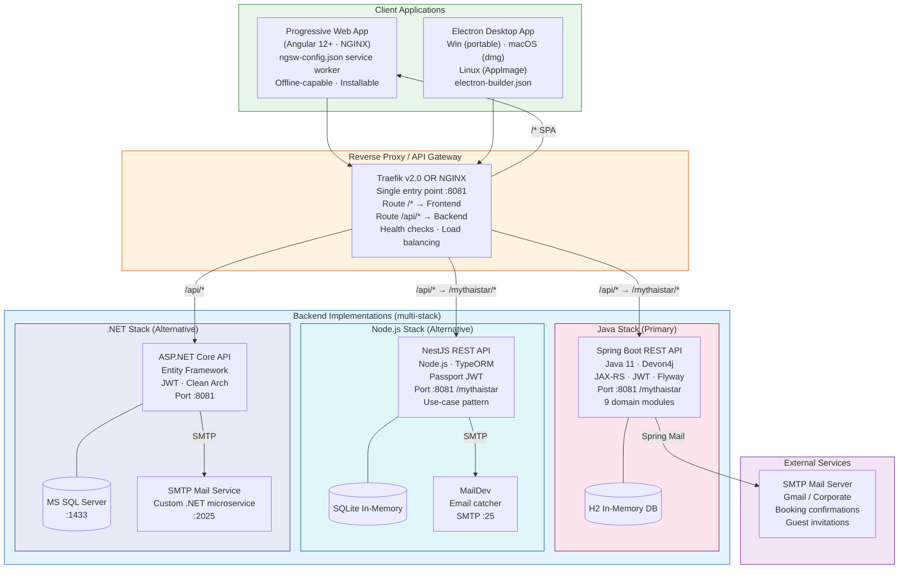
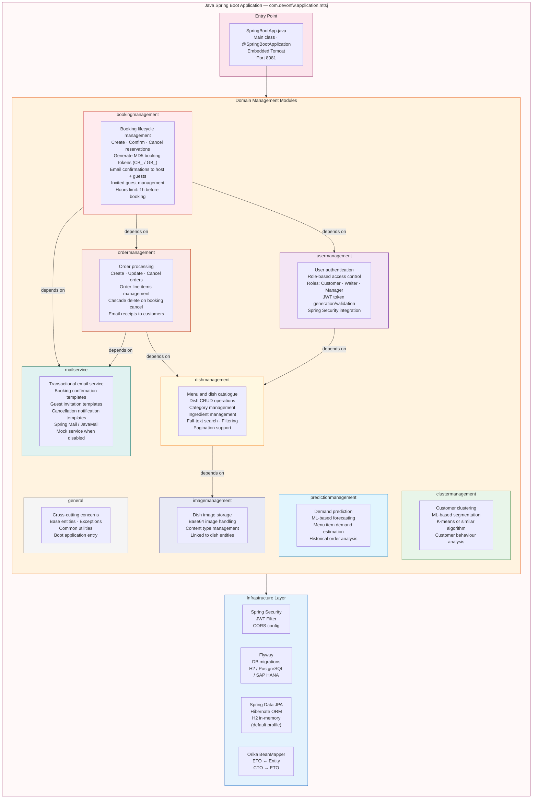
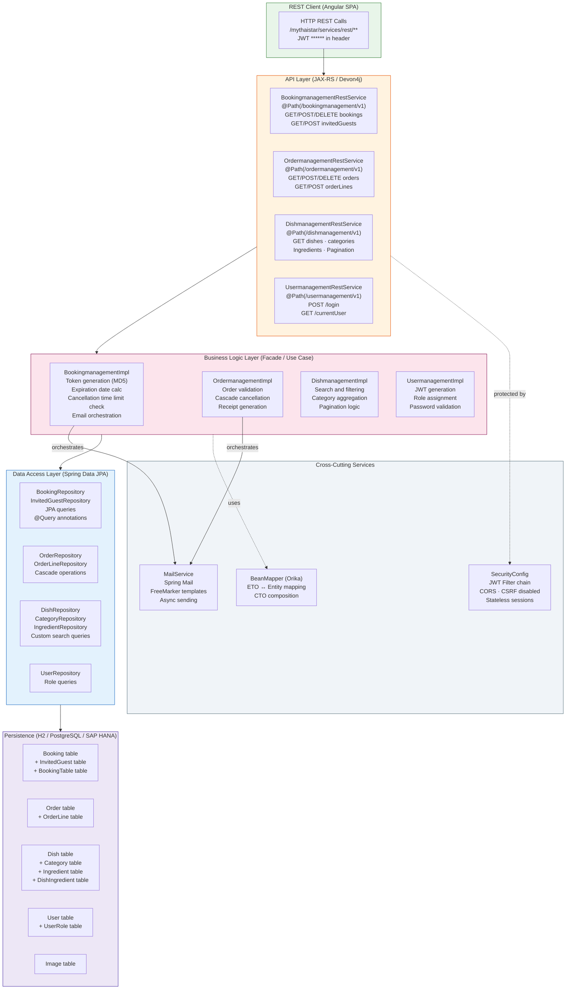
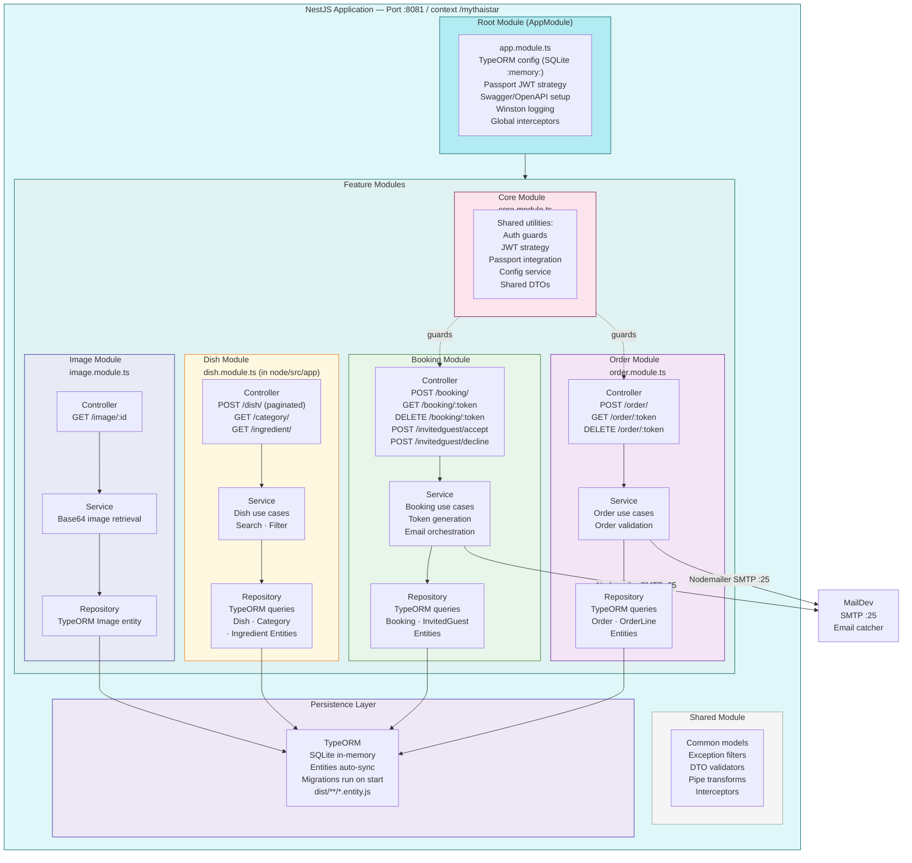
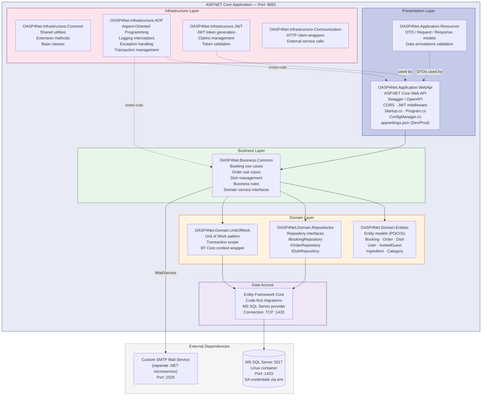
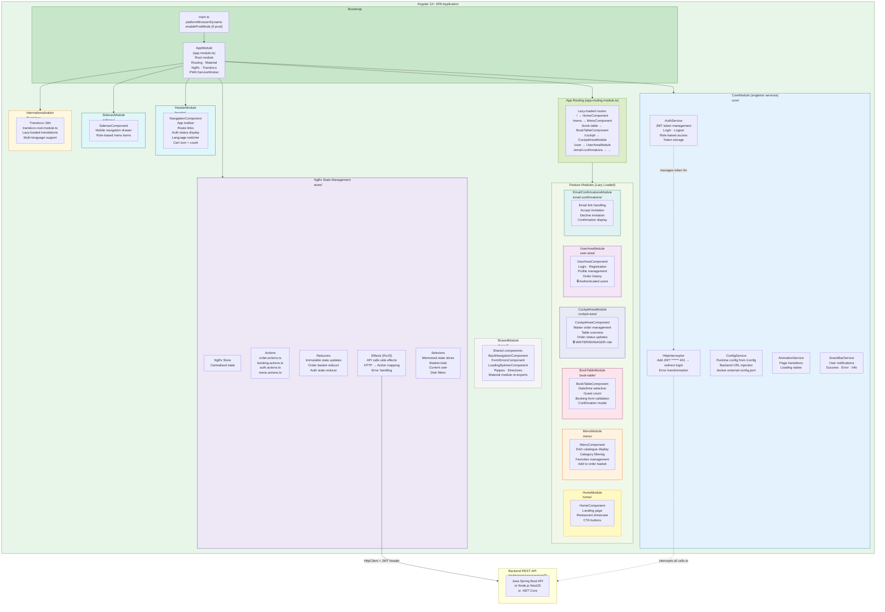
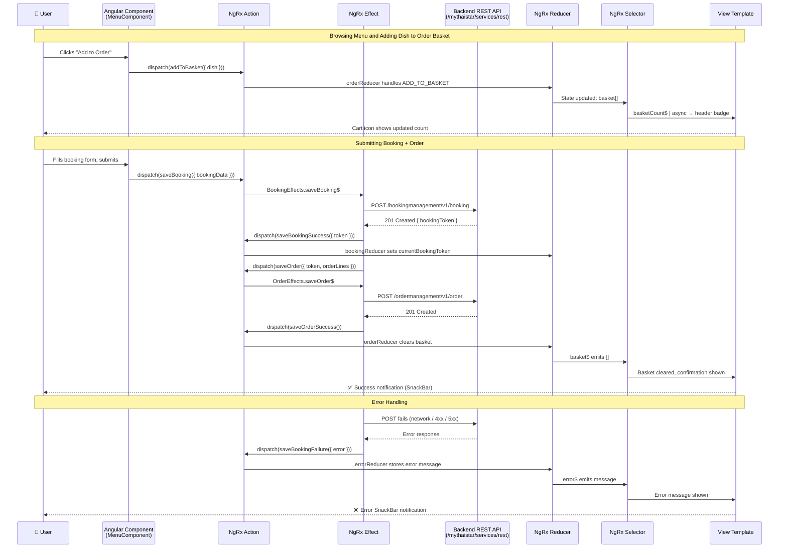
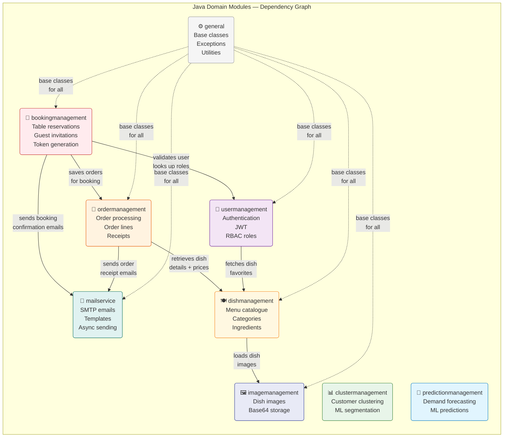
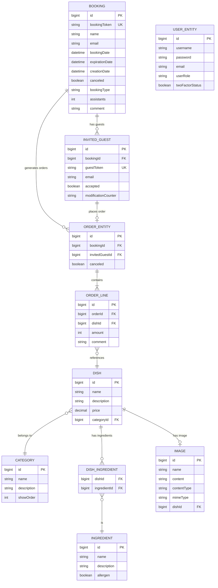
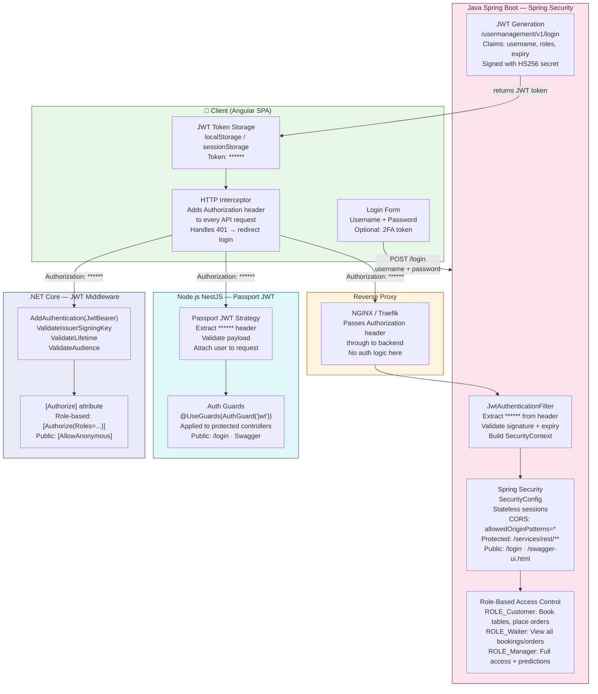

# My Thai Star — Component Architecture Diagrams

> **Generated by**: architecture-analyzer  
> **Source**: Live analysis of `java/mtsj/architecture.json`, `java/mtsj/core/src/main/java/com/devonfw/application/mtsj/`, `node/src/app/`, `net/netcore/`, `angular/src/app/`, `angular/src/app/store/`, `angular/src/app/core/`  
> **Application**: My Thai Star v3.2.0-SNAPSHOT

---

## 1. High-Level System Component Overview

---

## 2. Java Spring Boot — Domain Module Architecture

Derived directly from `java/mtsj/architecture.json` and `java/mtsj/core/src/main/java/com/devonfw/application/mtsj/`.

---

## 3. Java Spring Boot — Layered Architecture Detail

Shows the Devon4j layered architecture within each module (Service → Logic → DataAccess).

---

## 4. Node.js NestJS — Module Architecture

Derived from `node/src/app/` directory structure.

---

## 5. .NET Core — Clean Architecture Layers

Derived from `net/netcore/` project structure (`My Thai Star.sln`).

---

## 6. Angular Frontend — Module & State Architecture

Derived from `angular/src/app/` directory structure and `angular/src/app/store/`.

---

## 7. NgRx State Flow — Order & Booking

Shows the Redux-pattern data flow for order management in the Angular frontend.

---

## 8. Java Domain Module Dependency Graph

Derived from `java/mtsj/architecture.json`.

---

## 9. Data Model Summary

Shows the core entity relationships across all backend implementations.

---

## 10. Security Architecture

Shows JWT authentication and role-based access control across all stacks.

---

## Component Summary Table

### Java Spring Boot Modules

| Module | Responsibility | Key Dependencies | REST Base Path |
|---|---|---|---|
| `bookingmanagement` | Table reservations, guest invitations, token generation | ordermanagement, usermanagement, mailservice | `/bookingmanagement/v1` |
| `ordermanagement` | Order processing, order lines, cascade cancel | dishmanagement, mailservice | `/ordermanagement/v1` |
| `dishmanagement` | Menu catalogue, categories, ingredients, search | imagemanagement | `/dishmanagement/v1` |
| `usermanagement` | Authentication, JWT, RBAC roles | dishmanagement | `/usermanagement/v1` |
| `imagemanagement` | Dish image storage and retrieval | — | `/imagemanagement/v1` |
| `mailservice` | Transactional email (Spring Mail) | — | Internal service only |
| `clustermanagement` | Customer ML clustering/segmentation | — | `/clustermanagement/v1` |
| `predictionmanagement` | ML-based demand forecasting | — | `/predictionmanagement/v1` |
| `general` | Base classes, exceptions, Spring Boot app entry | — | — |

### Angular Feature Modules

| Module | Route | Role Access | Key Components |
|---|---|---|---|
| `HomeModule` | `/` | Public | `HomeComponent` |
| `MenuModule` | `/menu` | Public | `MenuComponent`, dish cards, filters |
| `BookTableModule` | `/book-table` | Public | Booking form, date picker |
| `CockpitAreaModule` | `/cockpit` | Waiter, Manager | Order management dashboard |
| `UserAreaModule` | `/user` | Authenticated | Profile, order history |
| `EmailConfirmationsModule` | `/email-confirmations` | Public (token-based) | Accept/decline invitation |
| `CoreModule` | — | Singleton | AuthService, ConfigService, Interceptors |
| `SharedModule` | — | Re-exported | Material, shared components, pipes |
