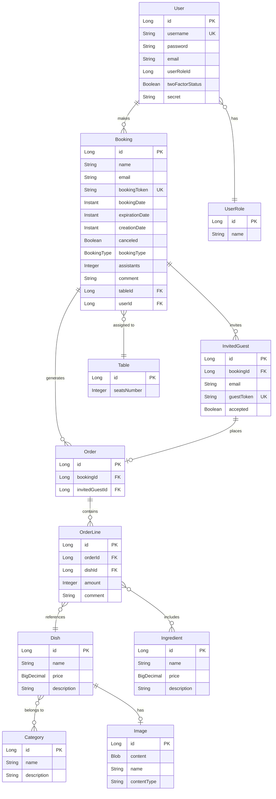

# My Thai Star — Comprehensive Source Code Documentation

> **Generated by Code Documentor Agent**
> Full-stack restaurant management reference application analysis covering Angular frontend, Java Spring Boot backend, and Node.js NestJS backend.

---

## Table of Contents

1. [Application Overview](#1-application-overview)
2. [Architecture](#2-architecture)
3. [Domain Model](#3-domain-model)
4. [Business Rules](#4-business-rules)
5. [API Documentation](#5-api-documentation)
6. [Backend — Java (Devon4j/Spring Boot)](#6-backend--java-devon4jspring-boot)
7. [Backend — Node.js (NestJS)](#7-backend--nodejs-nestjs)
8. [Frontend — Angular](#8-frontend--angular)
9. [Security Model](#9-security-model)
10. [Analytics Features](#10-analytics-features)
11. [Design Patterns](#11-design-patterns)
12. [Configuration](#12-configuration)

---

## 1. Application Overview

**My Thai Star** is a full-stack reference application built by the devonfw (Devon4j) community demonstrating enterprise application development best practices for a fictional Thai restaurant management system.

### Purpose

The application showcases how to build a production-grade restaurant management system with:
- Online table reservations and group event management
- Interactive menu browsing and ordering
- Staff management cockpit for waiters and managers
- JWT-based authentication with optional TOTP two-factor authentication
- ML-driven demand prediction (SAP HANA PAL ARIMA)
- Geo-spatial customer clustering analytics

### Technical Stack

| Layer | Technology |
|---|---|
| Frontend | Angular 11+, NgRx, Angular Material, Transloco, PWA/Service Worker |
| Backend (Java) | Devon4j, Spring Boot 2.4.4, JAX-RS, Spring Security, Hibernate JPA |
| Backend (Node.js) | NestJS, TypeORM, Passport JWT, Swagger/OpenAPI |
| Database | H2 (dev), SAP HANA (production) |
| Build | Maven (Java), npm/Yarn (Angular/Node.js) |
| Containerization | Docker Compose, Kubernetes (k8s.yml) |

---

## 2. Architecture

### Overall Architecture

The application follows a **layered architecture** pattern across all backends:

```
┌──────────────────────────────────────────────────────────┐
│                     Angular Frontend                       │
│  (NgRx Store · Components · Services · HTTP Interceptors) │
└─────────────────────────┬────────────────────────────────┘
                          │ REST/JSON
           ┌──────────────┴───────────────┐
           │                              │
┌──────────▼──────────┐    ┌─────────────▼────────────┐
│   Java Backend       │    │   Node.js Backend         │
│  (Spring Boot)       │    │   (NestJS)                │
│                      │    │                            │
│  REST Service Layer  │    │  Controller Layer          │
│  Business Logic      │    │  Service / Use-Case Layer  │
│  Data Access Layer   │    │  Repository Layer          │
└──────────┬───────────┘    └─────────────┬─────────────┘
           │                              │
┌──────────▼──────────────────────────────▼─────────────┐
│                     Database (H2 / SAP HANA)            │
└────────────────────────────────────────────────────────┘
```

### Java Backend Package Structure

```
com.devonfw.application.mtsj/
├── bookingmanagement/      # Reservation lifecycle
│   ├── common/api/         # Domain interfaces and Transfer Objects (ETO/CTO)
│   ├── dataaccess/api/     # JPA entities and repositories
│   ├── logic/api/          # Business logic interfaces
│   ├── logic/impl/         # Business logic implementations
│   └── service/impl/rest/  # JAX-RS REST endpoints
├── ordermanagement/        # Order processing
├── dishmanagement/         # Menu/dish catalog
├── usermanagement/         # User accounts and roles
├── predictionmanagement/   # ML demand forecasting
├── clustermanagement/      # Customer geo-clustering
├── imagemanagement/        # Dish image management
├── mailservice/            # Email notification abstraction
└── general/                # Cross-cutting: security, base entities, config
```

### Node.js Backend Package Structure

```
node/src/app/
├── booking/
│   ├── controllers/        # REST endpoints
│   ├── services/           # Service facade
│   │   └── use-cases/      # Individual business use cases
│   ├── repositories/       # TypeORM repositories
│   └── model/              # DTOs, entities, interfaces
├── order/
├── dish/
├── image/
├── core/                   # Auth, JWT, guards, user management
└── shared/                 # Base entities, filters, validators, logging
```

### Angular Frontend Module Structure

```
angular/src/app/
├── book-table/             # Reservation/invitation forms + NgRx store
├── menu/                   # Dish browsing, filtering, cart add
├── sidenav/                # Order cart (side panel) + submission
├── cockpit-area/           # Waiter/Manager management views
│   ├── order-cockpit/      # Order management table
│   ├── reservation-cockpit/# Booking management table
│   ├── prediction-cockpit/ # Demand forecast panel
│   └── clustering-cockpit/ # Geo-clustering panel
├── user-area/              # Login, registration, 2FA, profile
├── header/                 # Navigation, auth badge
├── email-confirmations/    # Email action handler (accept/decline/cancel)
├── core/                   # Auth guards, interceptors, config
└── shared/                 # Backend models, view models, shared module
```

---

## 3. Domain Model

### Entity Relationships



### BookingType Enum

| Value | Meaning | Token Prefix |
|---|---|---|
| `COMMON` (0) | Standard table reservation | `CB_` |
| `INVITED` (1) | Group event with guest invitations | `CB_` (host) / `GB_` (guest) |

---

## 4. Business Rules

### 4.1 Booking Rules

| Rule | Description |
|---|---|
| **Future date** | Booking date must be in the future |
| **Valid email** | Host email must follow format `text@text.xx` |
| **Min assistants** | Party size must be at least 1 (integer, max 99) |
| **Free table required** | COMMON bookings require an available table with sufficient seats |
| **Token generation** | `CB_` + `YYYYMMDD` + `_` + MD5(email + timestamp) |
| **Expiration** | Expiration date = booking date − 1 hour |
| **Default canceled** | New bookings always start with `canceled = false` |
| **COMMON + guests invalid** | A COMMON booking cannot include invited guests |

### 4.2 Invited Guest Rules

| Rule | Description |
|---|---|
| **Guest token** | Guest tokens prefixed with `GB_` + date + MD5(guestEmail + timestamp) |
| **Default not accepted** | New guests start with `accepted = false` |
| **Accept enables ordering** | Guests can only place orders after accepting the invitation |
| **Decline deletes orders** | When a guest declines, all their orders are cascade-deleted |
| **Host notified** | Host receives email whenever a guest accepts or declines |

### 4.3 Cancellation Rules

| Rule | Description |
|---|---|
| **Time window** | Booking cancellation allowed only before the expiration date (booking date − 1 hour) |
| **Order cancellation window** | Order cancellation allowed before `bookingDate − hoursLimit hours` (configurable) |
| **Cascade on cancellation** | Cancelling a booking cascades to delete all invited guests and their orders |
| **Notification** | Host and all guests receive cancellation emails |

### 4.4 Order Rules

| Rule | Description |
|---|---|
| **Valid token prefix** | Token must start with `CB_` or `GB_`; otherwise `WrongTokenException` |
| **Booking must exist** | `CB_` tokens require a valid booking; `NoBookingException` otherwise |
| **Guest must exist** | `GB_` tokens require a valid invited guest; `NoInviteException` otherwise |
| **Guest must accept** | Guest must have `accepted = true` to place an order |
| **One order per booking** | Each booking/guest can have exactly one order; `OrderAlreadyExistException` otherwise |
| **Pricing** | `line price = (dish.price + Σ extras.price) × amount` |
| **Email confirmation** | Order confirmation with itemized pricing sent after creation |

### 4.5 Menu/Dish Rules

| Rule | Description |
|---|---|
| **Category mapping** | Frontend category names map to server IDs (mainDishes=0 through favourites=8) |
| **Multi-category filter** | Dishes matching ANY selected category are included (OR logic) |
| **No duplicates** | Dishes matching multiple selected categories appear only once |
| **Base64 images** | Dish images are Base64-encoded in API responses |

### 4.6 User/Security Rules

| Rule | Description |
|---|---|
| **Unique username** | Usernames must be unique; `UserAlreadyExistsException` on conflict |
| **BCrypt passwords** | Passwords are always BCrypt-encoded before storage |
| **Default role** | `userRoleId = 0` if not specified during registration |
| **2FA TOTP** | Optional TOTP two-factor authentication using Base32 secret |
| **One-time secret** | TOTP secret is generated once and never regenerated |

---

## 5. API Documentation

### Java Backend REST Endpoints

**Base Path**: `/services/rest`

#### Booking Management (`/bookingmanagement/v1`)

| Method | Path | Description | Auth |
|---|---|---|---|
| `GET` | `/booking/{id}` | Get booking by ID | None |
| `POST` | `/booking` | Create new booking | None |
| `DELETE` | `/booking/{id}` | Delete booking | None |
| `POST` | `/booking/search` | Search bookings (paginated) | MANAGER/WAITER |
| `GET` | `/invitedguest/{id}` | Get invited guest | None |
| `POST` | `/invitedguest` | Save invited guest | None |
| `DELETE` | `/invitedguest/{id}` | Delete invited guest | None |
| `POST` | `/invitedguest/search` | Search invited guests | None |
| `GET` | `/invitedguest/accept/{token}` | Accept invitation | None |
| `GET` | `/invitedguest/decline/{token}` | Decline invitation | None |
| `GET` | `/booking/cancel/{token}` | Cancel booking | None |
| `GET` | `/table/{id}` | Get table by ID | None |
| `POST` | `/table/search` | Search tables | None |

#### Order Management (`/ordermanagement/v1`)

| Method | Path | Description | Auth |
|---|---|---|---|
| `GET` | `/order/{id}` | Get order by ID | None |
| `POST` | `/order` | Create order | None |
| `DELETE` | `/order/{id}` | Delete order | None |
| `GET` | `/order/cancelorder/{id}` | Cancel order | None |
| `POST` | `/order/search` | Search orders (paginated) | MANAGER/WAITER |
| `GET` | `/orderline/{id}` | Get order line | None |
| `POST` | `/orderline` | Save order line | None |
| `DELETE` | `/orderline/{id}` | Delete order line | None |
| `POST` | `/orderline/search` | Search order lines | None |
| `POST` | `/ordereddishes/history` | Get ordered dishes analytics | MANAGER |

#### Dish Management (`/dishmanagement/v1`)

| Method | Path | Description | Auth |
|---|---|---|---|
| `POST` | `/dish/search` | Search dishes with filters | None |
| `GET` | `/dish/{id}` | Get dish by ID | None |
| `POST` | `/category/search` | Search categories | None |
| `POST` | `/ingredient/search` | Search ingredients | None |

#### Authentication

| Method | Path | Description | Auth |
|---|---|---|---|
| `POST` | `/login` | Login (returns JWT) | None |
| `POST` | `/usermanagement/v1/user/register` | Register user | None |
| `GET` | `/usermanagement/v1/user/pairing/{username}` | Get 2FA QR code | Authenticated |
| `GET` | `/usermanagement/v1/user/twofactor/{username}` | Get 2FA status | Authenticated |
| `POST` | `/usermanagement/v1/user/twofactor` | Update 2FA status | Authenticated |

### Node.js Backend REST Endpoints

**Base Path**: `/services/rest`

| Method | Path | Description | Auth |
|---|---|---|---|
| `POST` | `/bookingmanagement/v1/booking` | Create booking | Optional |
| `POST` | `/bookingmanagement/v1/booking/search` | Search bookings | WAITER |
| `GET` | `/bookingmanagement/v1/invitedguest/accept/:token` | Accept invite | None |
| `GET` | `/bookingmanagement/v1/invitedguest/decline/:token` | Decline invite | None |
| `GET` | `/bookingmanagement/v1/booking/cancel/:token` | Cancel booking | None |
| `POST` | `/ordermanagement/v1/order` | Create order | None |
| `POST` | `/ordermanagement/v1/order/search` | Search orders | WAITER |
| `GET` | `/ordermanagement/v1/order/cancelorder/:id` | Cancel order | None |

---

## 6. Backend — Java (Devon4j/Spring Boot)

### Key Components

#### `BookingmanagementImpl`
**Location**: `core/.../bookingmanagement/logic/impl/BookingmanagementImpl.java`

The central service for all booking lifecycle operations. Uses MD5-based token generation with date+time+email as inputs, manages expiration dates, handles the full guest invitation workflow, and orchestrates email notifications.

**Key Methods**:

| Method | Purpose | Business Rule Enforced |
|---|---|---|
| `saveBooking()` | Create booking + guests | Token generation, expiration, email notification |
| `deleteBooking()` | Delete booking + cascade | Orders deleted first, then booking |
| `acceptInvite()` | Guest accepts | Sets accepted=true, notifies host |
| `declineInvite()` | Guest declines | Deletes orders, sets accepted=false, notifies host |
| `cancelInvite()` | Host cancels | Time window check, cascade delete, notify all |
| `buildToken()` | Generate MD5 token | Prefix + date + MD5(email+timestamp) |

#### `OrdermanagementImpl`
**Location**: `core/.../ordermanagement/logic/impl/OrdermanagementImpl.java`

Handles order creation with full validation pipeline and analytics. Validates token format and type, checks booking/guest existence and acceptance, prevents duplicates, calculates prices, and sends confirmation emails.

**Key Configuration Properties**:

| Property | Purpose |
|---|---|
| `client.port` | Client URL for email links |
| `server.servlet.context-path` | Server context path |
| `mythaistar.hourslimitcancellation` | Hours before booking that cancellation is no longer allowed |

#### `DishmanagementImpl`
**Location**: `core/.../dishmanagement/logic/impl/DishmanagementImpl.java`

Manages the menu catalog. Notable: category filtering is applied post-query as Java-side filtering to support OR-logic multi-category matching. Images are Base64-encoded from BLOB storage.

#### `UsermanagementImpl`
**Location**: `core/.../usermanagement/logic/impl/UsermanagementImpl.java`

Provides user registration with uniqueness enforcement, password encoding, and TOTP 2FA setup. Role lookup is provided to Spring Security for authority resolution.

#### `PredictionmanagementImpl`
**Location**: `core/.../predictionmanagement/logic/impl/PredictionmanagementImpl.java`

SAP HANA PAL (Predictive Analytics Library) integration for dish demand forecasting. Uses Auto-ARIMA model training and 7-day forecasting with temperature and holiday covariates.

#### `ClustermanagementImpl`
**Location**: `core/.../clustermanagement/logic/impl/ClustermanagementImpl.java`

Executes k-means geo-spatial customer clustering via a JPA named query targeting SAP HANA's clustering capabilities.

### Data Transfer Object (DTO) Pattern

The Java backend uses a clear DTO hierarchy:

- **`ETO` (Entity Transfer Object)**: Flat representation of a single entity
- **`CTO` (Composite Transfer Object)**: Aggregated view combining multiple ETOs

Example:
```
BookingCto {
  BookingEto booking        // The booking itself
  TableEto table            // Associated table
  OrderEto order            // Associated order
  UserEto user              // Associated user
  List<InvitedGuestEto>     // Guest list
  List<OrderEto> orders     // All orders
}
```

---

## 7. Backend — Node.js (NestJS)

### Use-Case Pattern

The NestJS backend implements business logic through dedicated **Use Case** classes, one per business operation:

| Use Case | Responsibility |
|---|---|
| `CreateBookingUseCase` | Transactional booking creation with table assignment |
| `CancelBookingUseCase` | Booking cancellation with time-window validation |
| `UpdateInvitedGuestUseCase` | Accept/decline invitation status update |
| `GetTableUseCase` | Find free table for given date and party size |
| `BookingMailerUseCase` | All booking-related email notifications |
| `CreateOrderUseCase` | Order creation with token validation and pricing |
| `DeleteOrderUseCase` | Order and order-line cascade deletion |
| `OrderMailerUseCase` | Order confirmation email |

### Key Business Logic in Node.js

#### Booking Creation (`CreateBookingUseCase`)

```typescript
// COMMON booking: auto-assign free table
if (bookingType === COMMON) {
  const tableId = await getTableUc.getFreeTable(bookingDate, assistants);
  if (!tableId) throw new NoFreeTablesException();
  booking.tableId = tableId;
}

// INVITED booking: create guest records
if (bookingType === INVITED && invitedGuests) {
  booking.invitedGuests = await saveGuests(invitedGuests);
}
```

#### Order Creation (`CreateOrderUseCase`)

```typescript
// CB_ token: validate booking, check no duplicate order
if (token.startsWith('CB_')) {
  if (!booking) throw new InvalidTokenException();
  if (booking.orderId) throw new OrderAlreadyDoneException();
}

// GB_ token: validate guest, check acceptance, check no duplicate order  
if (token.startsWith('GB_')) {
  if (!guest) throw new InvalidTokenException();
  if (!guest.accepted) throw new GuestNotAcceptedException();
  if (guest.orderId) throw new OrderAlreadyDoneException();
}
```

#### Table Assignment (`GetTableUseCase`)

The table availability search window is `[bookingDate - 1 hour, bookingDate]`:
```typescript
const tables = await tableRepository.getFreeTable(
  date.add(-1, 'hour').toDate(), // window start
  bookingDate,                    // window end
  assistants                      // minimum seats
);
```

### Booking Token Generation (Node.js)

```typescript
// In Booking.create() static factory method
bookingToken: 'CB_' + now.format('YYYYMMDD') + '_' + md5(email + now.format('YYYYMMDDHHmmss'))
expirationDate: bookingDate.subtract(1, 'hour').toDate()
```

---

## 8. Frontend — Angular

### Module Structure and Responsibilities

| Module | Key Components | Key Services | State |
|---|---|---|---|
| `BookTableModule` | BookTableComponent | BookTableService | BookTable NgRx store |
| `MenuModule` | MenuComponent, MenuFiltersComponent | MenuService | Menu NgRx store |
| `SidenavModule` | SidenavComponent | SidenavService, PriceCalculatorService | Order NgRx store |
| `WaiterCockpitModule` | OrderCockpitComponent, ReservationCockpitComponent | WaiterCockpitService | — |
| `UserAreaModule` | LoginDialogComponent, RegisterComponent | UserAreaService, AuthService | Auth NgRx store |
| `EmailConfirmationModule` | EmailConfirmationsComponent | — | — |

### Routing

| Route | Component | Guard |
|---|---|---|
| `/restaurant` | HomeComponent | None |
| `/menu` | MenuComponent | None |
| `/bookTable` | BookTableComponent | None |
| `/booking/:action/:token` | EmailConfirmationsComponent | None |
| `/orders` | OrderCockpitComponent | AuthGuardService |
| `/reservations` | ReservationCockpitComponent | AuthGuardService |
| `/prediction` | NotSupportedComponent | AuthGuardService |
| `/clustering` | NotSupportedComponent | AuthGuardService |

### NgRx State Management

The application uses NgRx for global state management:

```
App State
├── auth/            # User login state (isLogged, role, username, token)
├── order/           # Shopping cart orders list
├── bookTable/       # Booking form state
└── router/          # Router state (connected via StoreRouterConnectingModule)
```

### Pricing Service (Frontend)

```typescript
// PriceCalculatorService
getPrice(order: OrderView): number {
  const extrasPrice = order.extras.reduce((sum, e) => sum + e.price, 0);
  return (order.dish.price + extrasPrice) * order.orderLine.amount;
}

getTotalPrice(orders: OrderView[]): number {
  return orders.reduce((sum, o) => sum + this.getPrice(o), 0);
}
```

### Menu Category Mapping

```typescript
const categoryNameToServerId = {
  mainDishes: 0,
  starters:   1,
  desserts:   2,
  noodle:     3,
  rice:       4,
  curry:      5,
  vegan:      6,
  vegetarian: 7,
  favourites: 8,
};
```

### Booking Type Composition

```typescript
// BookTableService.composeBooking()
// type=0: Common reservation with assistants count
// type=1: Group invitation with guest email list
composeBooking(invitationData, type: number): Booking {
  const booking = { booking: { ...invitationData, bookingType: type } };
  if (type === 1) {
    booking.invitedGuests = invitationData.invitedGuests.map(email => ({ email }));
  } else {
    booking.booking.assistants = invitationData.assistants;
  }
  return booking;
}
```

---

## 9. Security Model

### Authentication

- **Java Backend**: Spring Security with username/password login, JWT token issued on success
- **Node.js Backend**: Passport.js with JWT strategy, `@UseGuards(AuthGuard(), RolesGuard)` on protected endpoints
- **Frontend**: JWT token stored in NgRx auth store; sent as ****** in Authorization header via HTTP interceptor

### Two-Factor Authentication (2FA)

```
User enables 2FA
    → Backend generates Base32 TOTP secret (stored per user)
    → QR code URI generated from secret
    → User scans with Google Authenticator / Authy
    → On login: username + password + TOTP code required
```

### Role-Based Access Control (RBAC)

| Role | Find Orders | Find Bookings | Demand Prediction | Geo Clustering |
|---|---|---|---|---|
| `ROLE_Customer` | ✅ | ✅ | ❌ | ❌ |
| `ROLE_Waiter` | ✅ | ✅ | ❌ | ❌ |
| `ROLE_Manager` | ✅ | ✅ | ✅ | ✅ |

### Permission Naming Convention

All permissions follow the pattern: `mts.<Action><Entity>`

Examples:
- `mts.FindOrder`, `mts.SaveOrder`, `mts.DeleteOrder`
- `mts.FindBooking`, `mts.SaveBooking`, `mts.DeleteBooking`
- `mts.GetNextWeekPrediction`, `mts.GetGeoCluster`

---

## 10. Analytics Features

### Demand Prediction (Manager only)

The prediction feature uses **SAP HANA Predictive Analytics Library (PAL)** with an Auto-ARIMA time series model.

**Workflow**:
1. Manager provides: start date, temperature per day (°C), holiday flag per day
2. System trains ARIMA model per dish using `PAL_AUTOARIMA` stored procedure
3. Forecast generated using `PAL_ARIMA_FORECAST` stored procedure
4. Results show predicted dish demand per day for the next 7 days

**Business Value**: Helps the restaurant optimize ingredient purchasing, kitchen preparation, and staffing levels based on predicted customer demand considering weather and holidays.

### Customer Geo Clustering (Manager only)

Applies **k-means clustering** on booking geographic data to identify customer hotspots.

**Input**: Dish ID, date range, number of clusters (k)

**Output**: Cluster assignments for all bookings in the period, enabling geographic market analysis.

---

## 11. Design Patterns

| Pattern | Where Used | Purpose |
|---|---|---|
| **Layered Architecture** | Java & Node.js backends | Separation of REST, Business Logic, and Data Access |
| **Repository Pattern** | Spring Data JPA & TypeORM | Abstract data access, testability |
| **Use Case Pattern** | Node.js backend | Encapsulate single business workflows in dedicated classes |
| **Facade Pattern** | Java `AbstractComponentFacade` | Single entry point per business component |
| **DTO / Transfer Object** | Java ETO/CTO | API isolation from domain entities |
| **Factory Method** | `Booking.create()` (Node.js) | Encapsulate entity creation with computed fields |
| **Observer / Reactive** | Angular RxJS throughout | Async data streams, HTTP response handling |
| **Redux/Store (NgRx)** | Angular frontend | Centralized, predictable state management |
| **Token-Based Auth** | JWT in both backends | Stateless authentication |
| **RBAC** | Java & Node.js security | Role-based permission assignment |
| **Strategy Pattern** | Booking type routing (CB_/GB_) | Different processing paths per token type |
| **Chain of Responsibility** | Angular interceptors | HTTP header injection, error handling |

---

## 12. Configuration

### Java Backend Key Properties

| Property | Default | Description |
|---|---|---|
| `client.port` | 4200 | Angular dev server port (for email links) |
| `server.servlet.context-path` | `/services/rest` | Base REST path |
| `mythaistar.hourslimitcancellation` | `1` | Hours before booking that order cancellation is blocked |
| `spring.boot.version` | `2.4.4` | Spring Boot version |
| `devon4j.version` | `2021.04.002` | Devon4j framework version |

### Java Maven Modules

| Module | Artifact | Description |
|---|---|---|
| `api` | `mtsj-api` | Business interfaces, Transfer Objects, REST service contracts |
| `core` | `mtsj-core` | Business logic implementations, data access, entities |
| `server` | `mtsj-server` | Spring Boot application packaging and configuration |

### Angular Environment Configuration

The frontend uses `ConfigService` to resolve `restServiceRoot$` and `restPathRoot$` observables, allowing runtime configuration of backend URLs without rebuilding the application.

---

## Summary

**My Thai Star** is a comprehensive reference application demonstrating:

1. **Clean Architecture**: Strict layering with clear separation of concerns across all backends
2. **Dual Backend Strategy**: Identical business capabilities implemented in both Java/Spring Boot and Node.js/NestJS, serving as alternative reference implementations
3. **Rich Business Logic**: Complete reservation management lifecycle including time-windowed cancellation, guest invitation workflows, email notifications, and one-order-per-booking enforcement
4. **Enterprise Security**: JWT authentication, RBAC with granular permissions, optional TOTP 2FA
5. **Analytics**: ML-based demand prediction and geographic clustering for management insights
6. **Modern Frontend**: Angular PWA with NgRx state management, reactive HTTP, and Material Design

The token-based booking system (CB_/GB_ prefix routing) is the architectural cornerstone that links the frontend, REST API, and all backend business rule enforcement together.
