# My Thai Star — Comprehensive UML Diagrams

> Generated by **uml-generator** agent from live source analysis.
> All diagrams use **Mermaid** format and are embedded for direct rendering.

---

## Table of Contents

1. [Class Diagrams](#1-class-diagrams)
   - 1.1 [JPA Entity Model](#11-jpa-entity-model)
   - 1.2 [Service & Facade Layer (Java)](#12-service--facade-layer-java)
   - 1.3 [Repository Layer](#13-repository-layer)
   - 1.4 [Transfer Objects (ETO / CTO)](#14-transfer-objects-eto--cto)
   - 1.5 [NestJS Domain Model](#15-nestjs-domain-model)
2. [Sequence Diagrams](#2-sequence-diagrams)
   - 2.1 [Booking Creation Flow](#21-booking-creation-flow)
   - 2.2 [Order Placement Flow](#22-order-placement-flow)
   - 2.3 [User Authentication Flow (JWT)](#23-user-authentication-flow-jwt)
3. [Use Case Diagram](#3-use-case-diagram)
4. [Component Diagrams](#4-component-diagrams)
   - 4.1 [Angular Module Hierarchy](#41-angular-module-hierarchy)
   - 4.2 [Java Back-end Component Diagram](#42-java-back-end-component-diagram)
   - 4.3 [NestJS Component Diagram](#43-nestjs-component-diagram)

---

## 1. Class Diagrams

### 1.1 JPA Entity Model

This diagram shows **all JPA entities** with their fields, JPA relationship annotations, and
the abstract base class they extend.

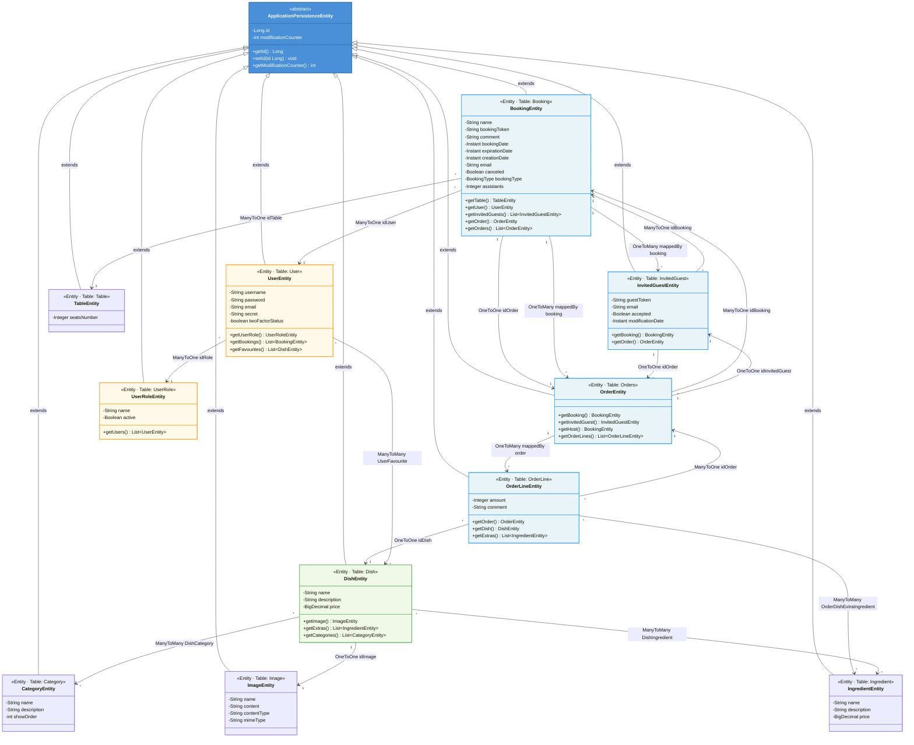

---

### 1.2 Service & Facade Layer (Java)

This diagram shows the **logic/facade classes**, their interfaces, and cross-domain dependencies as
found in `BookingmanagementImpl`, `OrdermanagementImpl`, `DishmanagementImpl`, and `UsermanagementImpl`.

```mermaid
classDiagram
    direction LR

    class AbstractComponentFacade {
        <<abstract>>
        #getBeanMapper() BeanMapper
    }

    class Bookingmanagement {
        <<interface>>
        +findBooking(id Long) BookingCto
        +findBookingByToken(token String) BookingCto
        +findBookingsByPost(criteria) Page~BookingCto~
        +saveBooking(booking BookingCto) BookingEto
        +deleteBooking(bookingId Long) boolean
        +findInvitedGuest(id Long) InvitedGuestEto
        +saveInvitedGuest(eto) InvitedGuestEto
        +deleteInvitedGuest(id Long) boolean
        +findInvitedGuestEtos(criteria) Page~InvitedGuestEto~
        +findTable(id Long) TableEto
        +buildToken(email String, type String) String
    }

    class BookingmanagementImpl {
        <<Named · Transactional>>
        -BookingRepository bookingDao
        -InvitedGuestRepository invitedGuestDao
        -TableRepository tableDao
        -Ordermanagement orderManagement
        -Mail mailService
        -int clientPort
        -int hoursLimit
        +saveBooking(booking BookingCto) BookingEto
        +deleteBooking(bookingId Long) boolean
        +buildToken(email, type) String
        -sendConfirmationEmails(entity) void
    }

    class Ordermanagement {
        <<interface>>
        +findOrder(id Long) OrderCto
        +findOrdersByPost(criteria) Page~OrderCto~
        +findOrdersByBookingToken(token) List~OrderCto~
        +findOrders(idBooking Long) List~OrderCto~
        +saveOrder(order OrderCto) OrderEto
        +deleteOrder(orderId Long) boolean
        +findOrderLine(id Long) OrderLineEto
        +saveOrderLine(eto) OrderLineEto
        +deleteOrderLine(id Long) boolean
    }

    class OrdermanagementImpl {
        <<Named · Transactional>>
        -OrderRepository orderDao
        -OrderLineRepository orderLineDao
        -OrderedDishesPerDayRepository orderedDishesPerDayDao
        -OrderedDishesPerMonthRepository orderedDishesPerMonthDao
        -Bookingmanagement bookingManagement
        -Dishmanagement dishManagement
        -Mail mailService
        +saveOrder(order OrderCto) OrderEto
        +deleteOrder(orderId Long) boolean
        -getValidatedOrder(token, entity) OrderEntity
        -sendOrderConfirmationEmail(token, entity) void
        -processOrders(ctos, order) void
    }

    class Dishmanagement {
        <<interface>>
        +findDish(id Long) DishCto
        +findDishesByPost(criteria) Page~DishCto~
        +saveDish(eto DishEto) DishEto
        +findCategory(id Long) CategoryEto
        +findCategoriesByPost(criteria) Page~CategoryEto~
        +findIngredient(id Long) IngredientEto
        +findIngredientsByPost(criteria) Page~IngredientEto~
    }

    class DishmanagementImpl {
        <<Named · Transactional>>
        -CategoryRepository categoryDao
        -DishRepository dishDao
        -IngredientRepository ingredientDao
        +findDishCtos(criteria) Page~DishCto~
        +saveDish(eto DishEto) DishEto
    }

    class Usermanagement {
        <<interface>>
        +findUser(id Long) UserEto
        +getUserStatus(username) UserEto
        +saveUser(eto UserEto) UserEto
        +deleteUser(id Long) boolean
        +generateUserQrCode(username) UserQrCodeTo
        +changeUserPassword(eto) void
    }

    class UsermanagementImpl {
        <<Named · Transactional>>
        -UserRepository userDao
        -UserRoleRepository userRoleDao
        -PasswordEncoder passwordEncoder
        +generateUserQrCode(username) UserQrCodeTo
        +getUserStatus(username) UserEto
        -initializeSecret(user) void
    }

    class Mail {
        <<interface>>
        +sendMail(to, subject, body) void
    }

    %% Inheritance
    AbstractComponentFacade <|-- BookingmanagementImpl : extends
    AbstractComponentFacade <|-- OrdermanagementImpl : extends
    AbstractComponentFacade <|-- DishmanagementImpl : extends
    AbstractComponentFacade <|-- UsermanagementImpl : extends

    %% Interface realizations
    Bookingmanagement <|.. BookingmanagementImpl : implements
    Ordermanagement <|.. OrdermanagementImpl : implements
    Dishmanagement <|.. DishmanagementImpl : implements
    Usermanagement <|.. UsermanagementImpl : implements

    %% Cross-domain dependencies
    BookingmanagementImpl --> Ordermanagement : Inject orderManagement
    BookingmanagementImpl --> Mail : Inject mailService
    OrdermanagementImpl --> Bookingmanagement : Inject bookingManagement
    OrdermanagementImpl --> Dishmanagement : Inject dishManagement
    OrdermanagementImpl --> Mail : Inject mailService

    style Bookingmanagement fill:#2196F3,color:#fff,stroke:#1565C0
    style Ordermanagement fill:#2196F3,color:#fff,stroke:#1565C0
    style Dishmanagement fill:#4CAF50,color:#fff,stroke:#2E7D32
    style Usermanagement fill:#FF9800,color:#fff,stroke:#E65100
    style BookingmanagementImpl fill:#bbdefb,stroke:#1565C0
    style OrdermanagementImpl fill:#bbdefb,stroke:#1565C0
    style DishmanagementImpl fill:#c8e6c9,stroke:#2E7D32
    style UsermanagementImpl fill:#fff3e0,stroke:#E65100
    style AbstractComponentFacade fill:#4a90d9,color:#fff,stroke:#2c6fad
```

---

### 1.3 Repository Layer

Shows all **Spring Data JPA repositories** with key custom query methods.

```mermaid
classDiagram
    direction TB

    class DefaultRepository {
        <<interface · devonfw>>
        +find(id Long) T
        +save(entity T) T
        +delete(entity T) void
        +deleteById(id Long) void
    }

    class BookingRepository {
        <<interface>>
        +findBookingByToken(token String) BookingEntity
        +findBookings(criteria BookingSearchCriteriaTo) Page~BookingEntity~
    }

    class InvitedGuestRepository {
        <<interface>>
        +findInvitedGuestByToken(token String) InvitedGuestEntity
        +findInvitedGuestByBooking(bookingId Long) List~InvitedGuestEntity~
        +findInvitedGuests(criteria) Page~InvitedGuestEntity~
    }

    class TableRepository {
        <<interface>>
        +findTables(criteria TableSearchCriteriaTo) Page~TableEntity~
    }

    class OrderRepository {
        <<interface>>
        +findOrders(criteria OrderSearchCriteriaTo) Page~OrderEntity~
        +findOrders(idBooking Long) List~OrderEntity~
        +findOrdersByBookingToken(token String) List~OrderEntity~
        +findOrdersByInvitedGuest(id Long) List~OrderEntity~
    }

    class OrderLineRepository {
        <<interface>>
        +findOrderLines(orderId Long) List~OrderLineEntity~
        +findOrderLines(criteria) Page~OrderLineEntity~
    }

    class OrderedDishesPerDayRepository {
        <<interface>>
        +findOrderedDishes(criteria) Page~OrderedDishesPerDayEntity~
    }

    class OrderedDishesPerMonthRepository {
        <<interface>>
        +findOrderedDishes(criteria) Page~OrderedDishesPerMonthEntity~
    }

    class DishRepository {
        <<interface>>
        +findDishes(criteria DishSearchCriteriaTo) Page~DishEntity~
    }

    class CategoryRepository {
        <<interface>>
        +findCategories(criteria) Page~CategoryEntity~
    }

    class IngredientRepository {
        <<interface>>
        +findIngredients(criteria) Page~IngredientEntity~
    }

    class UserRepository {
        <<interface>>
        +findByUsername(username String) UserEntity
        +findUsers(criteria UserSearchCriteriaTo) Page~UserEntity~
    }

    class UserRoleRepository {
        <<interface>>
        +findUserRoles(criteria) Page~UserRoleEntity~
    }

    DefaultRepository <|-- BookingRepository : extends
    DefaultRepository <|-- InvitedGuestRepository : extends
    DefaultRepository <|-- TableRepository : extends
    DefaultRepository <|-- OrderRepository : extends
    DefaultRepository <|-- OrderLineRepository : extends
    DefaultRepository <|-- OrderedDishesPerDayRepository : extends
    DefaultRepository <|-- OrderedDishesPerMonthRepository : extends
    DefaultRepository <|-- DishRepository : extends
    DefaultRepository <|-- CategoryRepository : extends
    DefaultRepository <|-- IngredientRepository : extends
    DefaultRepository <|-- UserRepository : extends
    DefaultRepository <|-- UserRoleRepository : extends

    style DefaultRepository fill:#607D8B,color:#fff,stroke:#37474F
    style BookingRepository fill:#bbdefb,stroke:#1565C0
    style InvitedGuestRepository fill:#bbdefb,stroke:#1565C0
    style TableRepository fill:#bbdefb,stroke:#1565C0
    style OrderRepository fill:#bbdefb,stroke:#1565C0
    style OrderLineRepository fill:#bbdefb,stroke:#1565C0
    style DishRepository fill:#c8e6c9,stroke:#2E7D32
    style CategoryRepository fill:#c8e6c9,stroke:#2E7D32
    style IngredientRepository fill:#c8e6c9,stroke:#2E7D32
    style UserRepository fill:#fff3e0,stroke:#E65100
    style UserRoleRepository fill:#fff3e0,stroke:#E65100
```

---

### 1.4 Transfer Objects (ETO / CTO)

Composite Transfer Objects (CTO) wrap one or more Entity Transfer Objects (ETO).

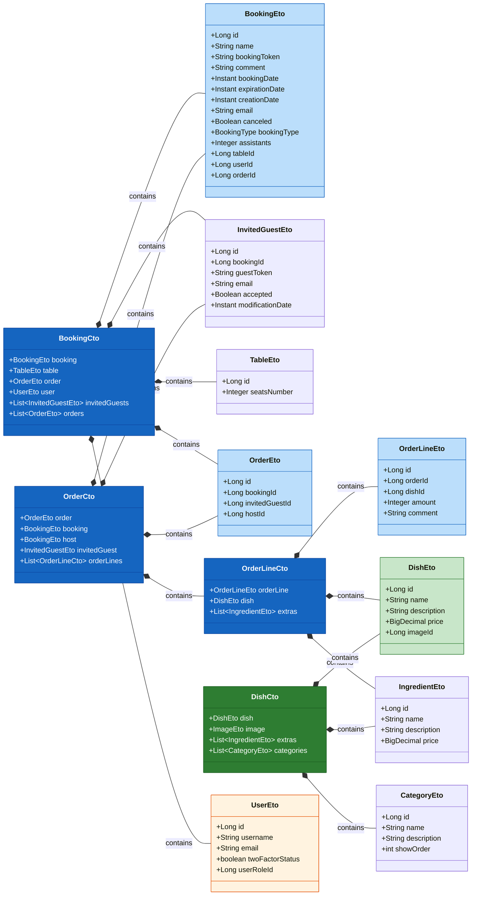

---

### 1.5 NestJS Domain Model

Node.js / NestJS backend entities, services, and use-cases.

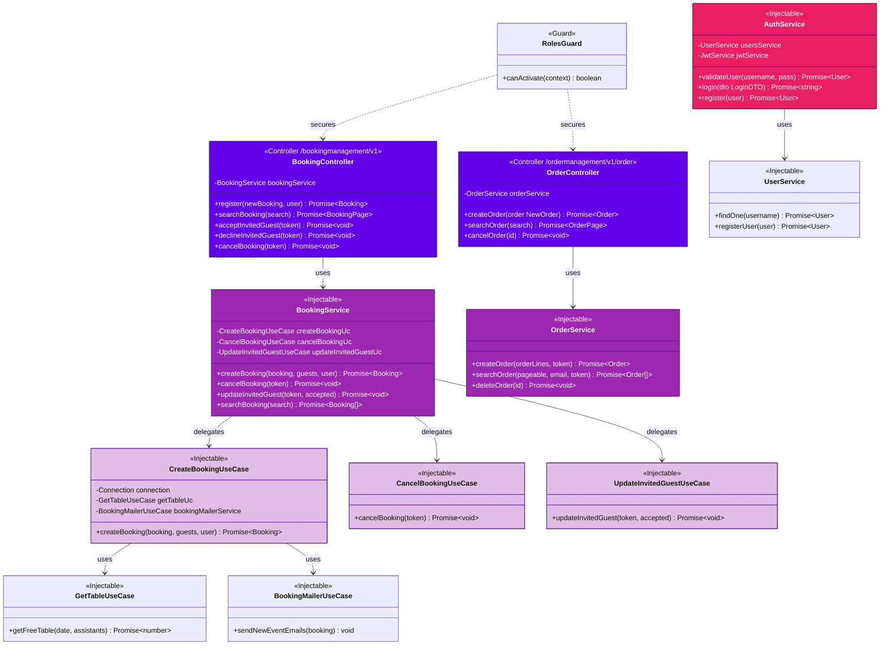

---

## 2. Sequence Diagrams

### 2.1 Booking Creation Flow

Complete flow from Angular UI through REST service, Business Facade, Repository, to Email notification.
Shows both **common booking** (single party) and **invited booking** (with guests) paths.

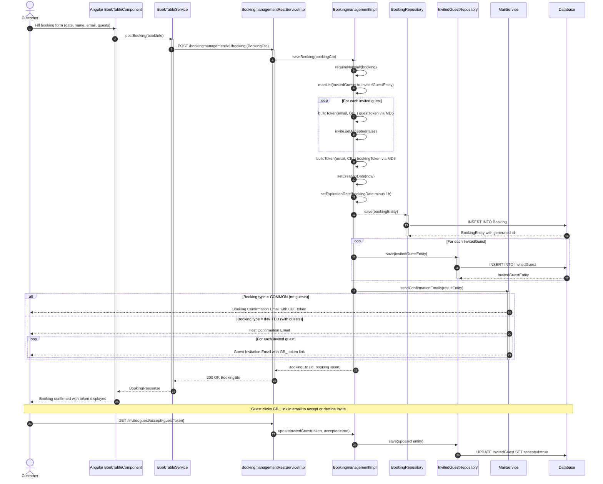

---

### 2.2 Order Placement Flow

Flow from selecting dishes on the menu to submitting an order via booking token.

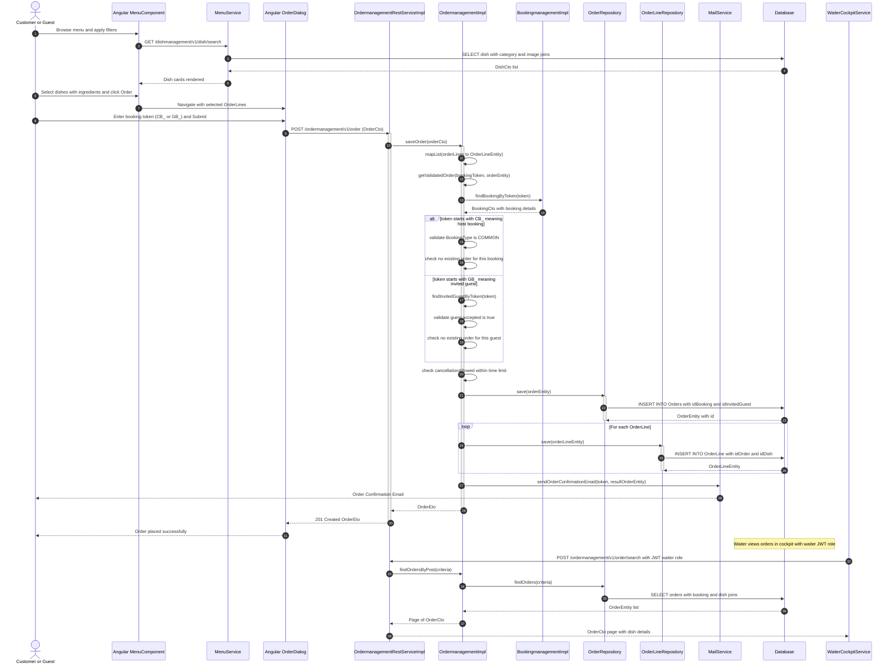

---

### 2.3 User Authentication Flow (JWT)

Shows the login, JWT issuance, and secured request lifecycle across both Java and NestJS backends.

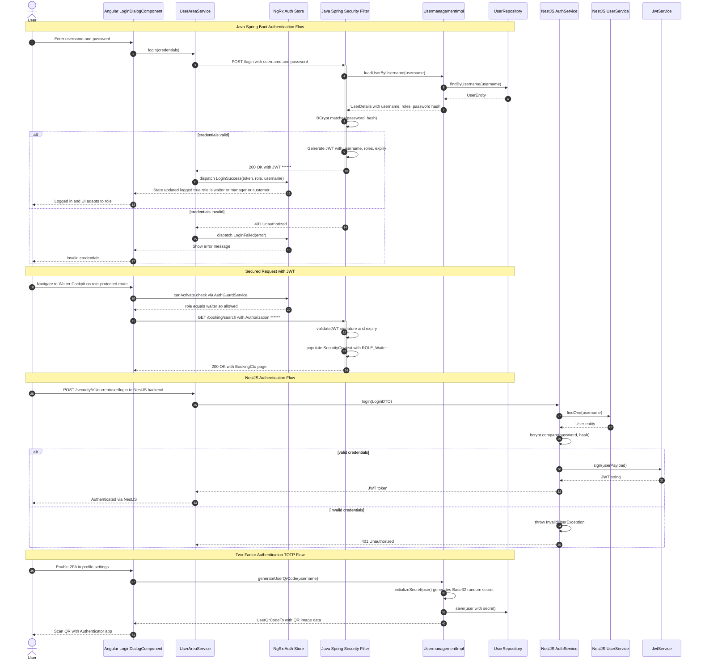

---

## 3. Use Case Diagram

All roles, actors, and their interactions with the My Thai Star system.

```mermaid
graph TB
    Guest([Guest or Customer])
    Waiter([Waiter])
    Manager([Manager])
    Admin([Admin])
    EmailSys([Email System])
    ExtAuth([Auth Provider JWT])

    subgraph MTS ["My Thai Star Restaurant System"]

        subgraph MenuMgmt ["Menu Browsing"]
            UC_Browse[Browse Menu and Dishes]
            UC_Filter[Filter by Category]
            UC_Search[Search Dishes]
            UC_ViewDish[View Dish Details]
        end

        subgraph BookingDomain ["Booking Management"]
            UC_MakeBooking[Make Reservation Common Booking]
            UC_InviteFriends[Invite Friends Event Booking]
            UC_AcceptInvite[Accept or Decline Invite]
            UC_CancelBooking[Cancel Booking]
            UC_ViewBookings[View All Bookings]
        end

        subgraph OrderDomain ["Order Management"]
            UC_PlaceOrder[Place Order with Token]
            UC_SelectDishes[Select Dishes and Extras]
            UC_CancelOrder[Cancel Order]
            UC_ViewOrders[View All Orders]
        end

        subgraph UserDomain ["User Account"]
            UC_Login[Login]
            UC_Register[Register]
            UC_2FA[Enable 2FA TOTP]
            UC_ChangePwd[Change Password]
            UC_Favourites[Manage Favourites]
        end

        subgraph CockpitDomain ["Waiter Cockpit"]
            UC_ReservCockpit[Manage Reservations]
            UC_OrderCockpit[View and Manage Orders]
        end

        subgraph AnalyticsDomain ["Analytics and Intelligence"]
            UC_Prediction[View Demand Predictions]
            UC_Clustering[View Customer Clustering]
        end

        subgraph AdminDomain ["Administration"]
            UC_ManageDishes[Manage Dishes]
            UC_ManageUsers[Manage Users and Roles]
            UC_ManageCategories[Manage Categories]
        end

    end

    Guest --> UC_Browse
    Guest --> UC_Filter
    Guest --> UC_Search
    Guest --> UC_ViewDish
    Guest --> UC_MakeBooking
    Guest --> UC_InviteFriends
    Guest --> UC_AcceptInvite
    Guest --> UC_CancelBooking
    Guest --> UC_PlaceOrder
    Guest --> UC_Login
    Guest --> UC_Register
    Guest --> UC_Favourites
    Guest --> UC_2FA
    Guest --> UC_ChangePwd
    Guest --> UC_CancelOrder

    UC_MakeBooking -.->|includes| UC_SelectDishes
    UC_InviteFriends -.->|includes| UC_SelectDishes
    UC_PlaceOrder -.->|includes| UC_SelectDishes
    UC_Login -.->|includes| ExtAuth
    UC_MakeBooking -.->|includes| EmailSys
    UC_InviteFriends -.->|includes| EmailSys
    UC_PlaceOrder -.->|includes| EmailSys
    UC_AcceptInvite -.->|includes| EmailSys

    Waiter --> UC_Login
    Waiter --> UC_ViewBookings
    Waiter --> UC_ViewOrders
    Waiter --> UC_ReservCockpit
    Waiter --> UC_OrderCockpit
    Waiter --> UC_CancelOrder

    Manager --> UC_Login
    Manager --> UC_Prediction
    Manager --> UC_Clustering
    Manager --> UC_ViewBookings
    Manager --> UC_ViewOrders

    Admin --> UC_Login
    Admin --> UC_ManageDishes
    Admin --> UC_ManageUsers
    Admin --> UC_ManageCategories
    Admin --> UC_Prediction
    Admin --> UC_Clustering

    style Guest fill:#2196F3,color:#fff,stroke:#1565C0
    style Waiter fill:#4CAF50,color:#fff,stroke:#2E7D32
    style Manager fill:#FF9800,color:#fff,stroke:#E65100
    style Admin fill:#f44336,color:#fff,stroke:#b71c1c
    style EmailSys fill:#9C27B0,color:#fff,stroke:#6A1B9A
    style ExtAuth fill:#607D8B,color:#fff,stroke:#37474F

    style MenuMgmt fill:#e3f2fd,stroke:#1565C0
    style BookingDomain fill:#e8f5e9,stroke:#2E7D32
    style OrderDomain fill:#fff3e0,stroke:#E65100
    style UserDomain fill:#fce4ec,stroke:#880e4f
    style CockpitDomain fill:#f3e5f5,stroke:#6A1B9A
    style AnalyticsDomain fill:#e0f2f1,stroke:#00695C
    style AdminDomain fill:#ffebee,stroke:#b71c1c
```

---

## 4. Component Diagrams

### 4.1 Angular Module Hierarchy

Shows all Angular feature modules, their components, services, and the NgRx Store slices.

```mermaid
graph TD
    AppModule["AppModule bootstrap root"]

    subgraph CoreInfra ["Core Infrastructure"]
        CoreModule["CoreModule"]
        ConfigModule["ConfigModule ConfigService"]
        AuthSvc["AuthService NgRx Store"]
        AuthGuard["AuthGuardService"]
        Interceptors["HTTP Interceptors JWT and Error"]
        SnackBar["SnackBarService"]
        WindowSvc["WindowService"]
    end

    subgraph SharedLayer ["SharedModule"]
        SharedComps["Shared Components and Directives"]
        SharedPipes["Pipes and Validators"]
    end

    subgraph GlobalStore ["Global NgRx Store root"]
        RootReducer["Root Reducer"]
        RouterEffects["Router Effects"]
    end

    subgraph HeaderMod ["HeaderModule"]
        HeaderComp["HeaderComponent nav bar and login trigger"]
    end

    subgraph HomeMod ["HomeModule"]
        HomeComp["HomeComponent"]
    end

    subgraph MenuMod ["MenuModule NgRx menu slice"]
        MenuComp["MenuComponent container"]
        MenuCardComp["MenuCardComponent"]
        MenuCardDetails["MenuCardDetailsComponent"]
        MenuCardComments["MenuCardCommentsComponent"]
        MenuFilters["MenuFiltersComponent"]
        FilterSearch["FilterSearchComponent"]
        FilterSort["FilterSortComponent"]
        FilterCheckboxes["FilterCheckboxesComponent"]
        MenuSvc["MenuService GET dishmanagement/v1"]
    end

    subgraph BookTableMod ["BookTableModule NgRx bookTable slice"]
        BookTableComp["BookTableComponent container"]
        BookTableDialog["BookTableDialogComponent"]
        InvitationDialog["InvitationDialogComponent"]
        BookTableSvc["BookTableService POST bookingmanagement/v1"]
        BTEffects["BookTable Effects"]
        BTReducer["BookTable Reducer"]
    end

    subgraph UserAreaMod ["UserAreaModule NgRx auth slice"]
        LoginDialog["LoginDialogComponent"]
        PasswordDialog["PasswordDialogComponent"]
        TwoFactorDialog["TwoFactorDialogComponent"]
        QrCodeDialog["QrCodeDialogComponent"]
        TwitterDialog["TwitterDialogComponent"]
        UserAreaSvc["UserAreaService POST usermanagement/v1"]
        AuthEffects["Auth Effects"]
        AuthReducer["Auth Reducer"]
    end

    subgraph CockpitMod ["WaiterCockpitModule waiter role only"]
        ReservationCockpit["ReservationCockpitComponent"]
        ReservationDialog["ReservationDialogComponent"]
        OrderCockpit["OrderCockpitComponent"]
        OrderDialog["OrderDialogComponent"]
        PredictionCockpit["PredictionCockpitComponent"]
        ClusteringCockpit["ClusteringCockpitComponent"]
        WaiterCockpitSvc["WaiterCockpitService"]
        PredictionSvc["PredictionService"]
        ClusteringSvc["ClusteringService"]
    end

    subgraph EmailMod ["EmailConfirmationModule"]
        EmailConfirmComp["EmailConfirmationComponent"]
    end

    subgraph SidenavMod ["SidenavModule"]
        SidenavComp["SidenavComponent"]
    end

    AppModule --> CoreModule
    AppModule --> ConfigModule
    AppModule --> HeaderMod
    AppModule --> HomeMod
    AppModule --> MenuMod
    AppModule --> BookTableMod
    AppModule --> UserAreaMod
    AppModule --> CockpitMod
    AppModule --> EmailMod
    AppModule --> SidenavMod
    AppModule --> GlobalStore

    CoreModule --> AuthSvc
    CoreModule --> AuthGuard
    CoreModule --> Interceptors
    CoreModule --> SnackBar
    CoreModule --> WindowSvc
    ConfigModule --> CoreModule

    MenuMod --> MenuComp
    MenuComp --> MenuCardComp
    MenuComp --> MenuFilters
    MenuCardComp --> MenuCardDetails
    MenuCardComp --> MenuCardComments
    MenuFilters --> FilterSearch
    MenuFilters --> FilterSort
    MenuFilters --> FilterCheckboxes
    MenuMod --> MenuSvc

    BookTableMod --> BookTableComp
    BookTableComp --> BookTableDialog
    BookTableComp --> InvitationDialog
    BookTableMod --> BookTableSvc
    BookTableMod --> BTEffects
    BookTableMod --> BTReducer

    UserAreaMod --> LoginDialog
    UserAreaMod --> PasswordDialog
    UserAreaMod --> TwoFactorDialog
    UserAreaMod --> QrCodeDialog
    UserAreaMod --> UserAreaSvc
    UserAreaMod --> AuthEffects
    UserAreaMod --> AuthReducer
    UserAreaMod --> AuthSvc

    CockpitMod --> ReservationCockpit
    CockpitMod --> OrderCockpit
    CockpitMod --> PredictionCockpit
    CockpitMod --> ClusteringCockpit
    ReservationCockpit --> ReservationDialog
    OrderCockpit --> OrderDialog
    CockpitMod --> WaiterCockpitSvc
    CockpitMod --> PredictionSvc
    CockpitMod --> ClusteringSvc

    style AppModule fill:#1565C0,color:#fff,stroke:#0d47a1
    style CoreModule fill:#4a90d9,color:#fff,stroke:#2c6fad
    style GlobalStore fill:#607D8B,color:#fff,stroke:#37474F
    style MenuMod fill:#e3f2fd,stroke:#1565C0
    style BookTableMod fill:#e8f5e9,stroke:#2E7D32
    style UserAreaMod fill:#fce4ec,stroke:#880e4f
    style CockpitMod fill:#f3e5f5,stroke:#6A1B9A
    style SharedLayer fill:#fff8e1,stroke:#F9A825
```

---

### 4.2 Java Back-end Component Diagram

Shows Devon4j layered architecture: REST → Logic → DataAccess, organized by domain.

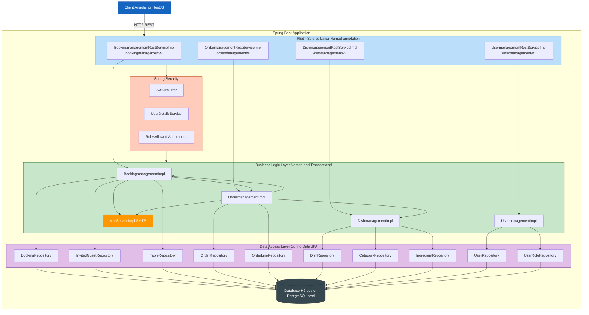

---

### 4.3 NestJS Component Diagram

Shows the NestJS module structure with controllers, services, use-cases, guards, and repositories.

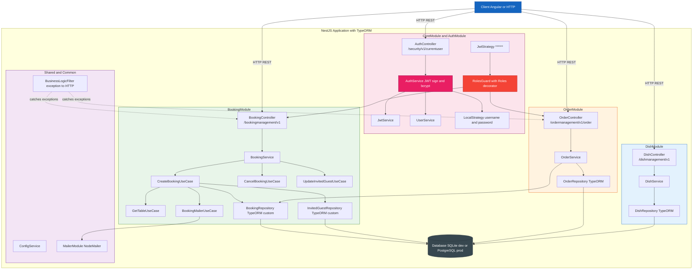

---

## Summary of Key Architectural Insights

| Concern | Java (Devon4j / Spring Boot) | NestJS (Node.js) | Angular (Frontend) |
|---|---|---|---|
| **Entry Point** | `BookingmanagementRestServiceImpl` | `BookingController` | `AppModule` |
| **Business Logic** | `BookingmanagementImpl` (Facade) | `BookingService` + Use Cases | NgRx Effects |
| **Data Access** | Spring Data JPA `DefaultRepository` | TypeORM custom repositories | HTTP via Services |
| **Auth** | Spring Security + JWT + `@RolesAllowed` | Passport JWT + `RolesGuard` | NgRx Auth Store + `AuthGuard` |
| **Token System** | CB_ (host) / GB_ (guest) prefix + MD5 | Same token model | Stored in NgRx store |
| **Events / Email** | `MailServiceImpl` (SMTP) | `BookingMailerUseCase` (NodeMailer) | N/A |
| **State Pattern** | N/A | Use Case pattern | NgRx (Actions → Effects → Reducers) |
| **2FA** | TOTP + Base32 secret + QR Code | N/A | QrCodeDialogComponent |

---

*Generated by uml-generator agent · Source: live analysis of `/java`, `/angular`, `/node` directories*
